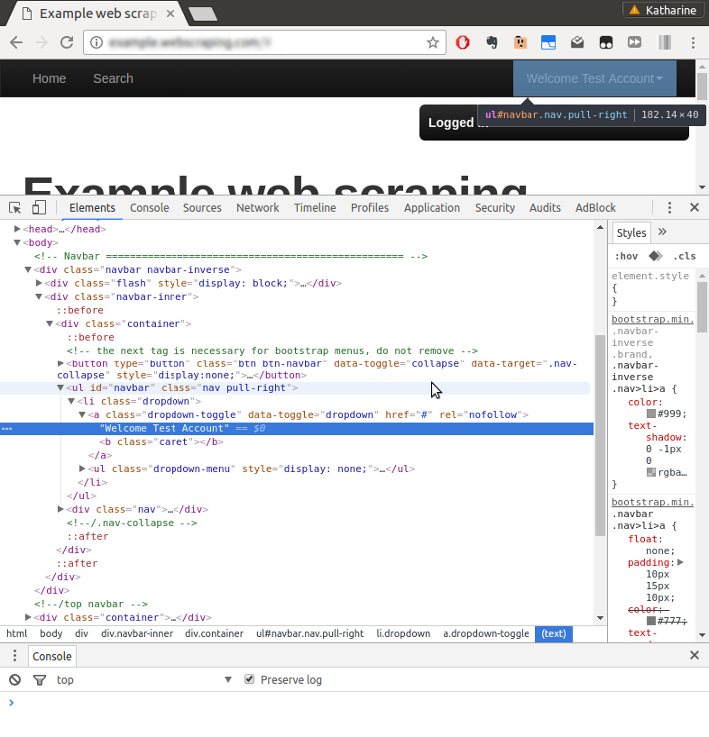

[toc]

### 6.1.1　从浏览器加载cookie

从前面的例子中可以看出，如何向服务器提交它所需的登录信息，有时候会很复杂。幸好，对于这种麻烦的网站还有一个变通方法，即先使用浏览器手工执行登录，然后在Python脚本中复用之前得到的cookie，从而实现自动登录。

不同浏览器存储cookie的格式不同，不过Firefox和Chrome都使用了一种可以通过Python解析的易访问格式： `sqlite` 数据库。

> 
> `SQLite` 是一个非常流行的开源SQL数据库。它可以很容易地在很多平台上进行安装，而且在Mac OSX中是预安装的。如果你想在自己的操作系统中下载并安装它，可以查看它的 `the Download page` ，或搜索针对你的操作系统的指令。

如果想要查看你的cookie，可以（如果已安装的话）运行 `sqlite3` 命令，并附带cookie文件的路径作为参数（如下所示为Chrome的示例）。

```python
$ sqlite3 [path_to_your_chrome_browser]/Default/Cookies
SQLite version 3.13.0 2016-05-18 10:57:30
Enter ".help" for usage hints.
sqlite> .tables
cookies meta
```

你需要先找到浏览器配置文件的路径。你可以通过搜索你的文件系统，或是在网上搜索你的浏览器及操作系统来找到它。如果你想了解SQLite的表格模式，可以使用 `.schema` ，并选择类似其他SQL数据库的语法函数。

除了在 `sqlite` 数据库中存储cookie外，一些浏览器（如Firefox）还会将会话直接存储在JSON文件中，这种格式可以很容易地使用Python进行解析。另外，还有一些浏览器扩展，比如SessionBuddy，可以导出会话到JSON文件中。对于登录而言，我们只需要找到合适的会话，其存储结构如下所示。

```python
{"windows": [...
  "cookies": [
    {"host":"example.python-scraping.com",
     "value":"514315085594624:e5e9a0db-5b1f-4c66-a864",
     "path":"/",
     "name":"session_id_places"}
  ...]
]}
```

下面的函数可以用于将Firefox会话解析为Python字典，之后我们可以将其提供给 `requests` 库。

```python
def load_ff_sessions(session_filename):
    cookies = {}
    if os.path.exists(session_filename):
        json_data = json.loads(open(session_filename, 'rb').read())
        for window in json_data.get('windows', []):
            for cookie in window.get('cookies', []):
                cookies[cookie.get('name')] = cookie.get('value')
    else:
        print('Session filename does not exist:', session_filename)
    return cookies
```

这里有一个比较麻烦的地方：不同操作系统中，Firefox存储会话文件的位置不同。在Linux系统中，其路径如下所示。

```python
~/.mozilla/firefox/*.default/sessionstore.js
```

在OS X中，其路径如下所示。

```python
~/Library/Application Support/Firefox/Profiles/*.default/
    sessionstore.js
```

而在Windows Vista及以上版本系统中，其路径如下所示。

```python
%APPDATA%/Roaming/Mozilla/Firefox/Profiles/*.default/sessionstore.js
```

下面是返回会话文件路径的辅助函数代码。

```python
import os, glob
def find_ff_sessions():
    paths = [
        '~/.mozilla/firefox/*.default',
        '~/Library/Application Support/Firefox/Profiles/*.default',
        '%APPDATA%/Roaming/Mozilla/Firefox/Profiles/*.default'
    ]
    for path in paths:
        filename = os.path.join(path, 'sessionstore.js')
        matches = glob.glob(os.path.expanduser(filename))
        if matches: m
            return matches[0]
```

需要注意的是，这里使用的 `glob` 模块会返回指定路径中所有匹配的文件。下面是修改后使用浏览器cookie登录的代码片段。

```python
>>> session_filename = find_ff_sessions()
>>> cookies = load_ff_sessions(session_filename)
>>> url = 'http://example.python-scraping.com'
>>> html = requests.get(url, cookies=cookies)
```

要检查会话是否加载成功，这次我们无法再依靠登录跳转了。这时我们需要抓取新生成的HTML，检查是否存在登录用户标签。如果得到的结果是 `Login` ，则说明会话没能正确加载。如果出现这种情况，你就需要使用Firefox浏览器确认一下是否已经成功登录示例网站。我们可以使用浏览器工具查看网站的 `User` 标签，如图6.2所示。


<center class="my_markdown"><b class="my_markdown">图6.2</b></center>

浏览器工具中显示该标签位于ID为“navbar”的 `<ul>` 标签中，我们可以使用第2章中介绍的 `lxml` 库抽取其中的信息。

```python
>>> tree = fromstring(html.content)
>>> tree.cssselect('ul#navbar li a')[0].text_content()
'Welcome Test account'
```

本节中的代码非常复杂，而且只支持从Firefox浏览器中加载会话。有很多浏览器附加组件和扩展支持保存会话到JSON文件，因此当你需要会话数据用于登录时，可以探索它们作为你的可选项。

在下一节中，我们将看到 `requests` 库关于会话的更高级使用（其文档地址为 `https://docs.python-requests.org/en/master/user/advanced/#session-objects` ），可以让我们在使用Python进行抓取时更轻松地利用浏览器会话。

