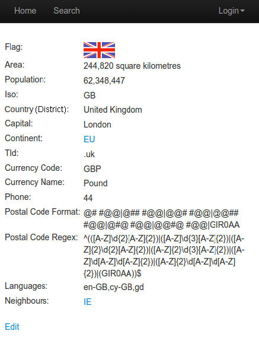
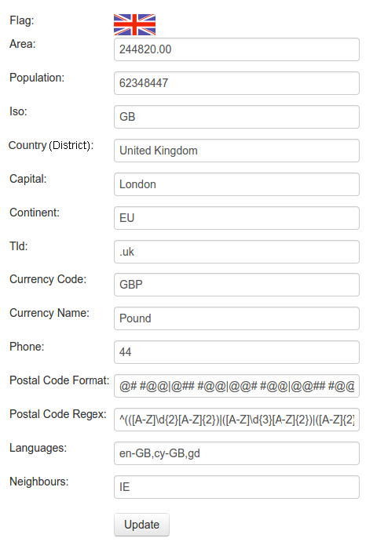
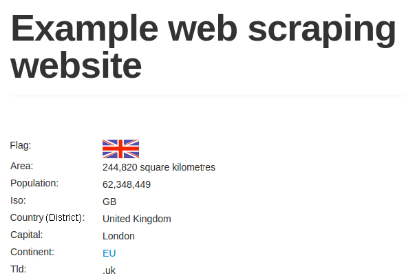

[toc]

### 6.2　支持内容更新的登录脚本扩展

既然我们可以通过脚本进行登录，那么我们也可以继续扩展该脚本，添加代码使其能够更新国家（或地区）数据。本节中使用的代码位于本书源码文件的 `chp6` 文件夹中，其名分别为 `edit.py` 和 `login.py` 。

如图6.3所示，每个国家（或地区）页面底部均有一个 **Edit** 链接。


<center class="my_markdown"><b class="my_markdown">图6.3</b></center>

在登录情况下，点击该链接将会前往另一个页面，在该页面中所有国家（或地区）属性都可以进行编辑，如图6.4所示。


<center class="my_markdown"><b class="my_markdown">图6.4</b></center>

这里我们编写一个脚本，每次运行时，都会使该国家（或地区）的人口数量加1。首先是重写 `login` 函数，以利用 `Session` 对象。这样可以使我们的代码更加整洁，并且可以让我们保持当前会话的登录状态。新的代码如下所示。

```python
def login(session=None):
    """ Login to example website.
        params:
            session: request lib session object or None
        returns tuple(response, session)
    """
    if session is None:
        html = requests.get(LOGIN_URL)
    else:
    html = session.get(LOGIN_URL)
data = parse_form(html.content)
data['email'] = LOGIN_EMAIL
data['password'] = LOGIN_PASSWORD
if session is None:
    response = requests.post(LOGIN_URL, data, cookies=html.cookies)
else:
    response = session.post(LOGIN_URL, data)
assert 'login' not in response.url
return response, session
```

现在无论是否存在会话，我们的登录表单都可以正常工作。默认情况下不使用会话，并期望用户使用cookie来保持登录。不过，对于一些表单来说会有问题，所以在扩展登录函数时，会话功能十分有用。下一步，我们需要通过复用 `parse_form()` 函数，抽取国家（或地区）的当前人口数量值。

```python
>>> from chp6.login import login, parse_form
>>> session = requests.Session()
>>> COUNTRY_URL = 'http://example.python-scraping.com/edit/United-Kingdom-239'
>>> response, session = login(session=session)
>>> country_or_district_html = session.get(COUNTRY_OR_DISTRICT_URL)
>>> data = parse_form(country_or_district_html.content)
>>> data
{'_formkey': 'd9772d57-7bd7-4572-afbd-b1447bf3e5bd',
 '_formname': 'places/2575175',
 'area': '244820.00',
 'capital': 'London',
 'continent': 'EU',
 'country_or_district': 'United Kingdom',
 'currency_code': 'GBP',
 'currency_name': 'Pound',
 'id': '2575175',
 'iso': 'GB',
 'languages': 'en-GB,cy-GB,gd',
 'neighbours': 'IE',
 'phone': '44',
 'population': '62348448',
 'postal_code_format': '@# #@@|@## #@@|@@# #@@|@@## #@@|@#@ #@@|@@#@
#@@|GIR0AA',
 'postal_code_regex': '^(([A-Z]d{2}[A-Z]{2})|([A-Z]d{3}[A-Z]{2})|([AZ]{
2}d{2}[A-Z]{2})|([A-Z]{2}d{3}[A-Z]{2})|([A-Z]erd[A-Z]d[A-Z]{2})|([AZ]{
2}d[A-Z]d[A-Z]{2})|(GIR0AA))$',
 'tld': '.uk'}
```

然后为人口数量加1，并将更新提交到服务器端。

```python
>>> data['population'] = int(data['population']) + 1
>>> response = session.post(COUNTRY_OR_DISTRICT_URL, data)
```

当我们再次回到国家（或地区）页时，可以看到人口数量已经增长到62,348,449，如图6.5所示。


<center class="my_markdown"><b class="my_markdown">图6.5</b></center>

读者可以对任何字段随意进行修改和测试，因为网站所用的数据库每个小时都会将国家（或地区）数据恢复为初始值，以保证数据正常。在 `the edit script` 中还包含修改货币字段的代码，可以作为另一个例子来使用。你还可以修改其他国家（或地区）的信息用于练习。

需要注意的是，严格来说，本例并不算是网络爬虫，而是广义上的网络机器人。这里使用的表单技术同样可以应用于访问你想抓取数据的复杂表单的交互当中。请确保将新的自动化表单的力量用于良好的用途，而不是垃圾邮件或恶意内容机器人。

