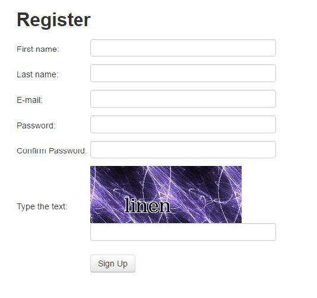

[toc]

### 7.1　注册账号

在第6章处理表单时，我们使用手工创建的账号登录网站，而忽略了创建账号这一部分，这是因为注册表单需要输入验证码，如图7.1所示。


<center class="my_markdown"><b class="my_markdown">图7.1</b></center>

请注意，每次加载表单时都会显示不同的验证码图像。为了了解表单需要哪些参数，我们可以复用上一章编写的 `parse_form()` 函数。

```python
>>> import requests
>>> REGISTER_URL = 'http://example.python-scraping.com/user/register'
>>> session = requests.Session()
>>> html = session.get(REGISTER_URL)
>>> form = parse_form(html.content)
>>> form
{'_formkey': '1ed4e4c4-fbc6-4d82-a0d3-771d289f8661',
 '_formname': 'register',
 '_next': '/',
 'email': '',
 'first_name': '',
 'last_name': '',
 'password': '',
 'password_two': None,
 'recaptcha_response_field': None}
```

前面的代码中，除 `recaptcha_response_field` 之外的其他域都很容易处理，在本例中这个域要求我们从初始页面显示的图像中抽取出 **strange** 字符串。

