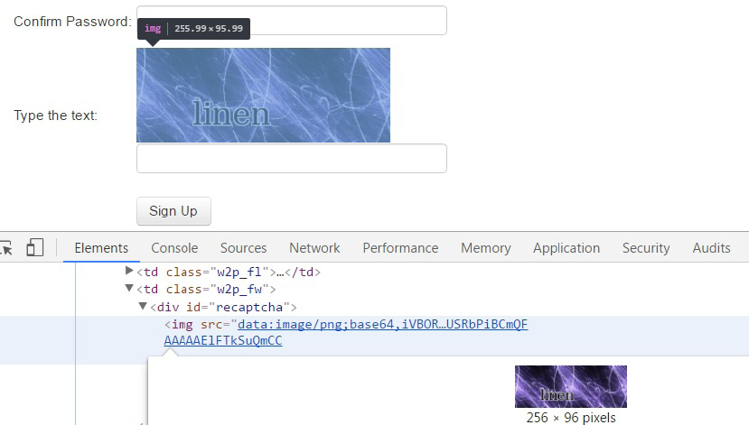

[toc]

### 7.1.1　加载验证码图像

在分析验证码图像之前，首先需要从表单中获取该图像。通过浏览器工具可以看到，图像数据是嵌入在网页中的，而不是从其他URL加载过来的，如图7.2所示。


<center class="my_markdown"><b class="my_markdown">图7.2</b></center>

为了在Python中处理该图像，我们将会用到 `Pillow` 包，可以使用如下命令通过 `pip` 安装该包。

```python
pip install Pillow
```

安装 `Pillow` 的其他方法可以参考 `http://pillow.readthedocs.io/en/latest/installation.html` 。

`Pillow` 提供了一个便捷的 `Image` 类，其中包含了很多用于处理验证码图像的高级方法。下面的函数使用注册页的HTML作为输入参数，返回包含验证码图像的 `Image` 对象。

```python
from io import BytesIO
from lxml.html import fromstring
from PIL import Image
import base64
def get_captcha_img(html):
    tree = fromstring(html)
    img_data = tree.cssselect('div#recaptcha img')[0].get('src')
    img_data = img_data.partition(',')[-1]
    binary_img_data = base64.b64decode(img_data)
    img = Image.open(BytesIO(binary_img_data))
    return img
```

开始几行使用 `lxml` 从表单中获取图像数据。图像数据的前缀定义了数据类型。在本例中，这是一张进行了Base64编码的PNG图像，这种格式会使用ASCII编码表示二进制数据。我们可以通过在第一个逗号处分割的方法移除该前缀。然后，使用Base64解码图像数据，回到最初的二进制格式。要想加载图像， `PIL` 还需要一个类似文件的接口，所以在传给 `Image` 类之前，我们又使用了 `BytesIO` 对这个二进制数据进行了封装。

在得到这个格式更加合适的验证码图像后，我们就可以尝试从中抽取文本了。

> 
> {Pillow与PIL的对比}  `Pillow` 是知名的Python图像处理库（Python Image Library，PIL）的分支版本，不过PIL从2009年开始就没有再更新过。 `Pillow` 使用了和原始 `PIL` 包相同的接口，并且拥有完善的文档，其文档地址为 `http://pillow.readthedocs.org` 。 `Pillow` 支持Python3（ `PIL` 不支持），因此我们将在本书中聚焦于使用 `Pillow` 。

