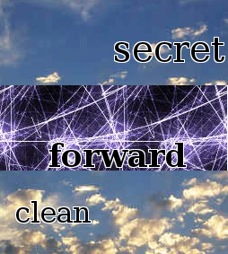

[toc]

### 7.2　光学字符识别

**光学字符识别（Optical Character Recognition，OCR）** 用于从图像中抽取文本。本节中，我们将使用开源的Tesseract OCR引擎，该引擎最初由惠普公司开发，目前由Google主导。Tesseract的安装说明可以从 `https://github.com/tesseract-ocr/tesseract/wiki/` 获取。然后，可以使用 `pip` 安装其Python封装版本 `pytesseract` 。

```python
pip install pytesseract
```

如果直接把验证码原始图像传给 `pytesseract` ，解析结果一般都会很糟糕。

```python
>>> import pytesseract
>>> img = get_captcha_img(html.content)
>>> pytesseract.image_to_string(img)
''
```

上面的代码执行后，会返回一个空字符串<a class="my_markdown" href="['#anchor71']"><sup class="my_markdown">[1]</sup></a>，也就是说Tesseract在抽取输入图像中的字符时失败了。这是因为Tesseract的设计初衷是为了抽取更加典型的文本，比如背景统一的书页。如果我们想要更加有效地使用Tesseract，需要先修改验证码图像，去除其中的背景噪音，只保留文本部分。

为了更好地理解我们将要处理的验证码系统，图7.3中又给出了几个示例验证码。


<center class="my_markdown"><b class="my_markdown">图7.3</b></center>

从图7.3中的例子可以看出，验证码文本一般都是黑色的，背景则会更加明亮，所以我们可以通过检查像素是否为黑色将文本分离出来，该处理过程又被称为 **阈值化** 。通过 `Pillow` 可以很容易地实现该处理过程。

```python
>>> img.save('captcha_original.png')
>>> gray = img.convert('L')
>>> gray.save('captcha_gray.png')
>>> bw = gray.point(lambda x: 0 if x < 1 else 255, '1')
>>> bw.save('captcha_thresholded.png')
```

首先，我们使用 `convert` 方法把图像转为灰度图。然后，使用 `point` 命令，通过 `lambda` 函数映射图像，此时会遍历图像中的每个像素。在 `lambda` 函数中，只有阈值小于 `1` 的像素才会保留，也就是说只有全黑的像素才会保留下来。这段代码片段保存了3张图像，分别是原始验证码图像、转换后的灰度图以及阈值化处理后的图像。

最终图像中的文本更加清晰，此时我们就可以将其传给Tesseract进行处理了。

```python
>>> pytesseract.image_to_string(bw)
'strange'
```

成功了！验证码中的文本已经被成功抽取出来了。在我测试的100张图片中，该方法正确解析了其中的82张验证码图像。

由于示例文本总是小写的ASCII字符，因此我们可以将结果限定在这些字符中，从而进一步提高性能。

```python
>>> import string
>>> word = pytesseract.image_to_string(bw)
>>> ascii_word = ''.join(c for c in word.lower() if c in
string.ascii_lowercase)
```

在对相同的100张图片的测试中，其识别率提高到了88%。

下面是目前注册脚本的完整代码。

```python
import requests
import string
import pytesseract
from lxml.html import fromstring
from chp6.login import parse_form
from chp7.image_processing import get_captcha_img, img_to_bw
REGISTER_URL = 'http://example.python-scraping.com/user/register'
def register(first_name, last_name, email, password):
    session = requests.Session()
    html = session.get(REGISTER_URL)
    form = parse_form(html.content)
    form['first_name'] = first_name
    form['last_name'] = last_name
    form['email'] = email
    form['password'] = form['password_two'] = password
    img = get_captcha_img(html.content)
    captcha = ocr(img)
    form['recaptcha_response_field'] = captcha
    resp = session.post(html.url, form)
    success = '/user/register' not in resp.url
    if not success:
        form_errors = fromstring(resp.content).cssselect('div.error')
        print('Form Errors:')
        print('n'.join(
             (' {}: {}'.format(f.get('id'), f.text) for f in
    form_errors)))
        return success
    def ocr(img):
        bw = img_to_bw(img)
        captcha = pytesseract.image_to_string(bw)
        cleaned = ''.join(c for c in captcha.lower() if c in
    string.ascii_lowercase)
        if len(cleaned) != len(captcha):
            print('removed bad characters: {}'.format(set(captcha) -
    set(cleaned)))
        return cleaned
```

`register()` 函数下载注册页面，抓取其中的表单，并在表单中设置新账号的名称、邮箱地址和密码。然后抽取验证码图像，传给OCR函数，并将OCR函数产生的结果添加到表单中。接下来提交表单数据，检查响应URL，确认注册是否成功。

如果注册失败（没有正确重定向到主页），将会打印出表单错误信息，比如我们可能需要使用更长的密码、不同的邮箱或验证码输入错误。我们还打印了移除的字符，用于帮助调试，使我们的验证码解析器更好。这些日志可能有助于我们识别常见的OCR错误，比如误将1认为l或类似的错误，这就需要在相似的字符间进行更完美的区分。

现在，只需要使用新账号信息调用 `register()` 函数，就可以注册账号了。

```python
>>> register(first_name, last_name, email, password)
True
```

