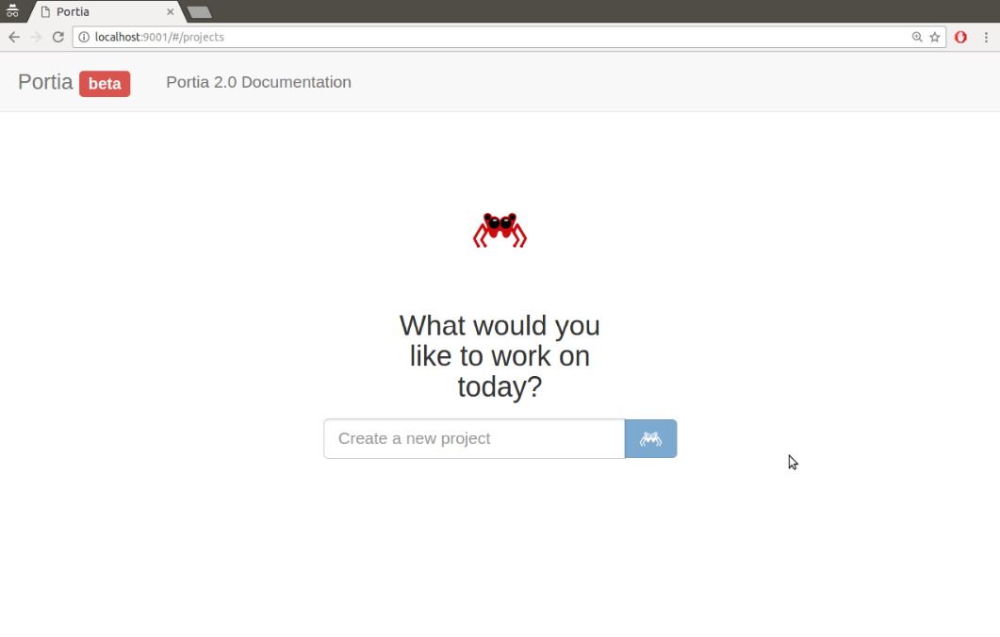

[toc]

### 8.5.1　安装

Portia是一款非常强大的工具，为了实现其功能需要依赖很多外部库。由于该工具相对较新，因此下面我们会稍微介绍一下它的安装步骤。如果未来该工具的安装步骤有所简化，可以从其最新文档中获取安装方法。当前运行Portia的推荐方式是使用Docker（开源容器框架）。如果你还没有安装Docker，则需要遵照最新的说明先进行安装。

Docker安装好并运行起来后，你可以拉取 `scrapinghub` 的镜像并启动。首先，你需要位于想要创建新的Portia项目的目录中，并运行如下命令。

```python
$ docker run -v ~/portia_projects:/app/data/projects:rw -p 9001:9001
scrapinghub/portia:portia-2.0.7
Unable to find image 'scrapinghub/portia:portia-2.0.7' locally
latest: Pulling from scrapinghub/portia
...
2017-03-28 12:57:42.711720 [-] Site starting on 9002
2017-03-28 12:57:42.711818 [-] Starting factory <slyd.server.Site instance
at 0x7f57334e61b8>
```

> 
> 在该命令中，我们创建了一个新的目录 `~/portia_projects` 。如果你希望将Portia项目存储在其他地方，可以修改 `-v` 命令，指向你想要存储Portia文件的绝对文件路径。

最后几行显示Portia网站已经启动并且正在运行。现在，可以通过浏览器访问 `http://localhost:9001/` 进入该网站。

初始屏幕类似图8.1所示。


<center class="my_markdown"><b class="my_markdown">图8.1</b></center>

如果你在安装过程中遇到了问题，可以查看Portia的问题页，网址为 `https://github.com/scrapinghub/portia/issues` ，也许其他人已经经历过相同的问题并且找到了解决方案。在本书中，我使用了指定的Portia镜像（ `scrapinghub/portia:portia-2.0.7` ），不过你也可以尝试使用官方发布的最新版本： `scrapinghub/portia` 。

此外，我建议始终使用README文件及Portia文档中记录的最新推荐说明，即使这些说明与本节中介绍的内容有所区别。Portia目前正处于活跃的开发期，因此在本书出版之后，说明文档可能会发生变化。

