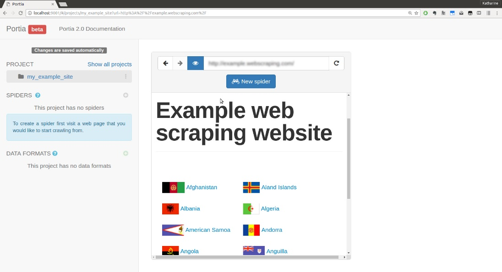
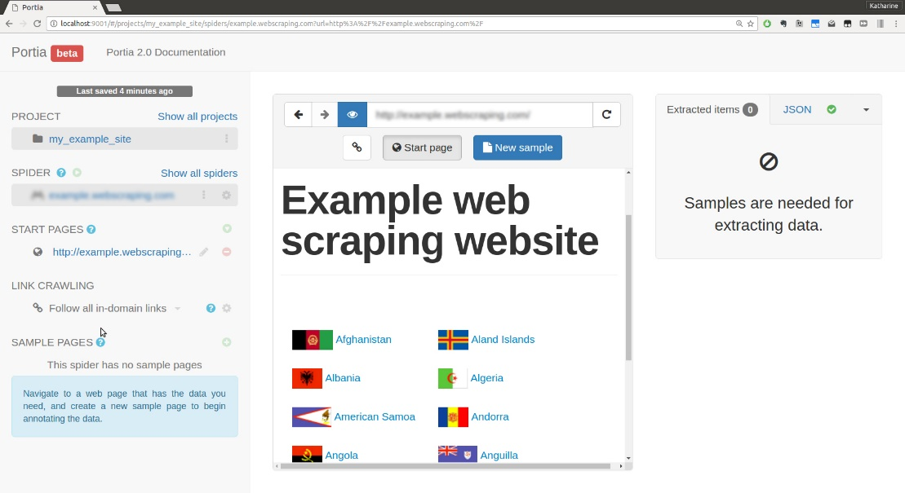
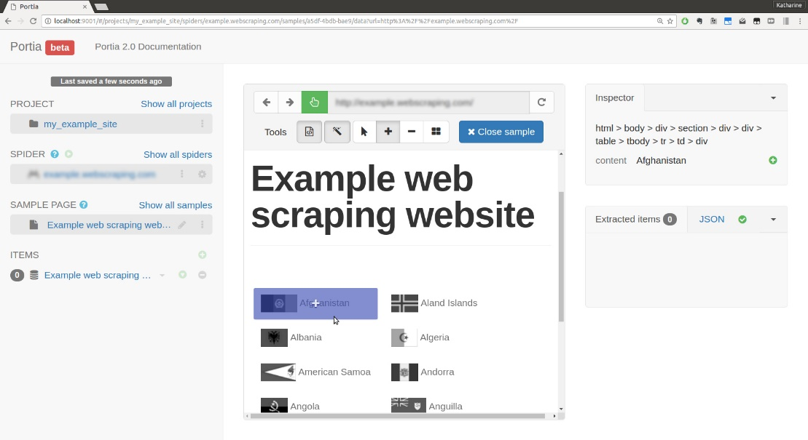
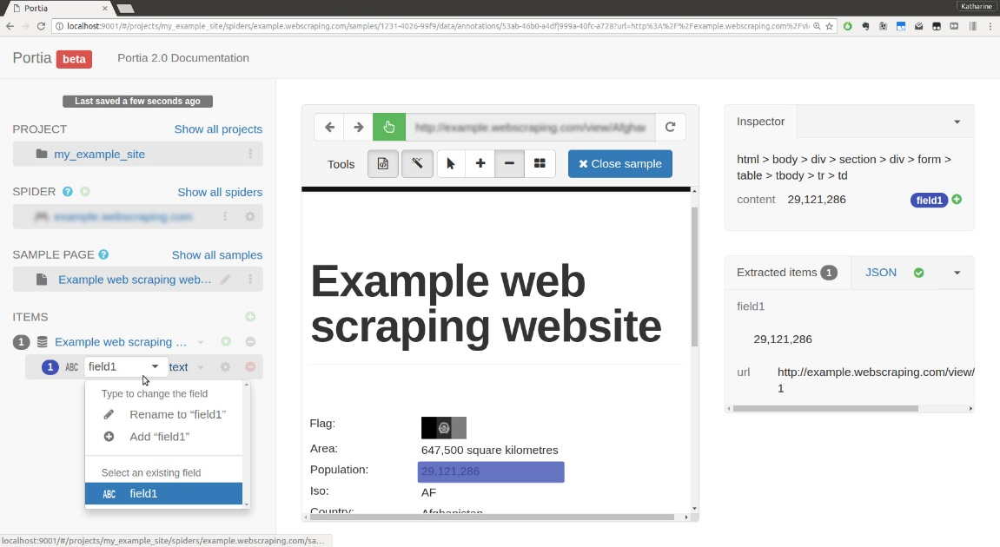
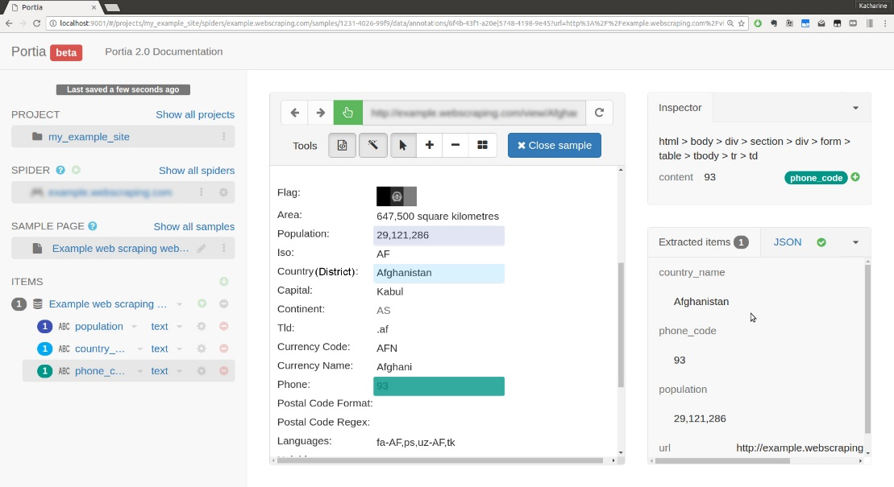
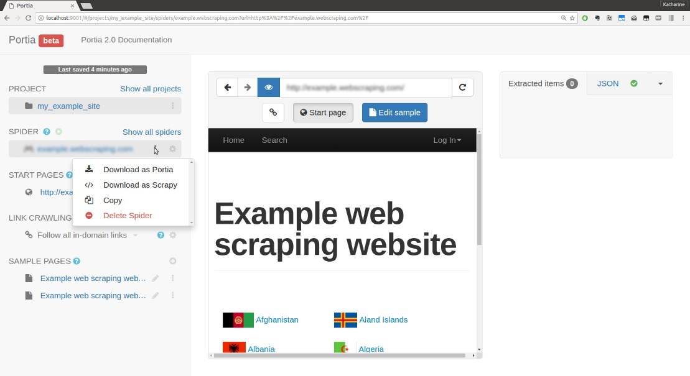

[toc]

### 8.5.2　标注

在Portia的启动页，页面会提示你输入项目名称。当你输入该文本后，将会有一个用于输入待抓取网站URL的文本框，比如输入 `http://example.python-scraping.com` 。

当你输入完成后，Portia将会加载项目视图，如图8.2所示。

<b class="my_markdown">图8.2</b>

当你点击 **New Spider** 按钮时，可以看到如图8.3所示的爬虫视图。

<b class="my_markdown">图8.3</b>

你会回忆起本章前面构建的Scrapy爬虫中的一些字段（比如起始页以及链接爬取规则）。默认情况下，爬虫名称被设置为域名（ `example. python-scraping.com` ），该名称可以通过单击相应标签进行修改。

接下来，单击New Sample按钮，开始从页面中收集数据，如图8.4所示。

<b class="my_markdown">图8.4</b>

现在，当你滚动页面中的不同元素时，可以看到它们会被高亮显示。你还可以在网站右侧区域的Inspector选项卡中查看CSS选择器。

由于我们想要抓取每个国家（或地区）页面中的人口数量这个元素，因此我们首先需要从首页导航到各个国家（或地区）的页面。为了实现该目标，我们先要单击Close Sample按钮，然后再单击任何国家（或地区）。当国家（或地区）页面被加载时，我们可以再次单击New Sample。

要想为我们的item添加用于抽取的字段，我们需要单击人口数量字段。在我们操作之后，会添加一个item，然后我们就可以查看抽取到的信息了。上述过程如图8.5所示。

<b class="my_markdown">图8.5</b>

我们可以使用左侧的文本字段区域重命名字段，只需输入新的名称population即可。然后，我们可以单击Add Field按钮。要想添加更多的字段，我们可以通过先单击大的+按钮，然后以相同的方式选择字段值，对国家（或地区）名称以及任何其他我们感兴趣的字段进行相同的操作即可。标注字段将会在网页中高亮显示，你可以在extracted items区域查看抽取的数据，如图8.6所示。

<b class="my_markdown">图8.6</b>

如果你想删除任何字段，只需使用字段名称旁边的红色的-符号即可。当标注完成后，单击顶部蓝色的Close sample按钮。如果之后你想下载爬虫，用于在Scrapy项目中运行，则可以通过单击爬虫名称后边的链接来实现，如图8.7所示。

<b class="my_markdown">图8.7</b>

你还可以在挂载的目录 `~/portia_projects` 中查看你的所有爬虫及其设置。

