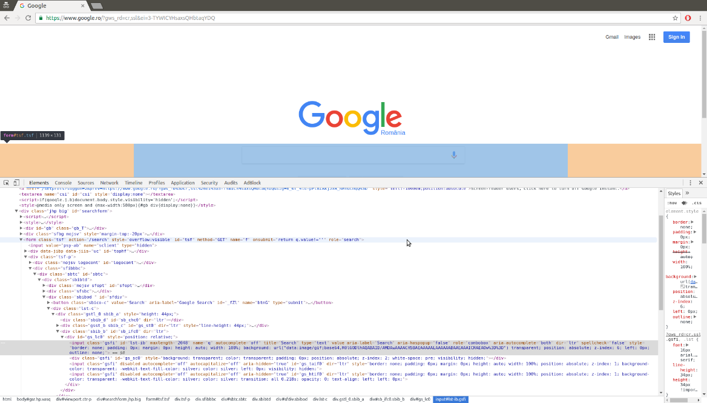
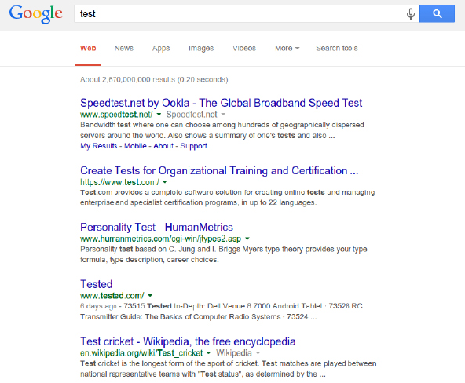
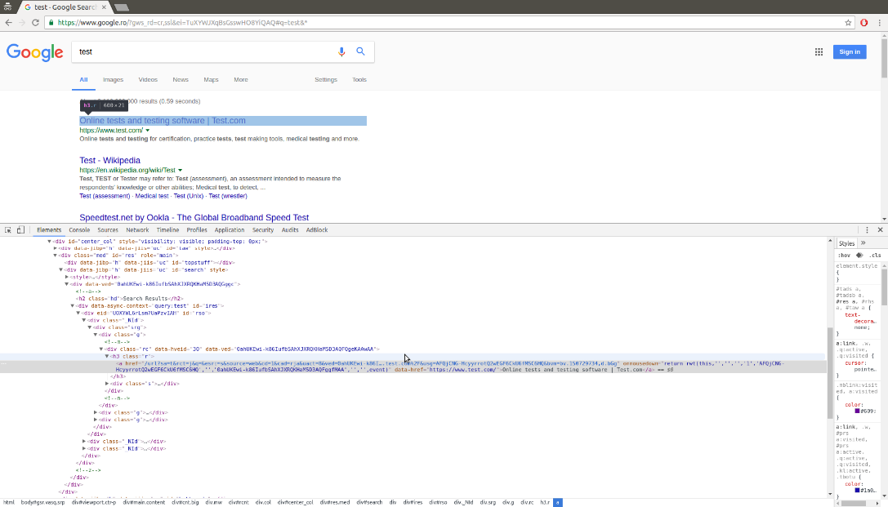
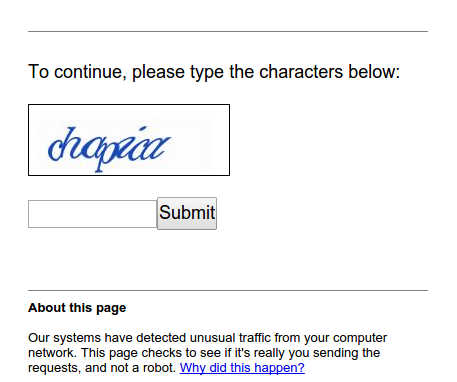

[toc]

### 9.1　Google搜索引擎

为了了解我们对CSS选择器知识的使用情况，我们将会抓取Google的搜索结果。根据第4章中Alexa的数据，Google是全世界最流行的网站之一，而且非常方便的是，该网站结构简单，易于抓取。

> 
> Google国际化版本可能会根据你的地理位置跳转到指定国家（或地区）的版本。在下述示例中，Google将被设置为罗马尼亚的版本，因此你的结果可能会看起来有些区别。

图9.1所示为Google搜索主页使用浏览器工具加载查看表单元素时的界面。


<center class="my_markdown"><b class="my_markdown">图9.1</b></center>

可以看到，搜索查询存储在输入参数 `q` 当中，然后表单提交到 `action` 属性设定的 `/search` 路径。我们可以通过将 `test` 作为搜索条件提交给表单对其进行测试，此时会跳转到类似 `https://www.google.ro/?gws_ rd=cr,ssl&ei=TuXYWJXqBsGsswHO8YiQAQ#q=test&*` 的 URL中。确切的URL取决于你的浏览器和地理位置。此外，如果开启了Google实时，那么搜索结果会使用AJAX执行动态加载，而不再需要提交表单。虽然URL中包含了很多参数，但是只有用于查询的参数 `q` 是必需的。

当URL为 `https://www.google.com/search?q=test` 时，也能产生相同的搜索结果，如图9.2所示。


<center class="my_markdown"><b class="my_markdown">图9.2</b></center>

搜索结果的结构可以使用浏览器工具来查看，如图9.3所示。


<center class="my_markdown"><b class="my_markdown">图9.3</b></center>

从图9.3中可以看出，搜索结果是以链接的形式出现的，并且其父元素是class为 `"r"` 的 `<h3>` 标签。

想要抓取搜索结果，我们可以使用第2章中介绍的CSS选择器。

```python
>>> from lxml.html import fromstring
>>> import requests
>>> html = requests.get('https://www.google.com/search?q=test')
>>> tree = fromstring(html.content)
>>> results = tree.cssselect('h3.r a')
>>> results
[<Element a at 0x7f3d9affeaf8>,
 <Element a at 0x7f3d9affe890>,
 <Element a at 0x7f3d9affe8e8>,
 <Element a at 0x7f3d9affeaa0>,
 <Element a at 0x7f3d9b1a9e68>,
 <Element a at 0x7f3d9b1a9c58>,
 <Element a at 0x7f3d9b1a9ec0>,
 <Element a at 0x7f3d9b1a9f18>,
 <Element a at 0x7f3d9b1a9f70>,
 <Element a at 0x7f3d9b1a9fc8>]
```

到目前为止，我们已经下载得到了Google的搜索结果，并且使用 `lxml` 抽取出其中的链接。在图9.3中，我们发现链接中的真实网站URL之后还包含了一串附加参数，这些参数将用于跟踪点击。

下面是我们在页面中找到的第一个链接。

```python
>>> link = results[0].get('href')
>>> link
'/url?q=http://www.speedtest.net/&sa=U&ved=0ahUKEwiCqMHNuvbSAhXD6gTMAA&usg=
AFQjCNGXsvN-v4izEgZFzfkIvg'
```

这里我们需要的内容是 `http://www.speedtest.net/` ，可以使用 `urlparse` 模块从查询字符串中将其解析出来。

```python
>>> from urllib.parse import parse_qs, urlparse
>>> qs = urlparse(link).query
>>> parsed_qs = parse_qs(qs)
>>> parsed_qs
{'q': ['http://www.speedtest.net/'],
 'sa': ['U'],
 'ved': ['0ahUKEwiCqMHNuvbSAhXD6gTMAA'],
 'usg': ['AFQjCNGXsvN-v4izEgZFzfkIvg']}
>>> parsed_qs.get('q', [])
['http://www.speedtest.net/']
```

该查询字符串解析方法可以用于抽取所有链接。

```python
>>> links = []
>>> for result in results:
... link = result.get('href')
... qs = urlparse(link).query
... links.extend(parse_qs(qs).get('q', []))
...
>>> links
['http://www.speedtest.net/',
'test',
'https://www.test.com/',
'https://ro.wikipedia.org/wiki/Test',
'https://en.wikipedia.org/wiki/Test',
'https://www.sri.ro/verificati-va-aptitudinile-1',
'https://www.sie.ro/AgentiaDeSpionaj/test-inteligenta.html',
'http://www.hindustantimes.com/cricket/india-vs-australia-live-cricket-scor
e-4th-test-dharamsala-day-3/story-8K124GMEBoiKOgiAaaB5bN.html',
'https://sports.ndtv.com/india-vs-australia-2017/live-cricket-score-india-v
s-australia-4th-test-day-3-dharamsala-1673771',
'http://pearsonpte.com/test-format/']
```

成功了！从Google搜索中得到的链接已经被成功抓取出来了。该示例的完整源码位于本书源码文件的 `chp9` 文件夹中，其名为 `scrape_google.py` 。

抓取Google搜索结果时会碰到的一个难点是，如果你的IP出现可疑行为，比如下载速度过快，则会出现验证码图像，如图9.4所示。

我们可以使用第7章中介绍的技术来解决验证码图像这一问题，不过更好的方法是降低下载速度，或者在必须高速下载时使用代理，以避免被Google怀疑。过分请求Google会造成你的IP甚至是一个IP段被封禁，几个小时甚至几天无法访问Google的域名，所以请确保你能够礼貌地使用该网站，不会使你的家庭或办公室中的其他人（包括你自己）被列入黑名单。


<center class="my_markdown"><b class="my_markdown">图9.4</b></center>

