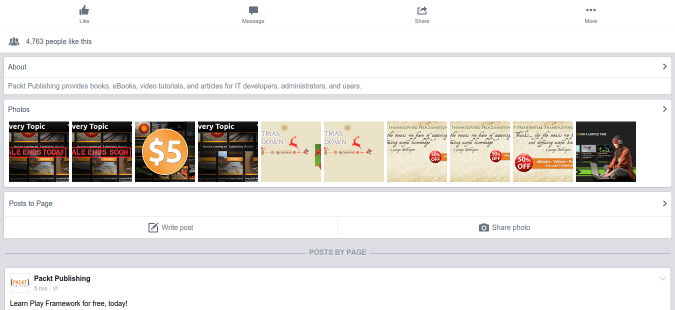

[toc]

### 9.2.1　网站

图9.5所示为Packt出版社的Facebook页面。

当你查看该页的源代码时，可以找到最开始的几篇日志，但是后面的日志只有在浏览器滚动时才会通过AJAX加载。另外，Facebook还提供了一个移动端界面，正如第1章所述，这种形式的界面通常更容易抓取。该页面在移动端的展示形式如图9.6所示。


<center class="my_markdown"><b class="my_markdown">图9.5</b></center>


<center class="my_markdown"><b class="my_markdown">图9.6</b></center>

当我们与移动端网站进行交互，并使用浏览器工具查看时，会发现该界面使用了和之前相似的结构来处理AJAX事件，因此该方法无法简化抓取。虽然这些AJAX事件可以被逆向工程，但是不同类型的Facebook页面使用了不同的AJAX调用，而且依据我的过往经验，Facebook经常会变更这些调用的结构，所以抓取这些页面需要持续维护。因此，如第5章所述，除非性能十分重要，否则最好使用浏览器渲染引擎执行JavaScript事件，然后访问生成的HTML页面。

下面的代码片段使用Selenium自动化登录Facebook，并跳转到给定页面的URL。

```python
from selenium import webdriver
def get_driver():
    try:
        return webdriver.PhantomJS()
    except:
        return webdriver.Firefox()
def facebook(username, password, url):
    driver = get_driver()
    driver.get('https://facebook.com')
    driver.find_element_by_id('email').send_keys(username)
    driver.find_element_by_id('pass').send_keys(password)
    driver.find_element_by_id('loginbutton').submit()
    driver.implicitly_wait(30)
    # wait until the search box is available,
    # which means it has successfully logged in
    search = driver.find_element_by_name('q')
    # now logged in so can go to the page of interest
    driver.get(url)
    # add code to scrape data of interest here ...
```

然后，可以调用该函数加载你感兴趣的Facebook页面，并使用合法的Facebook邮箱和密码，抓取生成的HTML页面。

