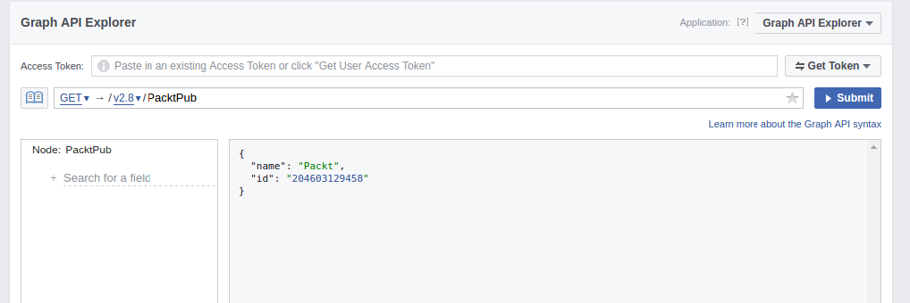

[toc]

### 9.2.2　Facebook API

如第1章所述，抓取网站是在其数据没有给出结构化格式时的最末之选。而Facebook确实为绝大多数公共或私有（通过你的用户账号）数据提供了API，因此我们需要在构建加强的浏览器抓取之前，首先检查一下这些API提供的访问是否已经能够满足需求。

首先要做的事情是确定通过API哪些数据是可用的。为了解决该问题，我们需要先查阅其API文档。开发者文档的网址为 `https://developers.facebook.com/docs` ，在这里给出了所有不同类型的API，包括图谱 API，该API中包含了我们想要的信息。如果你需要构建与Facebook的其他交互（通过API或SDK），可以随时查阅该文档，该文档会定期更新并且易于使用。

此外，根据文档链接，我们还可以使用浏览器内的图谱 API探索工具，其地址为 `https://developers.facebook.com/tools/explorer/` 。如图9.7所示，探索工具是用来测试查询及其结果的很好的地方。


<center class="my_markdown"><b class="my_markdown">图9.7</b></center>

在这里，我可以搜索API，获取PacktPub的Facebook页面ID。图谱探索工具还可以用来生成访问口令，我们可以用它来定位API。

想要在Python中使用图谱API，我们需要使用具有更高级请求的特殊访问口令。幸运的是，有一个名为 `facebook-sdk` （ `https://facebook-sdk.readthedocs.io` ）的维护良好的库可以供我们使用。我们只需通过 `pip` 安装它即可。

```python
pip install facebook-sdk
```

下面是使用Facebook的图谱API从Packt出版社页面中抽取数据的代码示例。

```python
In [1]: from facebook import GraphAPI
In [2]: access_token = '....' # insert your actual token here
In [3]: graph = GraphAPI(access_token=access_token, version='2.7')
In [4]: graph.get_object('PacktPub')
Out[4]: {'id': '204603129458', 'name': 'Packt'}
```

我们可以看到和基于浏览器的图谱探索工具相同的结果。我们可以通过传递想要抽取的额外信息，来获得页面中的更多信息。要确定使用哪些信息，我们可以在图谱文档中看到页面中所有可用的字段，文档地址为 `https://developers.facebook.com/docs/graph-api/reference/page/` 。使用关键字参数 `fields` ，我们可以从API中抽取这些额外可用的字段。

```python
In [5]: graph.get_object('PacktPub', fields='about,events,feed,picture')
Out[5]:
{'about': 'Packt provides software learning resources, from eBooks to video
courses, to everyone from web developers to data scientists.',
 'feed': {'data': [{'created_time': '2017-03-27T10:30:00+0000',
 'id': '204603129458_10155195603119459',
 'message': "We've teamed up with CBR Online to give you a chance to win 5
tech eBooks - enter by March 31! http://bit.ly/2mTvmeA"},
...
 'id': '204603129458',
 'picture': {'data': {'is_silhouette': False,
 'url':
'https://scontent.xx.fbcdn.net/v/t1.0-1/p50x50/14681705_10154660327349459_7
2357248532027065_n.png?oh=d0a26e6c8a00cf7e6ce957ed2065e430&oe=59660265'}}}
```

我们可以看到该响应是格式良好的Python字典，我们可以很容易地进行解析。

图谱API还提供了很多访问用户数据的其他调用，其文档可以从Facebook的开发者页面中获取，网址为 `https://developers.facebook.com/docs/graph-api` 。根据所需数据的不同，你可能还需要创建一个Facebook开发者应用，从而获得可用时间更长的访问口令。

