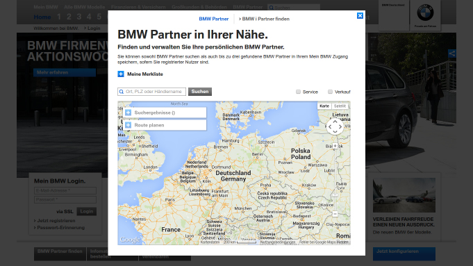
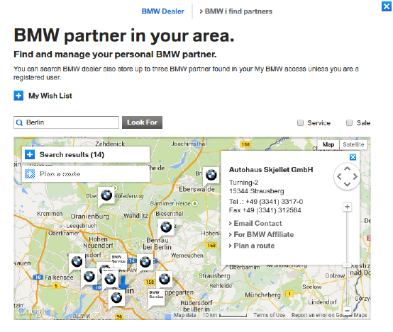

[toc]

### 9.4　宝马

为了研究如何对一个新的网站进行逆向工程，我们将以宝马官方网站作为示例。宝马官方网站中有一个查询本地经销商的搜索工具，其网址为 `https://www.bmw.de/de/home.html?entryType=dlo` ，界面如图9.9所示。


<center class="my_markdown"><b class="my_markdown">图9.9</b></center>

该工具将地理位置作为输入参数，然后在地图上显示附近的经销商地点，比如在图9.10中以 `Berlin` 作为搜索参数。


<center class="my_markdown"><b class="my_markdown">图9.10</b></center>

使用类似Network选项卡的浏览器开发者工具，我们会发现搜索触发了如下AJAX请求。

```python
https://c2b-services.bmw.com/c2b-localsearch/services/api/v3/
    clients/BMWDIGITAL_DLO/DE/
        pois?country=DE&category=BM&maxResults=99&language=en&
            lat=52.507537768880056&lng=13.425269635701511
```

这里， `maxResults` 参数被设为99。不过，我们可以使用第1章中介绍的技术增大该参数的值，以便在一次请求中下载所有经销商的地点。下面是将 `maxResults` 的值增加到 `1000` 时的输出结果。

```python
>>> import requests
>>> url =
'https://c2b-services.bmw.com/c2b-localsearch/services/api/v3/clients/BMWDI
GITAL_DLO/DE/pois?country=DE&category=BM&maxResults=%d&language=en&
lat=52.507537768880056&lng=13.425269635701511'
>>> jsonp = requests.get(url % 1000)
>>> jsonp.content
'callback({"status":{
...
})'
```

AJAX请求提供了 **JSONP** 格式的数据，其中JSONP是指填充模式的 **JSON** （ **JSON with padding** ）。这里的填充通常是指要调用的函数，而函数的参数则为纯JSON数据，在本例中调用的是 `callback` 函数。由于解析库不容易理解这种填充，因此我们需要移除它，使解析数据更合适。

要想使用Python的 `json` 模块解析该数据，首先需要将填充部分截取掉，我们可以通过切片操作来实现。

```python
>>> import json
>>> pure_json = jsonp.text[jsonp.text.index('(') + 1 :
jsonp.text.rindex(')')]
>>> dealers = json.loads(pure_json)
>>> dealers.keys()
dict_keys(['status', 'translation', 'metadata', 'data', 'count'])
>>> dealers['count']
715
```

现在，我们已经将德国所有的宝马经销商加载到JSON对象中，可以看出目前总共有715个经销商。下面是第一个经销商的数据。

```python
>>> dealers['data']['pois'][0]
{'attributes': {'businessTypeCodes': ['NO', 'PR'],
 'distributionBranches': ['T', 'F', 'G'],
 'distributionCode': 'NL',
 'distributionPartnerId': '00081',
 'facebookPlace': '',
 'fax': '+49 (30) 200992110',
 'homepage': 'http://bmw-partner.bmw.de/niederlassung-berlin-weissensee',
 'mail': 'nl.berlin@bmw.de',
 'outletId': '3',
 'outletTypes': ['FU'],
 'phone': '+49 (30) 200990',
 'requestServices': ['RFO', 'RID', 'TDA'],
 'services': ['EB', 'PHEV']},
 'category': 'BMW',
 'city': 'Berlin',
 'country': 'Germany',
 'countryCode': 'DE',
 'dist': 6.662869863289401,
 'key': '00081_3',
 'lat': 52.562568863415,
 'lng': 13.463589476607,
 'name': 'BMW AG Niederlassung Berlin Filiale Weißensee',
 'oh': None,
 'postalCode': '13088',
 'postbox': None,
 'state': None,
 'street': 'Gehringstr. 20'}
```

现在可以保存我们感兴趣的数据了。下面的代码片段将经销商的名称和经纬度写入一个电子表格当中。

```python
with open('../../data/bmw.csv', 'w') as fp:
    writer = csv.writer(fp)
    writer.writerow(['Name', 'Latitude', 'Longitude'])
    for dealer in dealers['data']['pois']:
        name = dealer['name']
        lat, lng = dealer['lat'], dealer['lng']
        writer.writerow([name, lat, lng])
```

运行该示例后，得到的 `bmw.csv` 表格中的内容类似如下所示。

```python
Name,Latitude,Longitude
BMW AG Niederlassung Berlin Filiale
Weissensee,52.562568863415,13.463589476607
Autohaus Graubaum GmbH,52.4528925,13.521265
Autohaus Reier GmbH & Co. KG,52.56473,13.32521
...
```

从宝马官网抓取数据的完整源代码位于本书源码文件的 `chp9` 文件夹中，其名为 `bmw_scraper.py` 。

> 　 **翻译外文内容**
> 你可能已经注意到宝马的第一个截图（见图9.8）是德文的，而第二个截图（见图9.9）是英文的。这是因为第二个截图中的文本使用了Google翻译的浏览器扩展进行了翻译。当尝试了解如何在外文网站中定位时，这是一个非常有用的技术。宝马官网在经过翻译后，仍然可以正常运行。不过还是要当心Google翻译可能会破坏一些网站的正常运行，比如依赖原始值的表单，其中的下拉菜单内容被翻译时就会出现问题。
> 在Chrome中，Google翻译可以通过安装 `Google Translate` 扩展获得；在Firefox中，可以安装 `Google Translator` 插件；而在IE中，则可以安装 `Google Toolbar` 。此外，还可以使用 `http://translate.google.com` 进行翻译，不过这样只会对原始文本有用，因此它不会保存格式。

