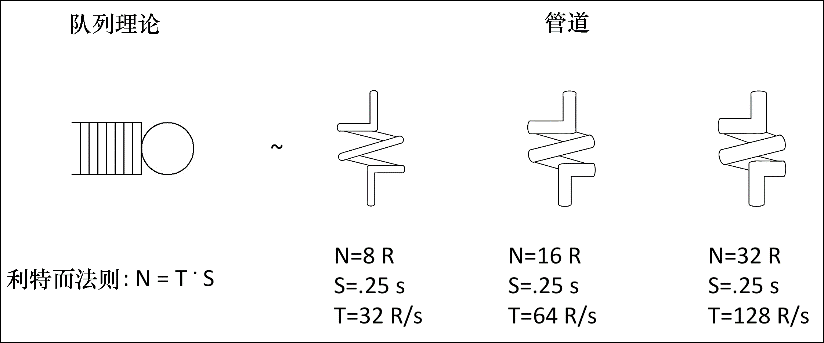

### 10.1　Scrapy引擎——一种直观方式

并行系统看起来与管道系统很相似。在计算机科学中，我们使用队列符号来表示队列以及处理中的元素（见图10.1左侧）。队列系统的基本法则是利特尔法则，该法则认为在稳定状态下，队列系统中的元素数量（N）等于系统吞吐量（T）乘以总排队/服务时间（S），即N = T · S。另外两种形式是：T = N / S以及S = N / T，在计算中同样有用。

<b class="my_markdown">图10.1　利特尔法则、队列系统以及管道</b>

在管道的几何形状中也有相似的法则（见图10.1右侧）。管道容量（V）等于管道长度L乘以横截面面积（A），即V = L·A。

如果我们想象长度表示服务时间（L～S），容量表示处理系统的元素数量（V～N），横截面面积表示吞吐量（A～N），那么利特尔法则和容量公式实际是相同的事情。

> 
> 这个类比有道理吗？答案是差不多。如果我们将工作单位想象为小滴液体，以恒定速率在管道内部移动，那么L～S绝对有意义，因为管道越长，水滴移动花费的时间越多。V～N同样有意义，因为管道越大，能够容纳的水滴越多。烦人的是，我们还可以通过施加更大压力的方式压入更多水滴。A～T是不太满足类比的一点。在管道中，实际吞吐量，即每秒进出管道的水滴数量，被称为“体积流量”，除非满足特定条件（孔口），否则其与A2成正比，而不是A。这是因为更宽的管道不只意味着有更多的液体流出，还会使液体流动更快，因为管壁之间存在更大的空间。不过为了本章的学习，我们可以忽略这些技术细节，而是假设生活在一个理想的世界中，在这里压力和速度都是常量，并且吞吐量与横截面面积直接成正比。

利特尔法则和这个简单的体积公式非常相似，这就使得该“管道模型”非常直观有用。让我们更详细地看一下图10.1中的示例（右侧）。假设管道系统表示Scrapy的下载器。第一个非常“细”的下载器，其总体积/并发级别（N）可能是8个并发请求。管道长度/延迟（S）对于一个快速的网站来说，可能S=250ms。在给定N和S时，现在可以计算处理元素的体积/吞吐量，每秒请求数为T = N / S = 8 / 0.25 = 32。

你会发现延迟经常是我们无法控制的，因为它依赖于远端服务器的性能以及网络的延迟。我们比较容易控制的是下载器中并发（N）的级别，可以将其从8增长到16或32个并发请求，即10.1图中的第二个和第三个管道。对于常量的长度（超出我们控制范围之外），可以通过只增加横截面面积的方式增长体积，也就是说增加吞吐量！按照利特尔法则，16个并发请求时，我们得到的每秒请求数为T = N / S = 16 / 0.25 = 64个，而在32个并发请求时，我们得到的每秒请求数是T = N / S = 32 / 0.25 = 128个。太好了！我们似乎可以通过增加并发的方式，使系统无限快。在急于得出这样的结论之前，还需要考虑队列系统级联的影响。

