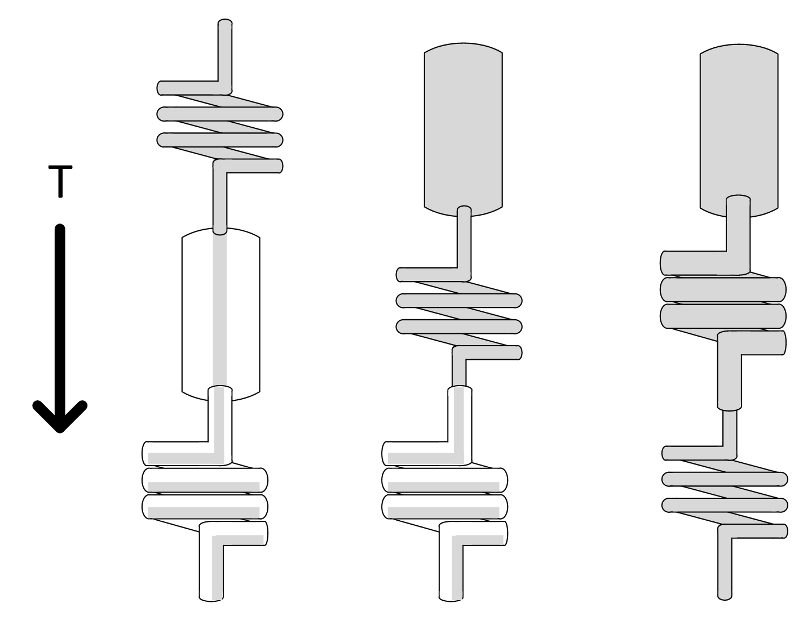

### 10.1.1　级联队列系统

当将不同横截面面积/吞吐量的几个管道依次连接起来时，可以很直观地理解整个系统的流量将由最窄的（最小吞吐量： **T** ）管道所限制（见图10.2）。

<b class="my_markdown">图10.2　不同容量的级联队列系统</b>

你还可以观察到最窄管道（即瓶颈）的位置，决定了其他管道是如何“填满”的。如果考虑到与系统内存需求相关的填充，就会意识到瓶颈的位置是非常重要的。我们最好通过配置保持管道充满，且单个工作单元的花销最少。在Scrapy中，一个工作单元（爬取一个页面）主要是由下载器前的URL（几个字节）以及下载后的URL加上服务器响应（较大）组成。

> 
> 这就是为什么在Scrapy系统中，通常将瓶颈放置在下载器中。

