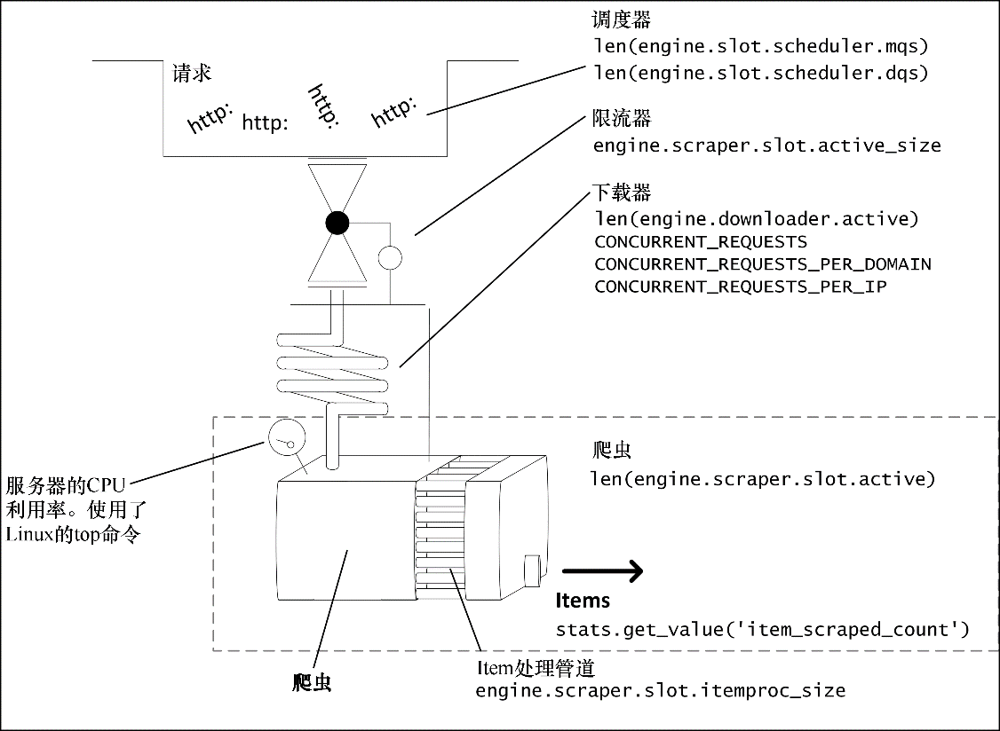

### 10.1.3　Scrapy性能模型

让我们回到Scrapy，详细看一下其性能模型（见图10.3）。

<b class="my_markdown">图10.3　Scrapy性能模型</b>

Scrapy包含如下组成部分。

+ **调度器：** 在这里，多个请求会排队等待下载器处理。它们主要由URL组成，因此会十分紧凑，这就意味着即使拥有大量URL也不会对系统有很大伤害，并且可以让我们在传入不规则请求流的情况下能够充分利用下载器。
+ **限流器：** 这是抓取过程（大储水池）反馈的安全阀，如果正在执行的响应的总计大小超过5MB，那么它会让前往下载器的后续请求停止。这可能会导致不可预料的性能起伏。
+ **下载器：** 这是Scrapy关于性能最重要的组成部分。它对能够并行执行的请求的数量有着复杂的限制。其延迟（管道长度）等于远程服务器响应的时间，加上所有网络/操作系统以及Python/Twisted的延迟。我们可以调整并行请求的数量，不过通常情况下，我们几乎无法控制延迟。下载器的容量由 `CONCURRENT_REQUESTS*` 设置限制，我们将会很快看到。
+ **爬虫：** 这是抓取过程中将响应转为 `Item` 和后续请求的部分。同时这也是我们编写的部分，通常情况下，只要遵照规则，它们就不会是性能瓶颈。
+ **Item** 管道：这是我们编写的代码的第二个部分。我们的爬虫可以对每个请求生成上百个 `Item` ，同一时刻只会处理 `CONCURRENT_ITEMS` 个。该值十分重要，因为假设你在管道中要处理数据库访问，那么使用默认值（100）就可能会过高，从而在无意间拖垮数据库。

爬虫和管道都应该使用异步代码，并且在必要时引发更多的延迟，但不应因此成为瓶颈。极少情况下，我们的爬虫/管道会处理非常繁重的事情。如果发生此种情况，那么服务器的CPU可能会成为瓶颈。

