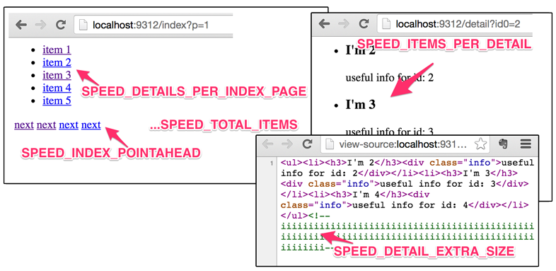

### 10.3　基准系统

为了第10章，我编写了一个简单的基准系统，可以让我们在不同场景下评估性能。该系统的代码比较复杂，你可以在 `speed/spiders/speed.py` 中找到它，但我不会详细讲解该代码。

该系统包含如下功能。

+ 我们的Web服务器上 `http://localhost:9312/benchmark/...` 目录的处理器。可以通过调整URL参数/Scrapy设置控制伪站点的结构（见图10.4）以及页面加载速度。无需担心细节，我们很快就会看到更多示例。现在，可以观察 `http://localhost:9312/benchmark/index?p=1` 与 `http://localhost: 9312/benchmark/ id:3/rr:5/index?p=1` 的区别。第一个页面加载时间在半秒之内，并且每个详情页中有一个条目；而第二个页面需要5秒时间加载，但每个详情页中包含3个条目。我们还可以向页面中添加一些隐藏的垃圾数据，使其更大一些。比如， `http://localhost:9312/ benchmark/ds:100/ detail?id0=0` 。默认情况下（参见 `speed/settings.py` ），页面渲染在 `SPEED_T_RESPONSE = 0.125` 秒内，伪站点包含 `SPEED_TOTAL_ITEMS = 5000` 个 `Item` 。


<center class="my_markdown"><b class="my_markdown">图10.4　我们的基准系统创建的具有可调整结构的伪站点</b></center>

+ 爬虫 `SpeedSpider` ，通过控制 `SPEED_START_REQUESTS_STYLE` 设置伪造一些获取 `start_requests()` 的方式，并提供了一个简单的 `parse_item()` 方法。默认情况下，我们使用 `crawler.engine.crawl()` 方法直接将所有启动URL提供给Scrapy的调度器。
+ 管道 `DummyPipeline` 伪造一些处理。它包含该处理可能导致的4种延迟类型：阻塞/计算/同步延迟（ `SPEED_PIPELINE_BLOCKING_DELAY` ，这是一种不好的方式）、异步延迟（ `SPEED_PIPELINE_ASYNC_DELAY` ，这是一种可以接受的方式）、使用 `treq` 库的远程API调用（ `SPEED_PIPELINE_API_VIA_TREQ` ，这是一种可以接受的方式）以及使用Scrapy的 `crawler.engine.download()` 的远程API调用（ `SPEED_PIPELINE_API_VIA_DOWNLOADER` ，这是一种不太好的方式）。默认情况下，该管道不会添加任何延迟。
+ 在 `settings.py` 中包含了一组高性能设置。所有可能会造成系统有任何减慢的设置都已经被禁用。由于我们只访问本地服务器，因此针对单域名请求数的限制也被禁用了。
+ 与第8章类似的少量度量捕获扩展。它将周期性地打印出核心度量指标。

我们已经在前面的例子中使用了该系统，不过让我们重新运行一次模拟，并使用Linux的时间工具测量完整的执行时间。可以在如下代码中看到被打印出来的核心度量指标。

```python
$ time scrapy crawl speed
...
INFO: s/edule　d/load　scrape　p/line　 done　　mem
INFO:　　　 0　　　 0　　　 0　　　 0　　　0　　　0
INFO:　　4938　　　14　　　16　　　 0　　 32　16384
INFO:　　4831　　　16　　　 6　　　 0　　147　 6144
...
INFO:　　 119　　　16　　　16　　　 0　 4849　16384
INFO:　　　 2　　　16　　　12　　　 0　 4970　12288
...
real 0m46.561s

```

| Column | Metric |
| :-----  | :-----  | :-----  | :-----  |
| s/edule | len(engine.slot.scheduler.mqs) |
| d/load | len(engine.downloader.active) |
| scrape | len(engine.scraper.slot.active) |
| p/line | engine.scraper.slot.itemproc_size |
| done | stats.get_value('item_scraped_count') |
| mem | engine.scraper.slot.active_size |

这种级别的透明度是非常明显的。我缩短了列名，不过它们应该仍然能够清楚说明含义。初始时，在调度器中有5000个URL，而在结束时，完成列中也有5000个item。下载器作为瓶颈，已经被充分利用，根据设置始终会有16个活跃的请求。抓取操作主要是爬虫，因为如我们在 `p/line` 列所见，管道是空的，由于它通常是在瓶颈之后，因此虽然一定程度上被利用了，但是没有充分利用。抓取5000个 `Item` 花费了46秒的时间，使用的并发请求N = 16，即每个请求的平均时间是46 · 16 / 5000 = 147ms，而不是我们期望的125ms，不过这也还可以接受。

