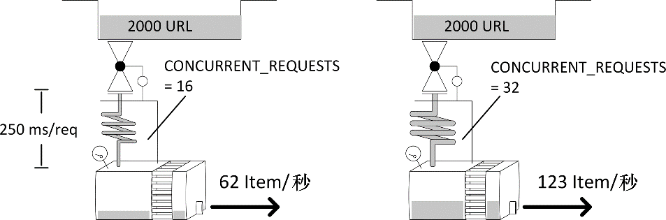
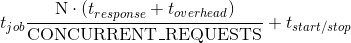

### 10.4　标准性能模型

标准性能模型在Scrapy功能正常且下载器为性能瓶颈时成立。在这种情况下，可以在调度器中看到一些请求，而在下载器中则是并发请求数的最大值（见图10.5）。抓取程序（爬虫和管道）被轻度加载，并且处理中的响应数不会持续增长。


<center class="my_markdown"><b class="my_markdown">图10.5　标准性能模型及一些实验结果</b></center>

有 3 个主要设置用于控制下载器能力： `CONCURRENT_REQUESTS` 、 `CONCURRENT_REQUESTS_PER_DOMAIN` 以及 `CONCURRENT_REQUESTS_PER_IP` 。其中第一个是粗调控制。无论如何都不会在同一时间有超过 `CONCURRENT_REQUESTS` 数量的请求处于活跃状态。而如果你的目标是单个域名或相对较少的几个域名， `CONCURRENT_REQUESTS_PER_DOMAIN` 可能会进一步限制活跃请求的数量。如果设置了 `CONCURRENT_REQUESTS_PER_IP` ，那么 `CONCURRENT_REQUESTS_PER_DOMAIN` 就会被忽略，此时有效的限制将会是针对单个（目标）IP的请求数。比如，当目标是一些共享主机站点时，多个域名可能会指向同一台服务器，该设置可以帮助你不会过度攻击该服务器。

为了保持现在的性能探索尽可能简单，我们通过使 `CONCURRENT_REQUESTS_PER_IP` 保留为默认值（0）以禁用每个IP的限制，并且设置 `CONCURRENT_REQUESTS_PER_DOMAIN` 的值为非常大的数值（1000000）。这样的组合可以有效禁用针对IP和域名的限制，下载器的并发数量可以完全由 `CONCURRENT_REQUESTS` 来控制。

我们希望系统吞吐量依赖于下载页面所花费的平均时间，包括远程服务器部分以及我们的系统（Linux、Twisted/Python）的延迟（t<sub class="my_markdown">download</sub> = t<sub>response</sub> + t<sub>overhead</sub>）。如果能够考虑一些启动和结束时间也是很好的。它包括你得到一个响应的时间与其Item从管道另一端出来的时间之间的间隔，以及在缓存冷启动时，你得到第一个响应之前的时间及性能较差时的时间。

总之，如果你需要完成N个请求的任务，并且我们的爬虫已经得到了适当的调整，那么你应该会在下述公式所得的时间内完成。


我们无法控制这些参数中的大部分，这多少让人有些遗憾。我们可以使用一台更强大的服务器来稍微控制t<sub class="my_markdown">overhead</sub>，类似情况还有t<sub class="my_markdown">start</sub>/t<sub class="my_markdown">stop</sub>（该参数几乎不值得为之努力，因为我们只会在每次运行时才会花费该时间）。除了对N个请求的给定工作量有少许改善外，我们所能细心调整的数值只有 `CONCURRENT_REQUESTS` ，它通常依赖于我们访问远程服务器的困难程度。如果我们将其设定为一个非常大的数值，在某一时刻，会使服务器的CPU能力或远程服务器及时响应的能力达到饱和，也就是说，t<sub class="my_markdown">response</sub>将会突增，因为目标网站对我们实施了限速、封禁，或者我们造成了目标网站宕机。

让我们运行一个实验来检查我们的理论。我们将以t<sub class="my_markdown">response</sub> ∈ {0.125s, 0.25s, 05s}、 `CONCURRENT_REQUESTS` ∈ {8, 16, 32, 64}的条件爬取2000个item，如下所示。

```python
$ for delay in 0.125 0.25 0.50; do for concurrent in 8 16 32 64; do
　　time scrapy crawl speed -s SPEED_TOTAL_ITEMS=2000 \
　　-s CONCURRENT_REQUESTS=$concurrent -s SPEED_T_RESPONSE=$delay
done; done

```

在我的笔记本上，完成2000个请求的时间如表10.1所示（以秒为单位）。

<center class="my_markdown"><b class="my_markdown">表10.1</b></center>

| CONCURRENT_REQUESTS | 125ms/请求 | 250ms/请求 | 500ms/请求 |
| :-----  | :-----  | :-----  | :-----  | :-----  | :-----  |
| 8 | 36.1 | 67.3 | 129.7 |
| 16 | 19.4 | 35.3 | 66.1 |
| 32 | 11.1 | 19.3 | 34.7 |
| 64 | 7.4 | 11.1 | 19.0 |

**警告：** 接下来将会是令人讨厌的计算！你可以略读本段内容。我们可以在图10.5中看到部分结果。通过重新排列最后的公式，我们可以将其转换为更加简单的形式（即y = t<sub class="my_markdown">overhead</sub> · x + t<sub class="my_markdown">start/stop</sub>，其中x = N / CONCURRENT_REQUESTS和y = t<sub class="my_markdown">job</sub> · x + t<sub class="my_markdown">response</sub>）。使用最小二乘法（Excel函数为 `LINEST` ）和前面的数据，我们可以计算得到t<sub class="my_markdown">overhead</sub> = 6ms，而t<sub class="my_markdown">start/stop</sub> = 3.1s。t<sub class="my_markdown">overhead</sub>是一个很小的数值，而启动时间却非常显著，不过它支持了数千个URL的长时间运行。因此，我们将使用一个非常有用的公式，以请求数/秒为单位近似系统的吞吐量，如下所示。


通过运行N个请求的长时间任务，我们可以测量出t<sub class="my_markdown">job</sub>的汇总时间，然后直接计算T。

