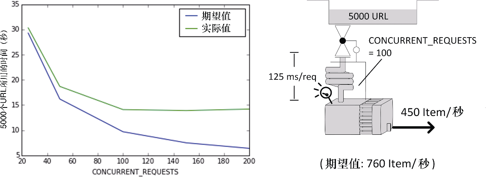

### 10.5.1　案例 #1：CPU饱和

**症状：** 在某些情况下，你增加了并发级别，但没有得到性能提升。当降低并发级别时，一切工作再次回归预期（见图10.6）。你的下载器可以被充分利用，但是似乎每个请求的平均时间出现了激增。当在UNIX/Linux系统中使用 `top` 命令、在Power Shell中使用 `ps` 命令或在Windows中使用任务管理器查看CPU负载如何时，会发现CPU负载非常高。


<center class="my_markdown"><b class="my_markdown">图10.6　当并发增长到一定程度后，性能趋于平缓</b></center>

**示例：** 假设运行了如下命令。

```python
$ for concurrent in 25 50 100 150 200; do
　 time scrapy crawl speed -s SPEED_TOTAL_ITEMS=5000 \
　　-s CONCURRENT_REQUESTS=$concurrent
 done

```

你得到了其抓取5000个URL的时间。在表10.2中，期望值一列是基于前面得到的公式计算所得，而CPU负载是通过 `top` 命令观察得到的（可以在开发机中使用第二个终端运行该命令）。

<center class="my_markdown"><b class="my_markdown">表10.2</b></center>

| CONCURRENT_REQUESTS | 期望值（秒） | 实际值（秒） | 期望值与实际值的百分比 | CPU负载 |
| :-----  | :-----  | :-----  | :-----  | :-----  | :-----  | :-----  |
| 25 | 29.3 | 30.34 | 97% | 52% |
| 50 | 16.2 | 18.7 | 87% | 78% |
| 100 | 9.7 | 14.1 | 69% | 92% |
| 150 | 7.5 | 13.9 | 54% | 100% |
| 200 | 6.4 | 14.2 | 45% | 100% |

在我们的实验中，由于几乎不执行任何处理，因此能够得到高并发。而在一个更复杂的系统中，很可能会更早地看到该行为。

**讨论：** Scrapy重度使用单一线程，当达到很高级别的并发时，CPU可能会成为瓶颈。假设不使用任何线程池，那么Scrapy应当使用的CPU负载建议在80%～90%。请记住你可能在其他系统资源上遇到相似的问题，比如网络带宽、内存或磁盘吞吐量，不过这些都很少见，并且会落入通用系统的管理范畴，因此就不在这里进一步强调了。

**解决方案：** 通常假设你的代码是有效的。你可以通过在同一台服务器上运行多个Scrapy爬虫，以使总计并发超过CONCURRENT_REQUESTS。这可以帮助你利用更多可用核心，尤其是当管道的其他服务或其他线程不使用它们的时候。如果需要更多的并发，可以使用多台服务器（参见第11章），这种情况下可能还需要更多可用的资金、网络带宽以及磁盘吞吐量。始终检查CPU利用率是你的首要约束。

