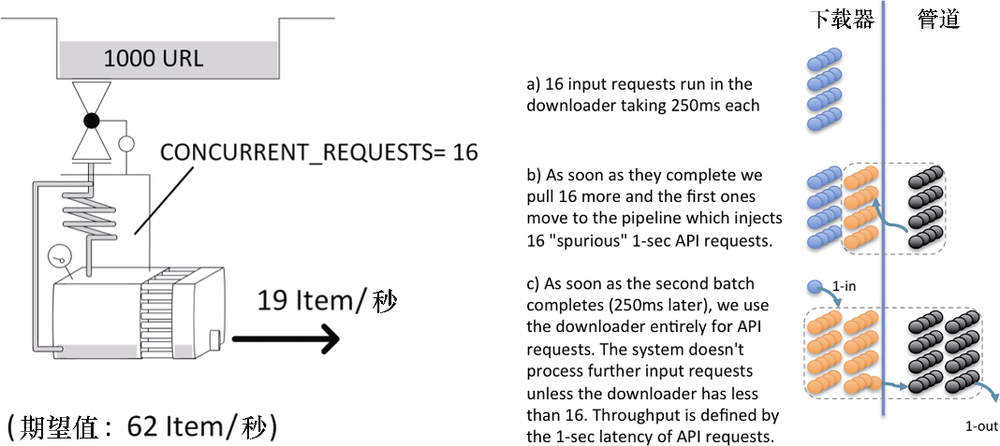
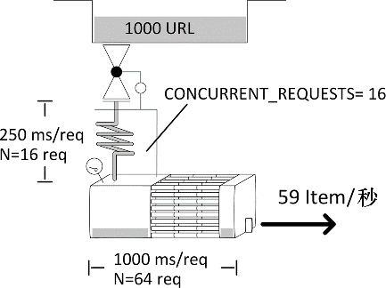

### 10.5.3　案例 #3：下载器中的“垃圾”

**症状：** 你得到的吞吐量低于预期。下载器看起来有时会有比 `CONCURRENT_REQUESTS` 更多的请求。

**示例：** 模拟以0.25秒响应时间的情况下载1000个页面。按照默认的16个并发，根据公式需要花费大约19秒的时间。我们使用一个管道，用 `crawler.engine.download()` 制造到伪造API的额外HTTP请求，其响应时间在 1 秒之内。你可以通过 `http:// localhost:9312/benchmark/ar:1/api?text=hello` 进行尝试（见图10.8）。让我们运行一个爬取程序。

```python
$ time scrapy crawl speed -s SPEED_TOTAL_ITEMS=1000 -s SPEED_T_
RESPONSE=0.25 -s SPEED_API_T_RESPONSE=1 -s SPEED_PIPELINE_API_VIA_
DOWNLOADER=1
...
s/edule　d/load　scrape　p/line　done　　mem
　　968　　　32　　　32　　　32　　 0　32768
　　952　　　16　　　 0　　　 0　　32　　　0
　　936　　　32　　　32　　　32　　32　32768
...
real 0m55.151s

```


<center class="my_markdown"><b class="my_markdown">图10.8　由虚假API请求数定义的性能</b></center>

非常奇怪！我们的任务不但花费了预期的 3 倍时间，还超出了下载器定义的 `CONCURRENT_REQUESTS` 所设定的16个活跃请求数（ `d/load` ）。下载器显然是瓶颈，因为它在超负荷工作。我们重新运行爬取程序，并在另一个控制台中打开到Scrapy的telnet连接。之后，就可以查看下载器中有哪些请求是活跃的了。

```python
$ telnet localhost 6023
>>> engine.downloader.active
set([<POST http://web:9312/ar:1/ti:1000/rr:0.25/benchmark/api>, ... ])

```

看起来它处理的大部分是API请求，而不是下载正常页面。

**讨论：** 你可能会认为没有人使用 `crawler.engine.download()` ，因为它看起来会比较复杂，不过它在Scrapy的基代码中使用了两次，分别是 `robots.txt` 中间件和多媒体管道。因此，当人们需要使用Web API时，它也会被推荐为一种解决方案。因为使用它要比使用阻塞API更好，比如我们在前面章节中看到的流行的Python包 `requests` ；而且，使用它还会比理解Twisted编程和使用 `treq` 简单一些。现在既然有了咱们这本书，这些就不再是使用它的借口了。另一方面，该错误非常难调试，所以应当在研究性能时主动检查下载器中的活跃请求。如果发现API或多媒体URL不是你爬取的直接目标，那么就意味着某些管道使用了 `crawler.engine.download()` 来执行HTTP请求。由于我们的 `CONCURRENT_REQUESTS` 限制不适用于这些请求，也就意味着我们很可能看到下载器加载的请求数超过 `CONCURRENT_ REQUESTS` ，乍看起来有些矛盾。除非虚假请求数降低到 `CONCURRENT_ REQUESTS` 以下，否则调度器不会获取新的正常页面请求。

因此，我们从系统中得到的吞吐量相当于原始请求持续1秒（API延迟），而不是0.25秒（页面下载延迟）的吞吐量不是一种巧合。这种情况特别容易令人困惑，因为除非API调用比页面请求慢，否则我们不会注意到任何性能下降。

**解决方案：** 我们可以使用 `treq` 代替 `crawler.engine.download()` 来解决该问题。你将发现这会使抓取程序的性能突增，这对于API架构来说可能是个坏消息。我将从一个低数值的CONCURRENT_REQUESTS开始，逐渐增长以确保不会使API服务器过载。

下面是和前面相同的运行示例，不过这次使用了 `treq` 。

```python
$ time scrapy crawl speed -s SPEED_TOTAL_ITEMS=1000 -s SPEED_T_
RESPONSE=0.25 -s SPEED_API_T_RESPONSE=1 -s SPEED_PIPELINE_API_VIA_TREQ=1
...
s/edule　d/load　scrape　p/line　done　　mem
　　936　　　16　　　48　　　32　　 0　49152
　　887　　　16　　　65　　　64　　32　66560
　　823　　　16　　　65　　　52　　96　66560
...
real 0m19.922s

```

你会发现一个非常有趣的事情。管道（ `p/line` ）似乎包含比下载器（ `d/load` ）更多的条目（见图10.9）。这种情况非常好，并且了解其原因也很有趣。


<center class="my_markdown"><b class="my_markdown">图10.9　拥有长管道非常完美（在Google图片中查看“industrial heat exchanger”）</b></center>

下载器如预期一样，充分加载了16个请求。也就是说，系统吞吐量为T = N / S = 16 / 0.25= 64个请求/秒。我们可以通过观察 `done` 列的增长进行确认。一个请求会在下载器中花费0.25秒，但是由于缓慢的API请求，它会在管道中花费1秒的时间。这意味着在管道中（p/line），我们期望看到平均N = T·S = 64·1 = 64个Item。非常好。这表示现在管道有瓶颈吗？不，因为我们没有限制同时在管道中处理的响应数量。只要数值不是无限增加，就能够很好地运行。在下一节中，我们将看到更多关于这个问题的讨论。

