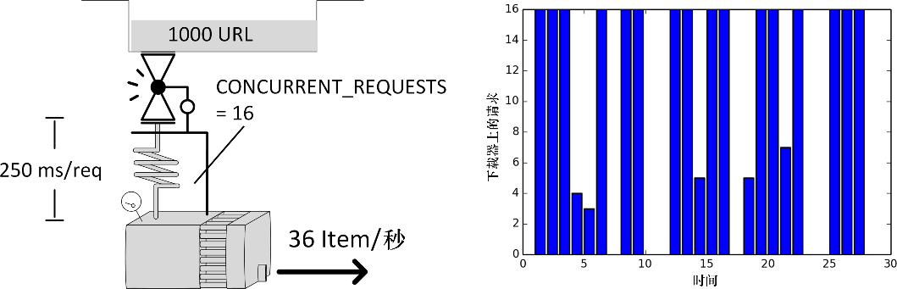

### 10.5.4　案例 #4：大量响应或超长响应造成的溢出

**症状：** 下载器几乎满负荷运转，并且一段时间后关闭。该模式不断重复。抓取程序的内存使用率很高。

**示例：** 此处我们使用了和前面一样的设置（使用了 `treq` ），不过响应会比较大，大约是120KB的HTML。如你所见，此时花费了31秒的时间完成，而不是20秒左右（见图10.10）。

```python
$ time scrapy crawl speed -s SPEED_TOTAL_ITEMS=1000 -s SPEED_T_
RESPONSE=0.25 -s SPEED_API_T_RESPONSE=1 -s SPEED_PIPELINE_API_VIA_TREQ=1 
-s SPEED_DETAIL_EXTRA_SIZE=120000
s/edule　d/load　scrape　p/line　done　　　mem
　　952　　　16　　　32　　　32　　 0　3842818
　　917　　　16　　　35　　　35　　32　4203080
　　876　　　16　　　41　　　41　　67　4923608
　　840　　　 4　　　48　　　43　 108　5764224
　　805　　　 3　　　46　　　27　 149　5524048
...
real 0m30.611s

```


<center class="my_markdown"><b class="my_markdown">图10.10　下载器中不规则的请求数表示响应大小限流</b></center>

**讨论：** 我们可能会天真地尝试将这种延迟解释为“创建、传输、处理页面需要花费更多时间”，不过这并不是此处发生的情况。此处有一个硬编码（编写代码时写入）的对请求总大小的限制： `max_active_size`  = 5000000。假设每个请求的大小等于其请求体的大小，并且至少是1KB。

一个重要的细节是，该限制可能是Scrapy最巧妙且本质的机制，用于防止过慢的爬虫或管道。如果你的任何一个管道的吞吐量比下载器的吞吐量更慢，最终就会发生这种情况。当管道处理时间过长时，即使很小的请求，也很容易触发该限制。下面是一个管道超长的极端案例，80秒之后就会开始产生问题。

```python
$ time scrapy crawl speed -s SPEED_TOTAL_ITEMS=10000 -s SPEED_T_
RESPONSE=0.25 -s SPEED_PIPELINE_ASYNC_DELAY=85

```

**解决方案：** 对于已存在的基础架构，针对该问题几乎无计可施。当你不再需要时（比如爬虫之后），清空响应体是个不错的选择，不过在写操作时执行该操作不会重置Scraper的计数器。所有你能做的就是降低管道的处理时间，从而有效减少Scraper中处理的响应数量。可以使用传统的优化手段实现它：检查可能与之交互的API或数据库是否能够支持抓取程序的吞吐量；分析抓取程序；将功能管道移动到批处理/后处理系统；使用更强大的服务器或分布式爬取。

