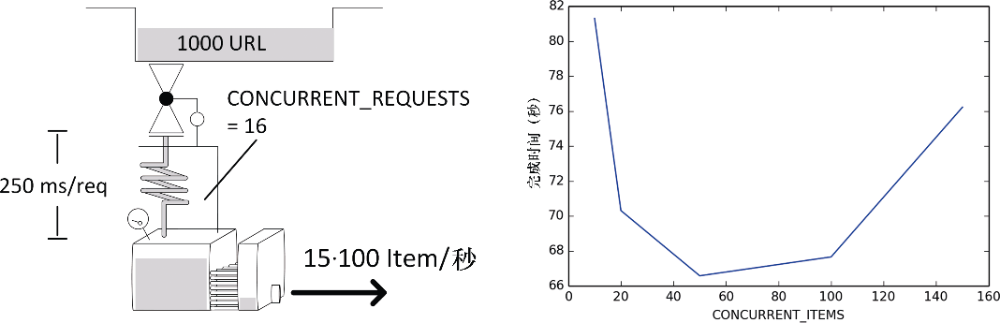

### 10.5.5　案例 #5：有限/过度item并发造成的溢出

**症状：** 你的爬虫为每个响应创建了多个Item。你得到的吞吐量低于预期，并且可能和前面案例中的开/关模式相同。

**示例：** 这里，我们有一个稍微不太一样的设置，我们有1000个请求，并且它们的每个返回页面都有100个Item。响应时间是0.25秒，Item管道处理时间为3秒。我们设置 `CONCURRENT_ITEMS` 的值从10到150，执行多次。

```python
for concurrent_items in 10 20 50 100 150; do
time scrapy crawl speed -s SPEED_TOTAL_ITEMS=100000 -s \
SPEED_T_RESPONSE=0.25 -s SPEED_ITEMS_PER_DETAIL=100 -s \
SPEED_PIPELINE_ASYNC_DELAY=3 -s \
CONCURRENT_ITEMS=$concurrent_items
done
...
s/edule　d/load　scrape　p/line　done　　 mem
　　952　　　16　　　32　　 180　　 0　243714
　　920　　　16　　　64　　 640　　 0　487426
　　888　　　16　　　96　　 960　　 0　731138
...

```

**讨论：** 值得再次注意，该情况只适用于爬虫为每个响应生成多个Item时。除这种情况外，你应该设置 `CONCURRENT_ITEMS = 1` ，然后忘了它。另外还需注意的是，这是一个虚拟的示例，因为其吞吐量相当大，达到了每秒大约1300个Item。之所以达到如此高的吞吐量，是因为延迟低且稳定、几乎没有真实处理，以及响应的大小很小。这种情况并不常见。

我们首先要注意的事情是，在此之前 `scrape` 和 `p/line` 列通常都是相同的数值，而现在 `p/line` 则是 `CONCURRENT_ITEMS · scrape` 。这是符合预期的，因为 `scrape` 显示的是响应数，而 `p/line` 则是 `Item` 数。

第二个有意思的事情是图10.11所示的浴缸形状的性能函数。由于纵轴是缩放的，因此该图表看起来会比实际情况更显著。在左侧，延迟非常高，因为触及了前一节所提到的内存限制。而在右侧，并发过多，造成使用了过多的CPU。获得最佳效果并不那么重要，因为向左右移动非常容易。


<center class="my_markdown"><b class="my_markdown">图10.11　以CONCURRENT_ITEMS为变量的爬取时间函数</b></center>

**解决方案：** 检测本案例的两种问题症状非常容易。如果CPU使用率过高，那么最好减少 `CONCURRENT_ITEMS` 的值。如果触及响应的5MB限制，那么你的管道无法跟上下载器的吞吐量，增加 `CONCURRENT_ITEMS` 的值可能能够快速解决该问题。如果修改后没有什么区别，那么应当遵照前面一节给出的建议，再三询问自己系统的其余部分是否能够支持你的抓取程序的吞吐量。

