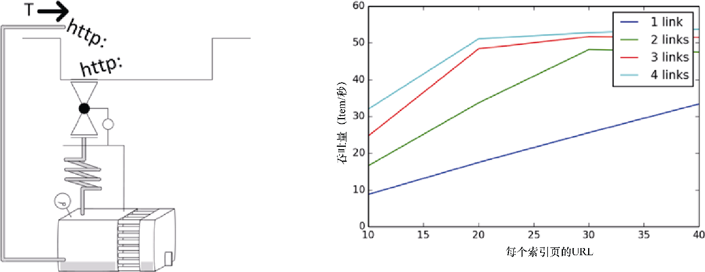

### 10.5.6　案例 #6：下载器未充分利用

**症状：** 你增加了 `CONCURRENT_REQUESTS` 的值，但是下载器并未跟上，没能充分利用。调度器是空的。

**示例：** 首先，我们运行一个没有问题的示例。我们将切换到1秒的响应时间，因为它能够简化计算量，使下载器的吞吐量T = N / S = N / 1 =  `CONCURRENT_REQUESTS` 。假设按照如下命令运行。

```python
$ time scrapy crawl speed -s SPEED_TOTAL_ITEMS=500 \
-s SPEED_T_RESPONSE=1 -s CONCURRENT_REQUESTS=64
s/edule　d/load　scrape　p/line　done　mem
　　 436　　　64　　　 0　　　 0　　 0　　0
...
real 0m10.99s

```

我们得到了一个充分利用的下载器（64个请求），总时间为11秒，与我们以每秒64个请求的条件处理500个URL的模型相匹配（S = N / T + t<sub class="my_markdown">start/stop</sub> = 500 / 64 + 3.1 = 10.91秒）。

现在，执行相同的爬取，不过不再像前面那些示例那样默认从列表中提供URL，而是使用索引页通过 `SPEED_START_REQUESTS_STYLE=UseIndex` 抽取URL。这和我们本书中其他章使用的模式相同。每个索引页默认包含20个URL。

```python
$ time scrapy crawl speed -s SPEED_TOTAL_ITEMS=500 \
-s SPEED_T_RESPONSE=1 -s CONCURRENT_REQUESTS=64 \
-s SPEED_START_REQUESTS_STYLE=UseIndex
s/edule　d/load　scrape　p/line　done　 mem
　　　 0　　　 1　　　 0　　　 0　　 0　　 0
　　　 0　　　21　　　 0　　　 0　　 0　　 0
　　　 0　　　21　　　 0　　　 0　　20　　 0
...
real 0m32.24s

```

很明显，这和前面的案例不太一样。不知为何，下载器的运行低于其最大能力，并且吞吐量为T = N / S−t<sub class="my_markdown">start/stop</sub> = 500 / (32.2 - 3.1) = 17个请求/秒。

**讨论：** 快速浏览 `d/load` 列，可以确信下载器没能充分利用。这是因为我们没有足够的URL提供给它。我们的抓取处理生成URL的速度比最大消费能力要慢。在本例中，每个索引页会生成20个URL加上1个前往下一索引页的URL。吞吐量无论如何都无法超过每秒20个请求，因为我们无法足够快地得到源URL。该问题非常隐蔽，容易被忽视。

**解决方案：** 如果每个索引页包含一个以上的下一页的链接，那么可以利用它们加速URL的生成。如果可以找到显示更多结果的索引页面（比如50个）就更好了。我们可以通过运行几个模拟来观察其行为。

```python
$ for details in 10 20 30 40; do for nxtlinks in 1 2 3 4; do
time scrapy crawl speed -s SPEED_TOTAL_ITEMS=500 -s SPEED_T_RESPONSE=1 \
-s CONCURRENT_REQUESTS=64 -s SPEED_START_REQUESTS_STYLE=UseIndex \
-s SPEED_DETAILS_PER_INDEX_PAGE=$details \
-s SPEED_INDEX_POINTAHEAD=$nxtlinks
done; done

```

在图10.12中，可以看到吞吐量是如何根据这两个参数变化的。我们观察到了线性行为，无论是下一页链接，还是详情页，直到达到系统上限。可以通过重新排列爬取的 `Rule` 进行实验。如果使用LIFO（默认）顺序，你可能会看到如果先调用索引页请求，最后在列表中抽取它们的话，能够得到较小的改善。你也可以尝试为访问索引页的请求设置高优先级。虽然这两种技术都没有显著的改善，但可以通过分别设置 `SPEED_INDEX_RULE_LAST=1` 和 `SPEED_INDEX_HIGHER_PRIORITY=1` 来进行尝试。请注意这两种解决方案都会首先下载整个索引页（由于优先级高），因此会在调度器中生成大量URL，增加内存需求。在它们完成所有索引之前，只会给出少量的结果。对于少量索引还可以接受，但是对于大量索引的情况，就不太可取了。


<center class="my_markdown"><b class="my_markdown">图10.12　以每个索引页链接的详情页及下一页数量为变量的吞吐量函数</b></center>

一个简单而又强大的技术是索引分片。这就需要你使用超过一个初始索引URL，在它们之间有一个最大距离。比如，如果索引包含100页，你可以选取1和51作为起始索引。然后，爬虫可以以两倍速率使用下一页链接有效遍历索引。如果你能找到一种遍历索引的方式，比如基于产品的品牌或提供给你的任何其他属性，并且可以将其按照大致相等的段进行拆分的话，也可以做到类似的事情。你可以使用 `-s SPEED_INDEX_SHARDS` 设置进行模拟。

```python
$ for details in 10 20 30 40; do for shards in 1 2 3 4; do
time scrapy crawl speed -s SPEED_TOTAL_ITEMS=500 -s SPEED_T_RESPONSE=1 \
-s CONCURRENT_REQUESTS=64 -s SPEED_START_REQUESTS_STYLE=UseIndex \
-s SPEED_DETAILS_PER_INDEX_PAGE=$details -s SPEED_INDEX_SHARDS=$shards
done; done

```

结果要比前面的技术更好，如果该方法适合你的话，我将会推荐这种方法，因为它更加简单整洁。

