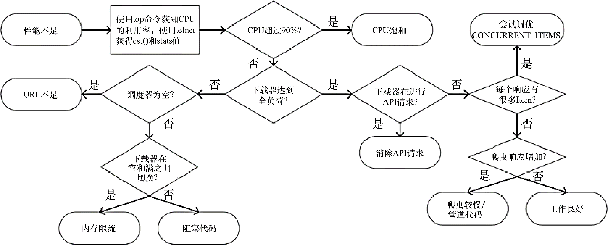

### 10.6　故障排除流程

总结来说，Scrapy在设计时就将下载器作为瓶颈。从一个低数值的 `CONCURRENT_REQUESTS` 开始，逐渐增加，直到触及下述限制之一：

+ CPU使用率大于80%～90%；
+ 源网站延迟过度增长；
+ 抓取程序中响应达到了5MB的内存限制。

同时，执行以下操作：

+ 始终保持调度器队列（mqs/dqs）中至少有一定量的请求，避免下载器出现URL饥饿；
+ 永远不要使用任何阻塞代码或CPU密集型代码。

图10.13总结了诊断并修复Scrapy性能问题的过程。

<b class="my_markdown">图10.13　Scrapy性能问题故障排除</b>

