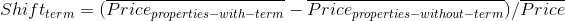

### 11.1　房产的标题是如何影响价格的

我们尝试解决的示例问题是找出标题是如何与房产价格相关的。我们会认为诸如“Jacuzzi”或“pool”这样的词汇与高价位相关，而类似“discount”这样的词汇与低价位相关。结合位置信息，就可能根据该位置信息和描述，为我们提供房产是否特价的实时报警。

我们所需要计算的是给定词汇在是否存在时的价格差：

比如，假设平均租金为$1000，我们观察到包含词汇jacuzzi的房产平均价格是$1300，而不包含该词汇的房产平均价格是$995，那么jacuzzi的价格差为shiftjacuzzi = (1300−995) / 1000 = 30.5%。如果存在一个包含jacuzzi关键词的房产，其价格只比平均价格高出5%，那么我会非常想要了解它。

请注意，该指标并非微不足道，因为关键词的效果将会被聚合。例如，既包含jacuzzi又包含discount的标题很可能显示出这些关键词的组合效果。我们收集并分析的数据越多，预估的准确度越高。下面我们将回到该问题上来，讲解如何在一分钟内实现一个流媒体解决方案。

