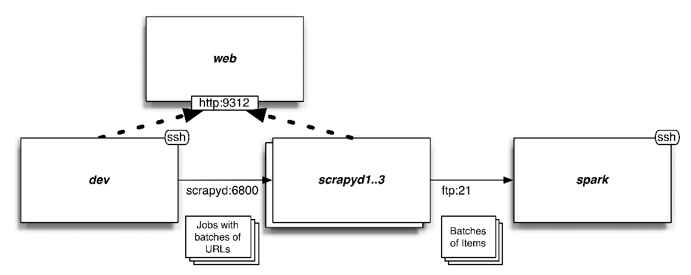

### 11.3　分布式系统概述

对我来说，设计该系统是一个非常棒的经历（见图11.2）。起初，我增加了功能和复杂性，以至于不得不要求读者拥有高端硬件才能运行这些示例。这就造成之后的一个紧迫需求成为简化——无论是为了保持硬件需求更加实际，还是确保本章能够保持专注在Scrapy上。

<b class="my_markdown">图11.2　系统概述</b>

最后，本章将要使用的系统包含我们的开发机以及几个其他服务器。我们将使用开发机执行索引页面的垂直抓取，并从中批量抽取URL。之后，将以轮询的方式将这些URL分发到Scrapyd节点当中执行爬取。最后，包含 `Item` 的 `.jl` 文件将会通过FTP传输到运行Apache Spark的服务器中。什么？FTP？是的，我选择FTP和本地文件系统，而不是HDFS或Apache Kafka的原因是因为其内存需求很低，并且Scrapy后端的FEED_URI能够直接支持。请注意，通过简单修改Scrapyd和Spark的配置，我们可以使用Amazon S3来存储这些文件，享受其带来的冗余性、扩展性等诸多特性。不过，这里不会有更多有意思的相关话题来学习任何奇技淫巧。

> 
> 使用FTP的一个风险是Spark可能会在其上传过程中看到不完整的文件。为了避免发生该问题，我们将使用Pure-FTPd以及一个回调脚本，在上传完成后立即将上传的文件移动到 `/root/items` 目录中。

每隔几秒，Spark将会检测该目录（ `/root/items` ），读取任何新文件，形成小批次，并执行分析。我们使用Apache Spark是因为它支持Python作为其编程语言，并且还支持流。到目前为止，我们可能已经使用了一些生命周期相对较短的爬取工作，不过现实世界中许多爬取工作永远都不会结束。爬取工作24/7不间断运行，并提供用于分析的数据流，数据越多其结果就越精确。正因如此，我们将使用Apache Spark进行展示。

> 
> 使用Apache Spark和Scrapy并没有什么特殊之处。你也可以选择使用Map-Reduce、Apache Storm或任何其他适合你需求的框架。

在本章中，我们并不会将 `Item` 插入到诸如ElasticSearch或MySQL等数据库当中。第9章中介绍的技术在这里同样适用，不过其性能会很糟糕。当你每秒钟执行数千次写入操作时，只有极少数的数据库系统能够运行良好，但这正是我们的管道将会做的事情。如果我们想要向数据库中插入数据，则需要遵循与使用Spark相似的流程，即批量导入生成的 `Item` 文件。你可以修改我们的Spark示例流程，批量导入到任意数据库当中。

最后需要注意的是，该系统并没有良好的弹性。我们假设各节点都是健康的，并且任何失败都不会产生严重的业务影响。Spark拥有弹性配置，能够提供高可用性。而除了Scrapyd的持久化队列外，Scrapy并没有提供任何相关的内建功能，这就意味着失败的任务需要在节点恢复后才能重新启动。这种方式对于你的需求来说，也许适合，也许不适合。如果对你而言弹性十分重要，那么你需要搭建监控和分布式队列方案（如基于Kafka或RabbitMQ），来重启失败的爬取工作。

