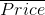
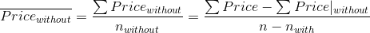
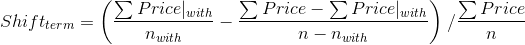

### 11.6　使用Apache Spark流计算偏移量

此刻，我们的Scrapy系统功能齐全。现在，让我们快速看一下Apache Spark的功能。

在本章最开始介绍的公式shift<sub class="my_markdown">term</sub>非常简单好用，但是无法有效实现。我们可以通过两个计数器计算，使用2·n<sub class="my_markdown">terms</sub>个计数器计算，每个新价格只需更新其中的4个。不过计算则是一个很大的问题，因为对于每个新价格来说，都需要更新2·(n<sub class="my_markdown">terms</sub>−1)个计数器。比如，我们需要添加jacuzzi的价格到每个Price<sub class="my_markdown">without</sub>计数器中，而不是只有jacuzzi这一个。这会造成算法由于包含大量条件而不可行。

为了解决该问题，我们所能注意到的是，如果我们将带某个条件的房产价格，与不带相同条件的房产价格相加，将会得到所有房产的价格（很明显！），即ΣPrice = ΣPrice|<sub class="my_markdown">with</sub> +ΣPrice|<sub class="my_markdown">without</sub>。因此，不带某个条件的房产平均价格可以使用如下的代价很小的操作进行计算。


使用该公式，偏移公式变为如下所示。


现在让我们看看如何实现该公式。请注意此处不是Scrapy的代码，因此感到有些陌生是很正常的，不过你仍然可以不费太多力气就能阅读并理解该代码。你可以在 `boostwords.py` 中找到该应用。请记住该代码中包含很多复杂的测试代码，你可以安全地忽略它们。其核心代码如下所示。

```python
# Monitor the files and give us a DStream of term-price pairs
raw_data = raw_data = ssc.textFileStream(args[1])
word_prices = preprocess(raw_data)
# Update the counters using Spark's updateStateByKey
running_word_prices = word_prices.updateStateByKey(update_state_function)
# Calculate shifts out of the counters
shifts = running_word_prices.transform(to_shifts)
# Print the results
shifts.foreachRDD(print_shifts)
```

Spark使用所谓的 `DStream` 表示数据流。 `textFileStream()` 方法监控文件系统的目录，当它检测到新文件时，将会从中获取数据流。 `preprocess()` 函数将其转变为条件/价格对的数据流。我们通过Spark的 `updateStateByKey()` 方法，使用 `update_state_function()` 函数，在运行的计数器中聚合这些条件/价格对。最后，通过运行 `to_shifts()` 计算偏移量，并使用 `print_shifts()` 函数打印出最佳结果。我们的大部分功能都很简单，它们只是按照对Spark高效的方式形成数据。最有意思的例外是我们的 `to_shifts()` 函数。

```python
def to_shifts(word_prices):
　　(sum0, cnt0) = word_prices.values().reduce(add_tuples)
　　avg0 = sum0 / cnt0
　　def calculate_shift((isum, icnt)):
　　　　avg_with = isum / icnt
　　　　avg_without = (sum0 - isum) / (cnt0 - icnt)
　　　　return (avg_with - avg_without) / avg0
　　return word_prices.mapValues(calculate_shift)
```

它如此紧密地遵循公式，令人印象非常深刻。除了其简单性之外，Spark的 `mapValues()` 使我们的（可能多台）Spark服务器能够以最小网络开销高效运行 `calculate_shift` 。

