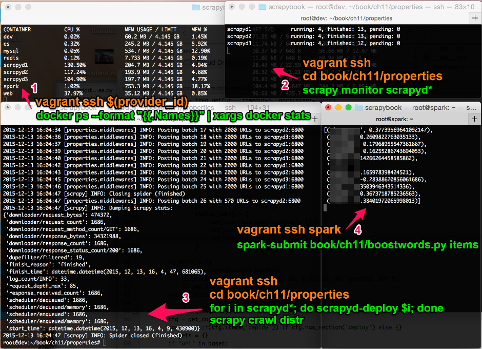

### 11.7　运行分布式爬取

我通常使用4个终端查看爬取的完成进度。为了使本节自成一体，因此我还为你提供了打开到相关服务器终端的 `vagrant ssh` 命令（见图11.3）。


<center class="my_markdown"><b class="my_markdown">图11.3　使用4个终端监控爬取</b></center>

在终端1中，我喜欢监控多台服务器的CPU和内存使用率。这有助于识别和修复潜在问题。要想启动它，可运行如下命令。

```python
$ alias provider_id="vagrant global-status --prune | grep 'docker-
provider' | awk '{print \$1}'"
$ vagrant ssh $(provider_id)
$ docker ps --format "{{.Names}}" | xargs docker stats

```

前面两行稍微复杂的代码允许通过ssh登录到docker provider VM中。如果使用的不是虚拟机，而是运行在docker驱动的Linux机器上，那么只需要最后一行。

第2个终端同样用于诊断，一般按照如下命令使用它运行 `scrapy monitor` 。

```python
$ vagrant ssh
$ cd book/ch11/properties
$ scrapy monitor scrapyd*

```

请记住使用 `scrapyd*` 以及以服务器名称命名的空文件， `scrapy monitor scrapyd*` 将被扩展为 `scrapy monitor scrapyd1 scrapyd2 scrapyd3` 。

第3个终端是我们的开发机，我们在这里启动爬虫。除此之外，大部分时间是空闲的。如果想要启动一个新的爬虫，可以执行如下命令。

```python
$ vagrant ssh
$ cd book/ch11/properties
$ for i in scrapyd*; do scrapyd-deploy $i; done
$ scrapy crawl distr

```

最后两行是最基本的。首先，我们使用 `for` 循环及 `scrapyd-deploy` 部署爬虫到服务器中。然后，使用 `scrapy crawl distr` 启动爬取操作。我们也可以运行更少的爬取操作，比如 `scrapy crawl distr -s CLOSESPIDER_PAGECOUNT=100` ，以爬取大约100个索引页，相当于大概3000个详情页。

最后的第4个终端用于连接Spark服务器，我们将使用它运行数据流分析任务。

```python
$ vagrant ssh spark
$ pwd
/root
$ ls
book items
$ spark-submit book/ch11/boostwords.py items

```

只有最后一行是最基本的，在该行中运行了 `boostwords.py` ，并将我们本地的 `items` 目录提供给监控。有时，我还会使用 `watch ls -l items` 来关注Item文件的到达情况。

究竟哪些关键词对价格影响最大呢？我把它作为惊喜，留给那些一直跟随下来的读者们。

