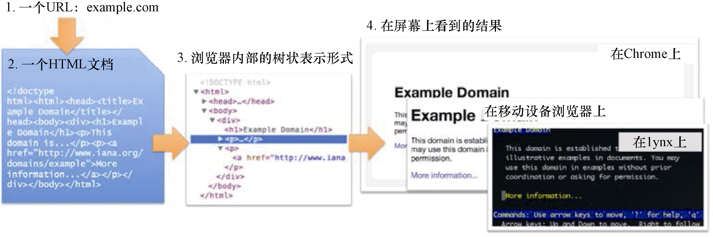

### 2.1　HTML、DOM树表示以及XPath

让我们花费一些时间来了解从用户在浏览器中输入URL（或者更常见的是，在其单击链接或书签时）到屏幕上显示出页面的过程。从本书的视角来看，该过程包含4个步骤，如图2.1所示。

<b class="my_markdown">图2.1</b>

+ 在浏览器中输入URL。URL的第一部分（域名，比如 `gumtree.com` ）用于在网络上找到合适的服务器，而URL以及cookie等其他数据则构成了一个请求，用于发送到那台服务器当中。
+ 服务端回应，向浏览器发送一个HTML页面。需要注意的是，服务端也可能返回其他格式，比如XML或JSON，不过目前我们只关注HTML。
+ 将HTML转换为浏览器内部的树状表示形式： **文档对象模型** （ **Document Object Model** ， **DOM** ）。
+ 基于一些布局规则渲染内部表示，达到你在屏幕上看到的视觉效果。

下面来看看这些步骤，以及它们所需的文档表示。这将有助于定位你想要抓取并编写程序获取的文本。

