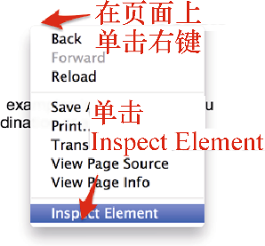
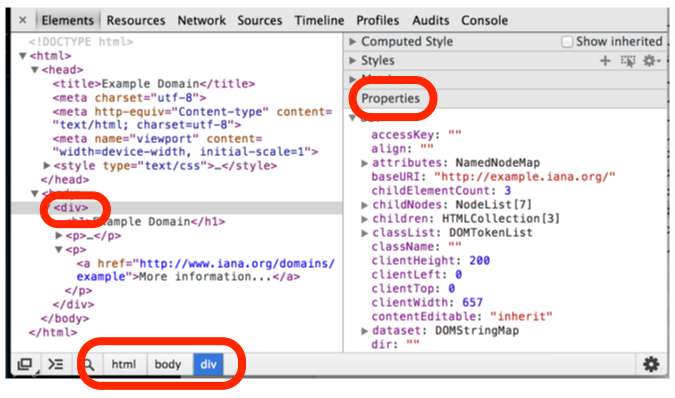

### 2.1.3　树表示法

每个浏览器都有其自身复杂的内部数据结构，凭借它来渲染网页。DOM表示法具有跨平台、语言无关性等特点，并且被大多数浏览器所支持。

想要在Chrome中查看网页的树表示法，可以右键单击你感兴趣的元素，然后选择 **Inspect Element** 。如果该功能被禁用，你仍然可以通过单击Chrome菜单并选择 **Tools | Developer Tools** 来访问它，如图2.2所示。

<b class="my_markdown">图2.2</b>

此时，你可以看到一些看起来和HTML表示非常相似但又不完全相同的东西。它就是HTML代码的树表示法。如果不管原始HTML文档是如何使用空格和换行符的话，它看起来几乎就是一样的。你可以单击每个元素，检查或调整属性等，同时可以在屏幕上观察这些变动有何影响。比如，当你双击某个文本，修改它，并按下回车键时，屏幕上的文本将会更新为这个新值。在右侧的 **Properties** 标签下，可以看到这个树表示法的属性，并且在底部可以看到一个类似面包屑的结构，它显示出了当前选择的元素在HTML元素层次结构中的确切位置，如图2.3所示。

<b class="my_markdown">图2.3</b>

需要注意的一个重要事情是，HTML只是文本，而树表示法是浏览器内存里的对象，你可以通过编程的方式查看并操纵它，比如在Chrome中使用 **Developer Tools** 。

