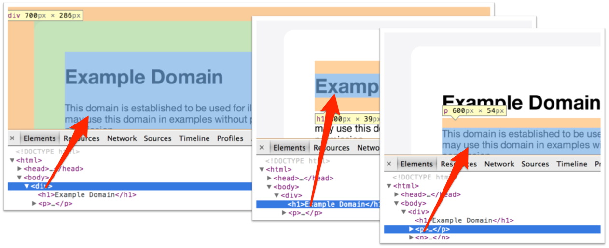

### 2.1.4　你会在屏幕上看到什么

HTML文本表示和树表示并不包含任何像我们通常在屏幕上看到的那种漂亮视图。这实际上是HTML成功的原因之一。它应该是一个由人类阅读的文档，并且可以指定页面中的内容，而不是用于在屏幕中渲染的方式。这意味着选择HTML文档并使其更加好看是浏览器的责任，不管它是诸如Chrome的全功能浏览器、移动设备浏览器，甚至是诸如Lynx的纯文本浏览器。

也就是说，网络的发展促使Web开发者和用户对网页渲染的控制产生了巨大需求。CSS的创建就是为了对HTML元素如何渲染给予提示。不过，对于抓取而言，我们并不需要任何和CSS相关的东西。

那么，树表示法是如何映射到我们在屏幕上所看到的东西呢？答案就是框模型。正如DOM树元素可以包含其他元素或文本一样，默认情况下，当在屏幕上渲染时，每个元素的框表示同样也都包含其嵌入元素的框表示。从这种意义上说，我们在屏幕上所看到的是原始HTML文档的二维表示——树结构也以一种隐藏的方式作为该表示的一部分。比如，在图2.4中，我们可以看到3个DOM元素（一个 `
` 和两个嵌入元素 `<h1>` 和 `
` ）是如何在浏览器和DOM中呈现的。

<b class="my_markdown">图2.4</b>

