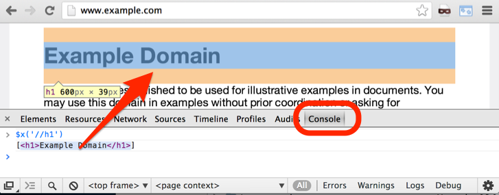

### 2.2　使用XPath选择HTML元素

如果你具有传统软件工程背景，并且不了解XPath相关知识的话，可能会担心为了访问HTML文档中的信息，你将需要做很多字符串匹配、在文档中搜索标签、处理特殊情况等工作，或是需要设法解析整个树表示法以获取你想抽取的东西。有一个好消息是这些工作都不是必需的。你可以通过一种称为XPath的语言选择并抽取元素、属性和文本，这种语言正是专门为此而设计的。

为了在Google Chrome浏览器中使用XPath，需要单击 **Developer Tools** 的 **Console** 标签，并使用 `$x` 工具函数。比如，你可以尝试在 `http://example. com/` 上使用 `$x('//h1')` 。它将会把浏览器移动到 `<h1>` 元素上，如图2.5所示。

<b class="my_markdown">图2.5</b>

你在Chrome的 **Console** 标签中将会看到返回的是一个包含选定元素的JavaScript数组。如果将鼠标指针移动到这些属性上，被选取的元素将会在屏幕上高亮显示，这样就会十分方便。

