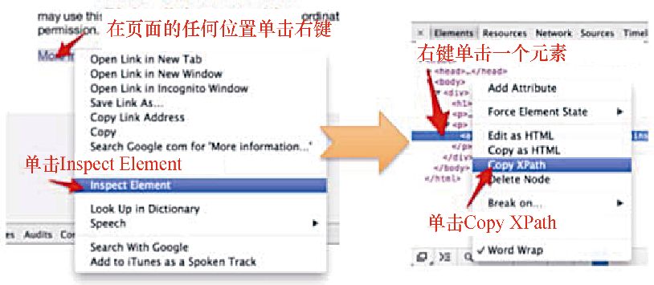

### 2.2.2　使用Chrome获取XPath表达式

Chrome通过向我们提供一些基本的XPath表达式，从而对开发者更加友好。从前文提到的检查元素开始：右键单击想要选取的元素，然后选择 **Inspect Element** 。该操作将会打开 **Developer Tools** ，并且在树表示法中高亮显示这个HTML元素。现在右键单击这里，在菜单中选择 **Copy XPath** ，此时XPath表达式将会被复制到剪贴板中。上述过程如图2.6所示。


<center class="my_markdown"><b class="my_markdown">图2.6</b></center>

你可以和之前一样，在命令行中测试该表达式。

```python
$x('/html/body/div/p[2]/a')
  [ <a href="http://www.iana.org/domains/example">More
information...</a>]

```

