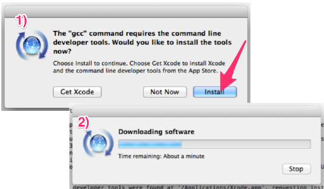

### 3.1.1　MacOS

为了更加方便地阅读本书，请按照后面给出的Vagrant使用说明操作。如果你想直接在MacOS系统中安装Scrapy，其实也很简单。只需要输入下面的命令即可。

```python
$ easy_install scrapy

```

然后，一切都会为你准备好。在过程中，可能会要求你填写密码或安装Xcode，如图3.1所示。这些都没有问题，你可以放心地接受这些请求。


<center class="my_markdown"><b class="my_markdown">图3.1</b></center>

