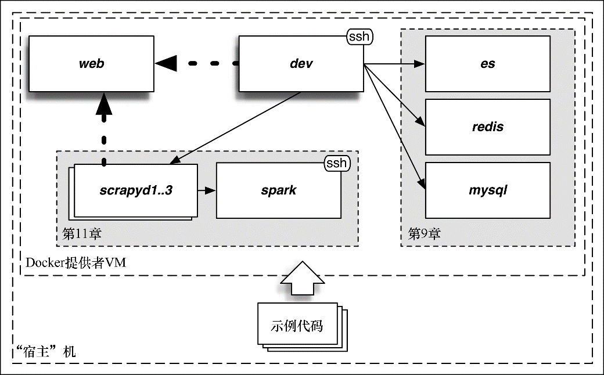

### 3.1.6　Vagrant：本书中运行示例的官方方式

本书中会有很多复杂但又有趣的例子，其中一些例子会用到很多服务。无论是处于初学还是进阶阶段，都可以运行本书中的这些示例，这是因为被称为Vagrant的程序可以让我们仅仅使用简单的命令就能准备好这个复杂的系统。本书中使用的系统如图3.2所示。


<center class="my_markdown"><b class="my_markdown">图3.2　本书使用的系统</b></center>

在Vagrant的术语中，你的电脑或笔记本被称为“宿主”机。Vagrant使用宿主机运行Docker提供者VM（虚拟机）。这些技术可以让我们拥有一个隔离的系统，在其中拥有其私有网络，可以忽略宿主机的软硬件，运行本书中的示例。

大部分章节只使用了两个服务："dev"机器和"web"机器。我们登录到dev机器中运行爬虫，抓取web机器中的页面。后面的一些章节会用到更多的服务，包括数据库和大数据处理引擎。

请按照附录A的说明，在操作系统中安装Vagrant。到附录A的结尾时，你应当已经在操作系统中安装好 `git` 和 `Vagrant` 了。打开控制台/终端/命令提示符，现在可以按照如下操作获取本书的代码了。

```python
$ git clone https://github.com/scalingexcellence/scrapybook.git
$ cd scrapybook

```

然后可以通过输入如下命令打开Vagrant系统。

```python
$ vagrant up --no-parallel

```

在首次运行时将会花费一些时间，这取决于你的网络连接状况。在这之后，'vagrant up'操作将会瞬间完成。当系统运行起来之后，就可以使用如下命令登录dev虚拟机。

```python
$ vagrant ssh

```

现在，你已经处于开发控制台当中，在这里可以按照本书的其他说明操作。代码已经从你的宿主机复制到dev机器当中，可以在book目录下找到这些代码。

```python
$ cd book
$ ls
ch03 ch04 ch05 ch07 ch08 ch09 ch10 ch11 ...

```

打开几个控制台并执行 `vagrant ssh` ，可以获得多个可供操作的dev终端。可以使用 `vagrant halt` 关闭系统，使用 `vagrant status` 查看系统状态。请注意， `vagrant halt` 不会关掉VM。如果出现问题，则需要打开VirtualBox然后手动关闭它，或者使用 `vagrant global-status` 找到其id（名为"docker-provider"），然后使用 `vagrant halt <ID>` 停掉它。即使你处于离线状态，大部分示例仍然能够运行，这也是使用Vagrant的一个很好的副作用。

现在，我们已经正确地创建好了系统，下面就该准备学习Scrapy了。

