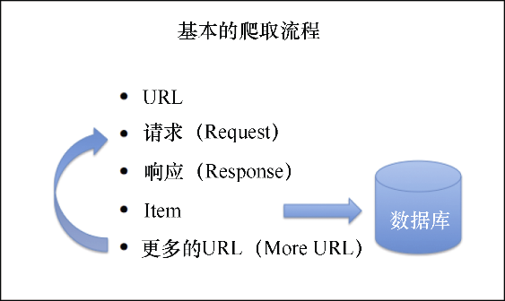

### 3.2　UR2IM——基本抓取流程

每个网站都是不同的，如果发现某些不常见的情况，则需要一些额外的学习，或是在Scrapy的邮件列表中咨询一些问题。不过，为了知道在哪里和如何搜索，重要的是对其流程有一个整体的了解，并且清楚相关的术语。和Scrapy打交道时，你所遵循的最通用的流程是UR2IM流程，如图3.3所示。

<b class="my_markdown">图3.3　UR2IM流程</b>

