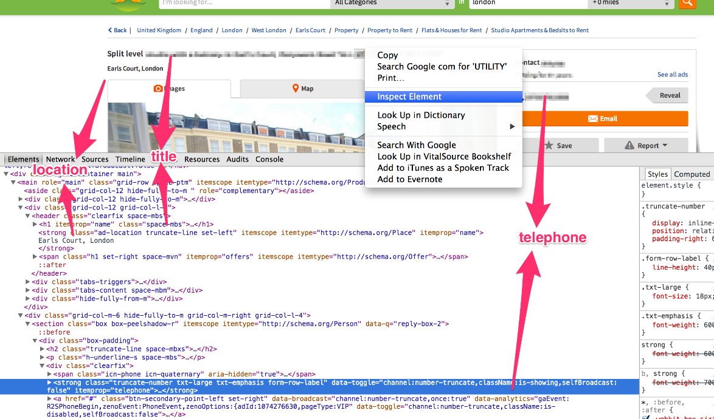
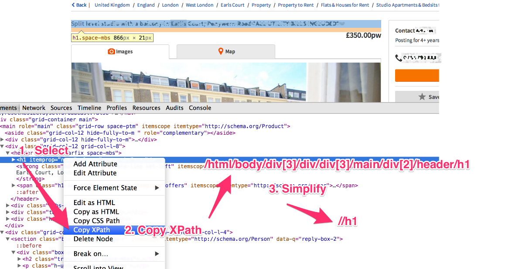
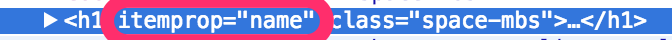

### 3.2.3　Item

> 
> 这里使用了一个 `response` 对象，并调用了它的 `xpath()` 方法来抽取感兴趣的值。不过， `xpath()` 返回的值是什么呢？如果在一个简单的XPath表达式中，不使用 `.extract()` 方法，将会得到如下的显示输出：
> `xpath()` 返回了网页内容预加载的 `Selector` 对象。我们目前只使用了 `xpath()` 方法，不过它还有另一个有用的方法： `css()` 。 `xpath()` 和 `css()` 都会返回选择器，只有当调用 `extract()` 或 `re()` 方法的时候，才会得到真实的文本数组。这种方式非常好用，因为这样就可以将 `xpath()` 和 `css()` 操作串联起来了。比如，可以使用 `css()` 快速抽取正确的HTML元素。
> 请注意，在后台中 `css()` 实际上编译了一个 `xpath()` 表达式，不过我们输入的内容要比XPath自身更加简单。接下来，串联一个 `xpath()` 方法，只抽取其中的文本。
> 最后，还可以通过 `re()` 方法，串联上正则表达式，以抽取感兴趣的值。
> 实际上，这个表达式与原始表达式相比，并无好坏之差。请把它当作一个引起思考的说明性示例。在本书中，我们将尽可能保持事物简单，同时也会尽可能多地使用虽然有些老旧但仍然好用的XPath。关键点是记住 `xpath()` 和 `css()` 返回的 `Selector` 对象是可以被串联起来的。为了获取真实值，可以使用 `extract()` ，也可以使用 `re()` 。在Scrapy的每个新版本当中，都会围绕这些类添加新的令人兴奋且高价值的功能。相关的Scrapy文档部分为 `http://doc.scrapy.org/en/latest/topics/selectors.html` 。该文档非常优秀，相信你可以从中找到抽取数据的最有效的方式。

下一步是尝试从响应中将数据抽取到 `Item` 的字段中。因为该页面的格式是HTML，因此可以使用XPath表达式进行操作。首先，让我们看一下这个页面，如图3.4所示。


```python
>>> response.xpath('.')
[<Selector xpath='.' data=u'<html>\n<head>\n<meta 
charse'>]

```

<center class="my_markdown"><b class="my_markdown">图3.4　页面、感兴趣的字段及其HTML代码</b></center>

在图3.4中有大量的信息，但其中大部分都是布局：logo、搜索框、按钮等。虽然这些信息都很有用，但是爬虫并不会对其产生兴趣。我们可能感兴趣的字段，比如说包括房源的标题、位置或代理商的电话号码，它们都具有对应的HTML元素，我们需要定位到这些元素，然后使用前一节中所描述的流程抽取数据。那么，先从标题开始吧（如图3.5所示）。

```python
>>> response.css('.ad-price')
[<Selector xpath=u"descendant-or-self::*[@class and
contains(concat(' ', normalize-space(@class), ' '), '
ad-price ')]" data=u'<strong class="ad-price txt-xlarge
txt-e'>]

```


<center class="my_markdown"><b class="my_markdown">图3.5　抽取标题</b></center>

```python
>>> response.css('.ad-price').xpath('text()')
[<Selector xpath='text()' data=u'\xa3334.39pw'>]

```

右键单击页面上的标题，并选择 **Inspect Element** 。这样就可以看到相应的HTML源代码了。现在，尝试通过右键单击并选择 **Copy XPath** ，抽取标题的XPath表达式。你会发现Chrome浏览器给我们的XPath表达式很精确，但又十分复杂，因此该表达式是非常脆弱的。我们将对其进行一些简化，只使用最后的一部分，通过使用表达式 `//h1` ，选择在页面中可以看到的任何 `H1` 元素。尽管这种方式有些误导，因为我们并不是真的需要页面中的每一个 `H1` ，不过实际上这里只有标题使用了 `H1` ；而作为优秀的SEO实践，每个页面应当只有一个 `H1` 元素，并且大部分网站确实是这样的。

> 
> SEO是Search Engine Optimization（搜索引擎优化）的缩写，即通过优化网站代码、内容和出入站链接的流程，实现提供给搜索引擎的最佳方式。

```python
>>> response.css('.ad-price').xpath('text()').re('[.0-
9]+')
[u'334.39']

```

我们来检查下该XPath表达式能否在scrapy shell中良好运行。

```python
>>> response.xpath('//h1/text()').extract()
[u'set unique family well']

```

非常好，完美工作。你应该已经注意到我在 `//h1` 表达式的结尾处添加了 `/text()` 。如果想要只抽取 `H1` 元素所包含的文本内容，而不是 `H1` 元素自身的话，就需要使用到它。我们通常都会使用 `/text()` 来获得文本字段。如果忽略它，就会得到整个元素的文本，包括并不需要的标记。

```python
>>> response.xpath('//h1').extract()
[u'<h1 itemprop="name" class="space-mbs">set unique family well</h1>']

```

此时，我们就得到了抽取本页中第一个感兴趣的属性（标题）的代码，不过如果你观察得更仔细的话，就会发现还有一种更好更简单的方法也可以做到。

Gumtree通过微数据标记注解它们的HTML。比如，我们可以看到，在其头部有一个 `itemprop="name"` 的属性，如图3.6所示。非常好，这样我们就可以使用一个更简单的XPath表达式，而不再包含任何可视化元素了，此时得到的表达式为 `//­*[@itemprop="name"][1]/text()` 。你可能会奇怪为什么我们选择了包含 `itemprop="name"` 的第一个元素。


<center class="my_markdown"><b class="my_markdown">图3.6　Gumtree拥有微数据标记</b></center>

> 
> 稍等！你是说第一个？如果你是一个经验丰富的程序员，可能已经将 `array[1]` 作为数组的第二个元素了。令人惊讶的是，XPath是从1开始的，因此 `array[1]` 是数组的第一个元素。

我们这么做，不只是因为 `itemprop="name"` 在许多不同的上下文中作为微数据来使用，还因为Gumtree在其页面的“你可能还喜欢……”部分为其他属性使用了嵌套的信息，以这种方式阻止我们对其轻易识别。尽管如此，这并不是一个大问题。我们只需要选择第一个，而且我们也将使用同样的方式处理其他字段。

让我们来看一下价格。价格被包含在如下的HTML结构当中。

```python
<strong class="ad-price txt-xlarge txt-emphasis" itemprop="price">
£334.39pw</strong>
```

我们又一次看到了 `itemprop="name"` 这种形式，太棒了。此时，XPath表达式将会是 `//­*[@itemprop="price"][1]/text()` 。我们来试一下吧。

```python
>>> response.xpath('//­*[@itemprop="price"][1]/text()').extract()
[u'\xa3334.39pw']

```

我们注意到，这里包含一些Unicode字符（英镑符号£），然后是 `334.39pw` 的价格。这表明数据并不总是像我们希望的那样干净，所以可能还需要对其进行一些清洗的工作。比如，在本例中，我们可能需要使用一个正则表达式，以便只选择数字和点号。可以使用 `re()` 方法做到这一要求，并使用一个简单的正则表达式替代 `extract()` 。

```python
>>> response.xpath('//­*[@itemprop="price"][1]/text()').re('[.0-9]+')
[u'334.39']

```

描述文本的抽取也是相似的。有一个 `itemprop="description"` 的属性用于标示描述。其XPath表达式为  `//­*[@itemprop="description"][1]/text()` 。相似地，住址部分使用 `itemtype="http://schema.org/ Place"` 注解；因此， `XPath` 表达式为  `//­*[@itemtype="http://schema.org/Place"][1]/text()` 。

同理，图片使用了 `itemprop="image"` 。因此使用 `//img[@itemprop="image"][1]/@src` 。这里需要注意的是，我们没有使用 `/text()` ，这是因为我们并不需要任何文本，而是只需要包含图片URL的 `src` 属性。

假设这些是我们想要抽取的全部信息，我们可以将其总结到表3.1中。

<center class="my_markdown"><b class="my_markdown">表3.1</b></center>

| 基本字段 | XPath表达式 |
| :-----  | :-----  | :-----  | :-----  |
| `title` | `//­*[@itemprop="name"][1]/text()` | 示例值： `[u'set unique family well']` |
| `price` | `//­*[@itemprop="price"][1]/text()` | 示例值（使用 `re()` ）： `[u'334.39']` |
| `description` | `//­*[@itemprop="description"][1]/text()` | 示例值： `[u'website court warehouse\r\npool...']` |
| `address` | `//­*[@itemtype="http://schema.org/Place"][1]/text()` | 示例值： `[u'Angel, London']` |
| `image_urls` | `//­*[@itemprop="image"][1]/@src` | 示例值： `[u'.../images/i01.jpg']` |

现在，表3.1就变得非常重要了，因为如果我们有许多包含相似信息的网站，则很可能需要创建很多类似的爬虫，此时只需改变前面的这些表达式。此外，如果想要抓取大量网站，也可以使用这样一张表格来拆分工作量。

到目前为止，我们主要在使用HTML和XPath。接下来，我们将开始编写一些真正的Python代码。

