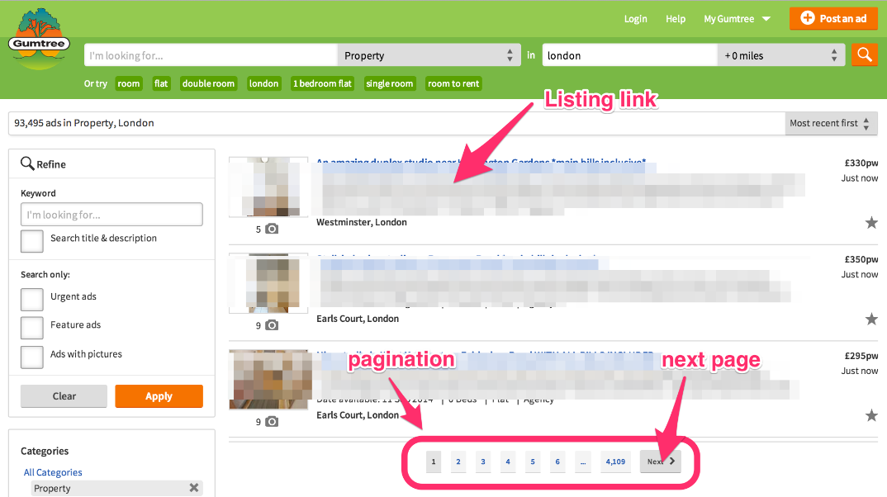
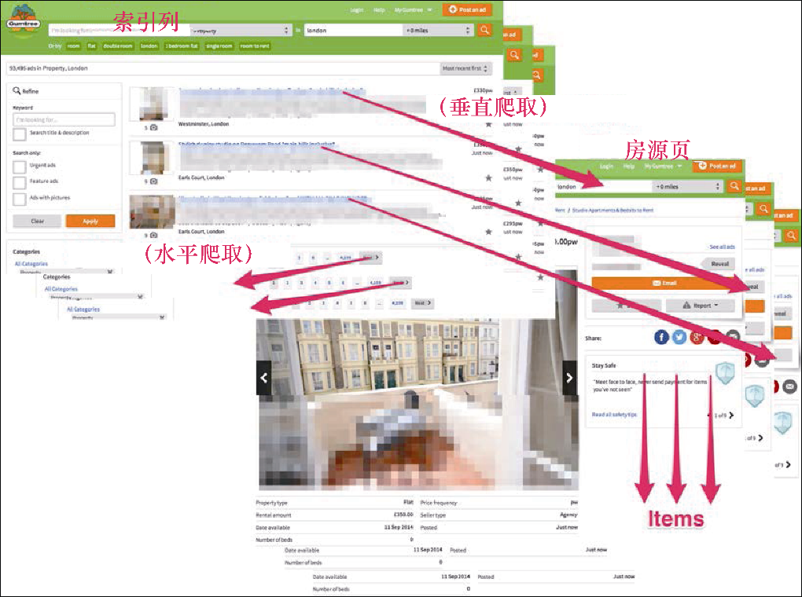
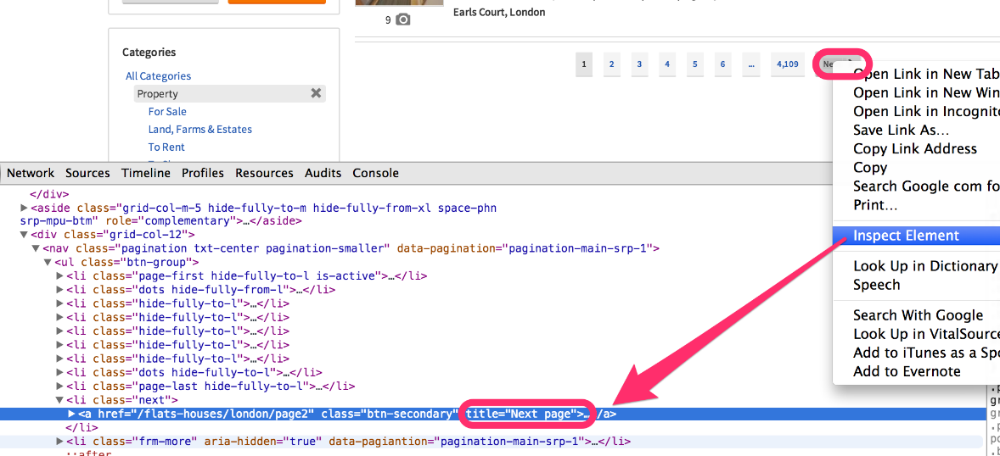
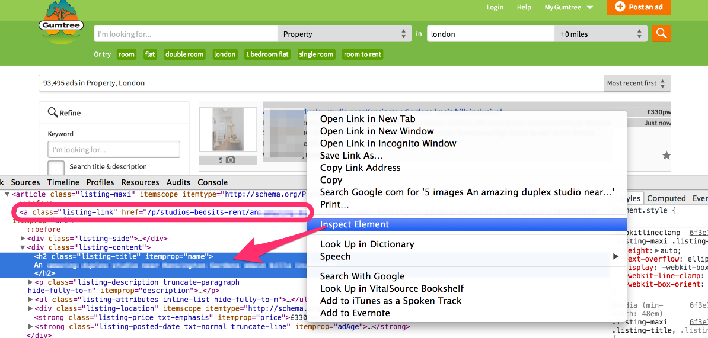

### 3.4　抽取更多的URL

到目前为止，我们使用的只是设置在爬虫的 `start_urls` 属性中的单一URL。而该属性实际为一个元组，我们可以硬编码写入更多的URL，如下所示。

```python
start_urls = (
　　'http://web:9312/properties/property_000000.html',
　　'http://web:9312/properties/property_000001.html',
　　'http://web:9312/properties/property_000002.html',
)
```

这种写法可能不会让你太激动。不过，我们还可以使用文件作为URL的源，写法如下所示。

```python
start_urls = [i.strip() for i in
open('todo.urls.txt').readlines()]
```

这种写法其实也不那么令人激动，但它确实管用。更经常发生的情况是感兴趣的网站中包含一些索引页及房源页。比如，Gumtree就包含了如图3.7所示的索引页，其地址为  `
<a class="my_markdown" href="['http://www.gumtree.com/flats-houses/london']">http://www.gumtree.com/flats-houses/london</a>
` 。


<center class="my_markdown"><b class="my_markdown">图3.7　Gumtree的索引页</b></center>

一个典型的索引页会包含许多到房源页面的链接，以及一个能够让你从一个索引页前往另一个索引页的分页系统。

因此，一个典型的爬虫会向两个方向移动（见图3.8）：


<center class="my_markdown"><b class="my_markdown">图3.8　向两个方向移动的典型爬虫</b></center>

+ 横向——从一个索引页到另一个索引页；
+ 纵向——从一个索引页到房源页并抽取 `Item` 。

在本书中，我们将前者称为 **水平爬取** ，因为这种情况下是在同一层级下爬取页面（比如索引页）；而将后者称为 **垂直爬取** ，因为该方式是从一个更高的层级（比如索引页）到一个更低的层级（比如房源页）。

实际上，它比听起来更加容易。我们所有需要做的事情就是再增加两个XPath表达式。对于第一个表达式，右键单击 **Next Page** 按钮，可以注意到URL包含在一个链接中，而该链接又是在一个拥有类名 `next` 的 `li` 标签内，如图3.9所示。因此，我们只需使用一个实用的XPath表达式 `//­*[contains(@class,"next")]//@href` ，就可以完美运行了。


<center class="my_markdown"><b class="my_markdown">图3.9　查找下一个索引页URL的XPath表达式</b></center>

对于第二个表达式，右键单击页面中的列表标题，并选择 **Inspect Element** ，如图3.10所示。


<center class="my_markdown"><b class="my_markdown">图3.10　查找列表页URL的XPath表达式</b></center>

请注意，URL中包含我们感兴趣的 `itemprop="url"` 属性。因此，表达式 `//­*[@itemprop="url"]/@href` 就可以正常运行。现在，打开一个scrapy shell来确认这两个表达式是否有效：

```python
$ scrapy shell http://web:9312/properties/index_00000.html
>>> urls = response.xpath('//­*[contains(@class,"next")]//@href').extract()
>>> urls
[u'index_00001.html']
>>> import urlparse
>>> [urlparse.urljoin(response.url, i) for i in urls]
[u'http://web:9312/scrapybook/properties/index_00001.html']
>>> urls = response.xpath('//­*[@itemprop="url"]/@href').extract()
>>> urls
[u'property_000000.html', ... u'property_000029.html']
>>> len(urls)
30
>>> [urlparse.urljoin(response.url, i) for i in urls]
[u'http://..._000000.html', ... /property_000029.html']

```

非常好！可以看到，通过使用之前已经学习的内容及这两个XPath表达式，我们已经能够按照自身需求使用水平抓取和垂直抓取的方式抽取URL了。

