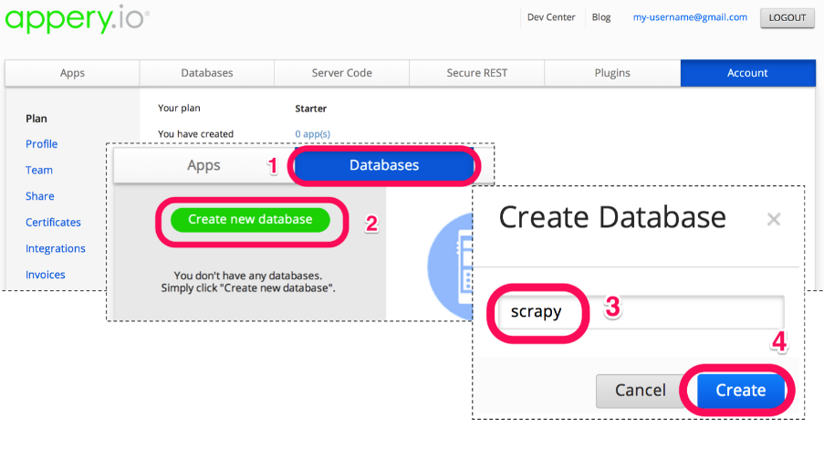
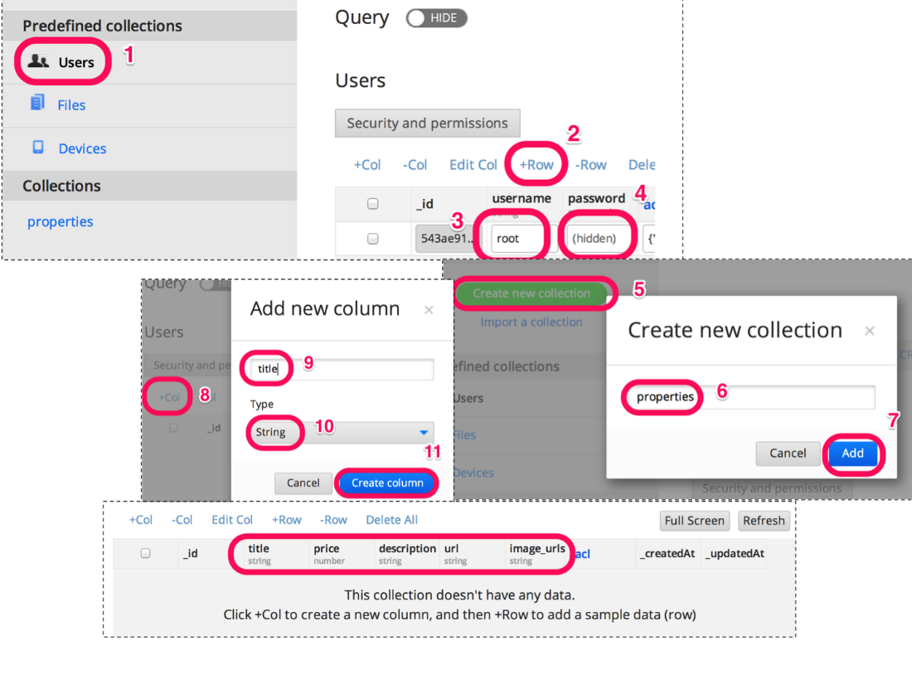

### 4.2　创建数据库和集合

第一步是通过单击Appery.io网站上的 **Sign-Up** 按钮并选取免费方案，来注册免费的Appery.io方案。你需要提供用户名、邮箱地址以及密码，然后就会创建好新账户了。等待几秒钟后，账户完成激活。然后就可以登录到Appery.io的仪表盘了。现在，开始准备创建新的数据库以及集合，如图4.1所示。

<b class="my_markdown">图4.1　使用Appery.io创建新数据库及集合</b>

为了完成该操作，需要按照如下步骤执行。

1．单击 **Databases** 选项卡（1）。

2．然后单击绿色的 **Create new database** （2）按钮。将新数据库命名为 `scrapy` （3）。

3．现在，单击 **Create** 按钮（4）。此时会自动打开Scrapy数据库的仪表盘，在这里，你可以创建新的集合。

在Appery.io的术语中，一个数据库是由一组集合组成的。大致来说，一个应用使用一个单独的数据库（至少在最初时是这样），每个数据库中包含多个集合，比如用户、房产、消息等。Appery.io默认已经提供了一个 **Users** 集合，其中包括用户名和密码（它们有很多内置功能）。图4.2所示为创建集合的过程。

<b class="my_markdown">图4.2　使用Appery.io创建新数据库及集合</b>

现在，我们添加一个用户，用户名为root，密码为pass。当然，你也可以选择更加安全的用户名和密码。为实现该目的，请单击侧边栏的 **Users** 集合（1），然后单击 **+Row** 添加用户/行（2）。在出现的两个字段中填入用户名和密码（3）和（4）。

我们还需要创建一个新的集合，用于存储Scrapy抓取到的房产数据，并将该集合命名为properties。通过单击绿色的 **Create new collection** 按钮（5），将其命名为 `properties` （6），然后单击 **Add** 按钮（7），就可以创建新的集合了。现在，我们还必须对该集合进行一些定制化处理。单击 **+Col** 添加数据库列（8）。每个数据库列都有其类型，用于对值进行校验。除了价格是数值类型外，大部分字段都是简单的字符串类型。我们将通过单击 **+Col** 添加几个列（8），并填充列名（9），如果不是字符串类型的话，还需要选择类型（10），然后单击 **Create column** 按钮（11）。重复该过程5次，创建表4.1中展示的列。

<b class="my_markdown">表4.1</b>

| 列 | title | price | description | url | image_urls |
| :-----  | :-----  | :-----  | :-----  | :-----  | :-----  | :-----  | :-----  |
| 类型 | string | number | string | string | string |

在集合创建的最后，你应该已经将所需的所有列都创建完成了，就像表4.1中所示的那样。现在已经准备好从Scrapy中导入一些数据了。

