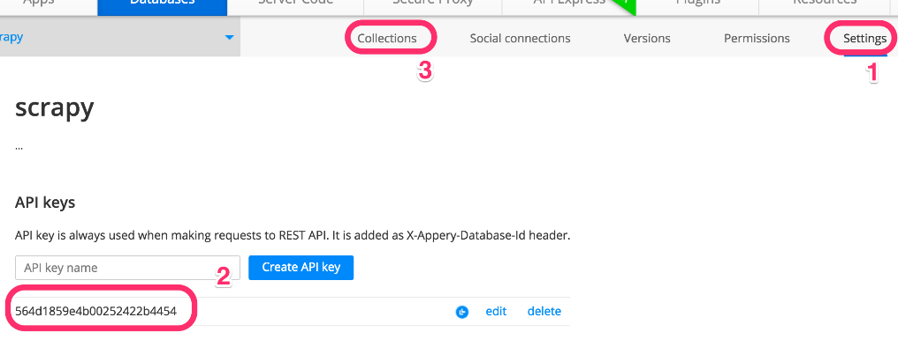
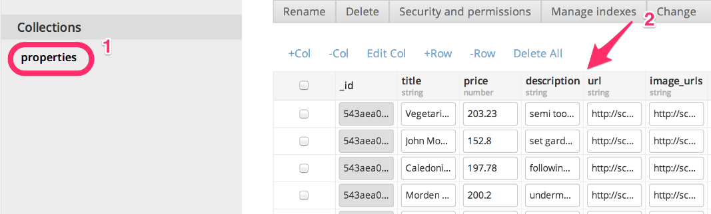

### 4.3　使用Scrapy填充数据库

首先，我们需要一个API key。我们可以在 **Settings** 选项卡（1）中找到它。复制该值（2），然后单击 **Collections** 选项卡（3）回到房产集合中，过程如图4.3所示。


<center class="my_markdown"><b class="my_markdown">图4.3　使用Appery.io创建新数据库及集合</b></center>

非常好！现在需要修改在第3章中创建的应用，将数据导入到Appery.io中。我们先将项目以及名为 `easy` 的爬虫（ `easy.py` ）复制过来，并将该爬虫重命名为 `tomobile` （ `tomobile.py` ）。同时，编辑文件，将其名称设为 `tomobile` 。

```python
$ ls
properties scrapy.cfg
$ cat properties/spiders/tomobile.py
...
class ToMobileSpider(CrawlSpider):
　　name = 'tomobile'
　　allowed_domains = ["scrapybook.s3.amazonaws.com"]
　　# Start on the first index page
　　start_urls = (
　　　　'http://scrapybook.s3.amazonaws.com/properties/'
　　　　'index_00000.html',
　　)
...

```

> 
> 本章代码可以在GitHub的 ch04 目录下找到。

你可能已经注意到的一个问题是，这里并没有使用之前章节中用过的Web服务器（ `http://web:9312` ），而是使用了该站点的一个公开可用的副本，这是我存放在 `http://scrapybook.s3.amazonaws.com` 上的副本。之所以在本章中使用这种方式，是因为这样可以使图片和URL都能够公开可用，此时就可以非常轻松地分享应用了。

我们将使用Appery.io的管道来插入数据。Scrapy管道通常是一个很小的Python类，拥有后置处理、清理及存储Scrapy Item的功能。第8章将会更深入地介绍这部分的内容。就目前来说，你可以使用 `easy_install` 或 `pip` 安装它，不过如果你使用的是我们的Vagrant dev机器，则无需进行任何操作，因为我们已经将其安装好了。

```python
$ sudo easy_install -U scrapyapperyio

```

或

```python
$ sudo pip install --upgrade scrapyapperyio

```

此时，你需要对Scrapy的主设置文件进行一些小修改，将之前复制的API key添加进来。第7章将会更加深入地讨论设置。现在，我们所需要做的就是将如下行添加到 `properties/settings.py` 文件中。

```python
ITEM_PIPELINES = {'scrapyapperyio.ApperyIoPipeline': 300}
APPERYIO_DB_ID = '<<Your API KEY here>>'
APPERYIO_USERNAME = 'root'
APPERYIO_PASSWORD = 'pass'
APPERYIO_COLLECTION_NAME = 'properties'
```

不要忘记将APPERYIO_DB_ID替换为你的API key。此外，还需要确保设置中的用户名和密码，要和你在Appery.io中创建数据库用户时使用的相同。要想向Appery.io的数据库中填充数据，请像平常那样启动scrapy crawl。

```python
$ scrapy crawl tomobile -s CLOSESPIDER_ITEMCOUNT=90
INFO: Scrapy 1.0.3 started (bot: properties)
...
INFO: Enabled item pipelines: ApperyIoPipeline
INFO: Spider opened
...
DEBUG: Crawled (200) <GET https://api.appery.io/rest/1/db/login?username=
root&password=pass>
...
DEBUG: Crawled (200) <POST https://api.appery.io/rest/1/db/collections/
properties>
...
INFO: Dumping Scrapy stats:
　{'downloader/response_count': 215,
　 'item_scraped_count': 105,
　...}
INFO: Spider closed (closespider_itemcount)

```

这次的输出会有些不同。可以看到在最开始的几行中，有一行是用于启用 `ApperyIoPipeline` 这个Item管道的；不过最明显的是，你会发现尽管抓取了100个Item，但是却有200次请求/响应。这是因为Appery.io的管道对每个Item都执行了一个到Appery.io服务端的额外请求，以便写入每一个Item。这些带有 `api.appery.io` 这个URL的请求同样也会在日志中出现。

当回到Appery.io时，可以看到在 **properties** 集合（1）中已经填充好了数据（2），如图4.4所示。


<center class="my_markdown"><b class="my_markdown">图4.4　使用数据填充properties集合</b></center>

