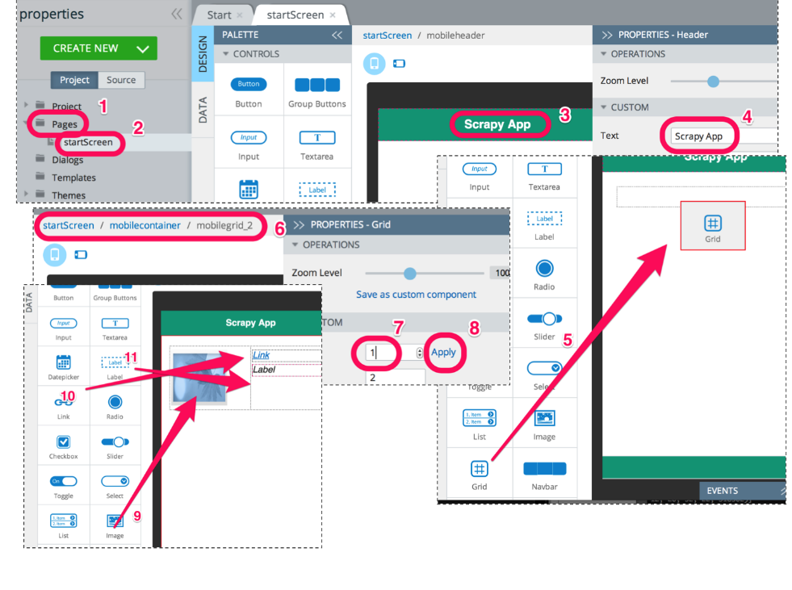

### 4.4.2　创建用户界面

下面将要开始创建应用所有的可视化元素了，这将会使用编辑器中的 **DESIGN** 选项卡来实现，如图4.6所示。

<b class="my_markdown">图4.6　创建用户界面</b>

从页面左侧的树中，展开 **Pages** 文件夹（1），然后单击 **startScreen** （2）。UI编辑器将会打开该页面，我们可以在其中添加一些控件。下面使用编辑器编辑标题，以便对其更加熟悉。单击头部标题（3），然后会发现屏幕右侧的属性区域会变为显示标题的属性，其中包含一个 `Text` 属性，将该属性值修改为 **Scrapy App** ，屏幕中间的标题也会相应地更新。

然后，需要添加一个网格组件，从左侧面板（5）中拖曳 **Grid** 控件即可实现。该控件有两行，而根据我们的需求，只需要一行即可。选择刚刚添加的网格。当手机视图顶部的缩略图区域（6）变灰时，就可以知道该网格已经被选取了。如果没有被选取，单击该网格以便选中。然后右侧的属性栏会更新为网格的属性。这里只需要将Rows属性设置为1，然后单击Apply即可（7）和（8）。现在，该网格就会被更新为只有一行了。

最后，拖拽另外一些控件到网格中。首先要在网格左侧添加图片控件（9），然后在网格右侧添加链接（10），最后在链接下面添加标签（11）。

就布局而言，此时已经足够。接下来将从数据库中向用户界面输入数据。

