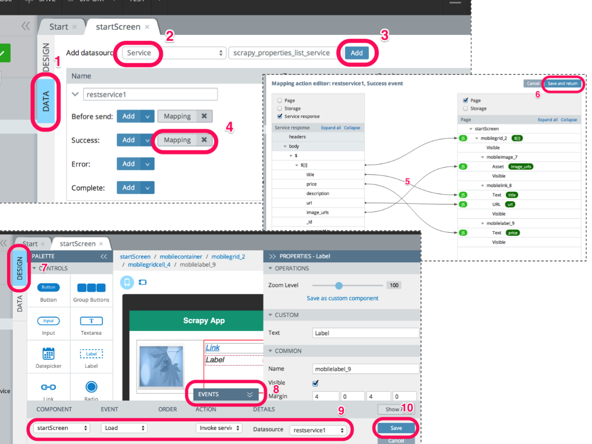

### 4.4.3　将数据映射到用户界面

目前为止，我们花费了大量时间在DESIGN选项卡中，以创建应用的可视化效果。为了将可用的数据链接到这些控件中，需要切换到 **DATA** 选项卡（1），如图4.7所示。

<b class="my_markdown">图4.7　将数据映射到用户界面</b>

选择 **Service** （2）作为数据源类型。由于前面创建的服务是唯一可用的服务，因此它会被自动选取。然后可以继续单击 **Add** 按钮（3），此时服务属性将会在其下方列出。只要按下了 **Add** 按钮，就会看到像 **Before send** 以及 **Success** 这样的事件。我们可以通过单击 **Success** 后面的 **Mapping** 按钮，定制服务成功调用后要做的事情。

此时会打开 **Mapping action editor** ，我们可以在这里完成连线。该编辑器有两侧。左侧是服务响应中可用的字段，而在右侧中可以看到前面步骤中添加的UI控件的属性。两侧都有一个 **Expand all** 链接，单击该链接可以看到所有可用的数据和控件。接下来，需要按照表4.2中给出的5个映射，从左侧向右侧拖曳。

<b class="my_markdown">表4.2</b>

| 响应 | 组件 | 属性 | 备注 |
| :-----  | :-----  | :-----  | :-----  | :-----  | :-----  |
| `$[i]` | `mobilegrid_2` |  | 使用for循环创建每一行 |
| `title` | `mobilelink_8` | Text | 设置链接文本 |
| `price` | `mobilelabel_9` | Text | 在文本域中设置价格 |
| `image_ urls` | `mobileimage_7` | Asset | 从图片容器的URL中加载图片 |
| `url` | `mobilelink_8` | URL | 为链接设置URL。当用户单击时，将会加载关联的页面 |

