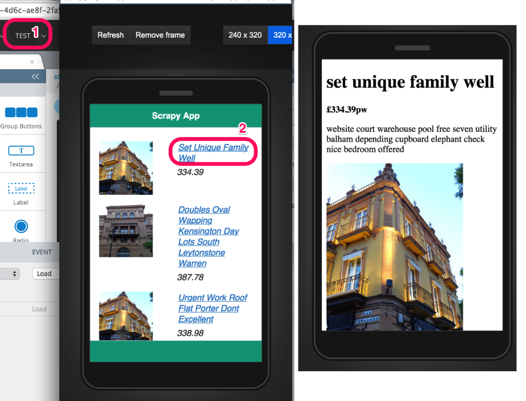
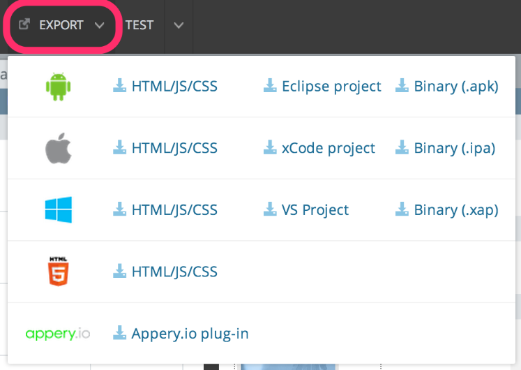

### 4.4.5　测试、分享及导出你的手机应用

现在，可以测试这个应用了。我们所需要做的事情就是单击UI生成器顶部的 **TEST** 按钮（1），如图4.8所示。

<b class="my_markdown">图4.8　运行在你浏览器中的手机应用</b>

手机应用将会在浏览器中运行。这些链接都是有效的（2），可以浏览。可以预览不同的手机屏幕方案以及设备方向，也可以单击 **View on Phone** 按钮，此时会显示一个二维码，你可以使用移动设备扫描该二维码，并预览该应用。你只需分享其生成的链接，其他人也可以在他们的浏览器中尝试该应用。

只需单击几下，我们就可以将Scrapy抓取的数据组织起来，并展示在手机应用中。如果你需要更进一步地定制该应用，可以参考Appery.io提供的教程，其网址为 `http://devcenter.appery.io/tutorials/` 。当一切准备就绪时，就可以通过 **EXPORT** 按钮导出该应用了，Appery.io提供了非常丰富的导出选项，如图4.9所示。

<b class="my_markdown">图4.9　你可以将应用导出到大部分主流移动平台</b>

你可以导出项目文件，在自己喜欢的IDE中进一步开发；也可以获得二进制文件，发布到各个平台的手机市场当中。

