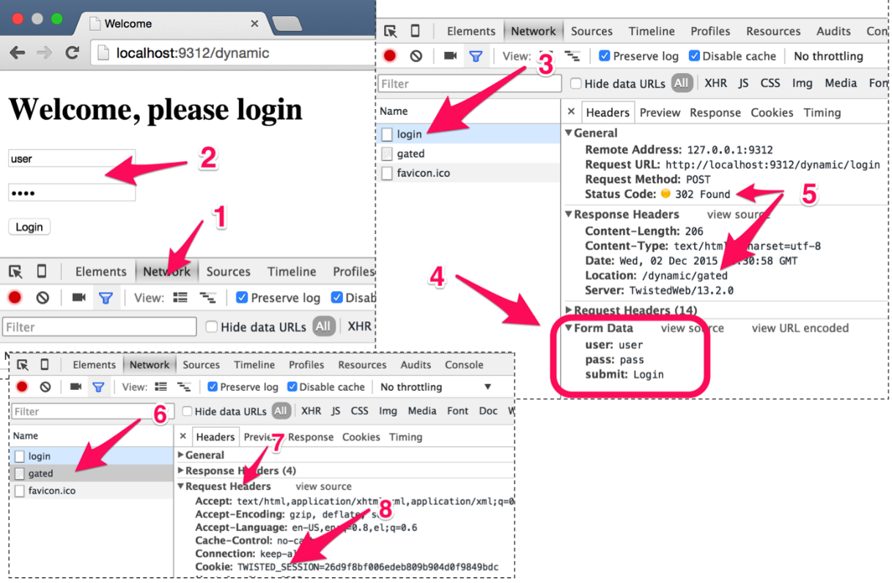
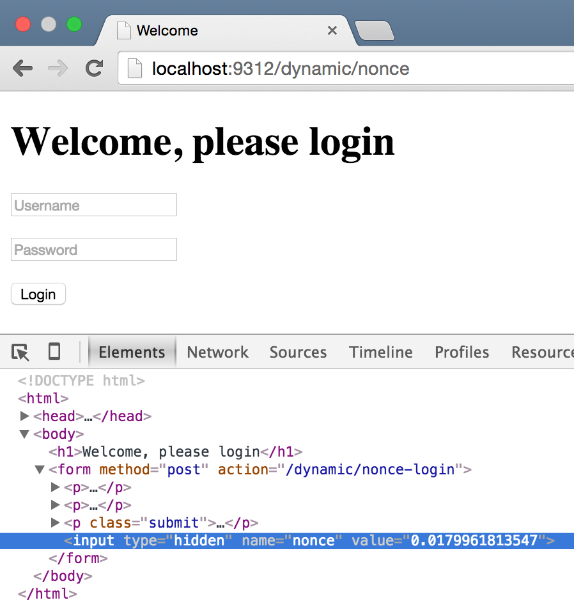

### 5.1　需要登录的爬虫

通常情况下，你会发现自己想要抽取数据的网站存在登录机制。大部分情况下，网站会要求你提供用户名和密码用于登录。你可以从 `http://web:9312/dynamic` （从dev机器访问）或 `http://localhost:9312/ dynamic` （从宿主机浏览器访问）找到我们要使用的例子。如果使用"user"作为用户名，"pass"作为密码的话，你就可以访问到包含3个房产页面链接的网页。不过现在的问题是，要如何使用Scrapy执行相同的操作？

让我们使用Google Chrome浏览器的开发者工具来尝试理解登录的工作过程（见图5.1）。首先，打开 **Network** 选项卡（1）。然后，填写用户名和密码，并单击 **Login** （2）。如果用户名和密码正确，你将会看到包含3个链接的页面。如果用户名和密码不匹配，将会看到一个错误页。


<center class="my_markdown"><b class="my_markdown">图5.1　登录网站时的请求和响应</b></center>

当按下 **Login** 按钮时，会在Google Chrome浏览器开发者工具的 **Network** 选项卡中看到一个包含 **Request Method: POST** 的请求，其目的地址为 `http://localhost:9312/dynamic/login` 。

> 
> 前面章节中的请求都是GET类型的请求，一般用于获取不会改变的数据，比如简单的网页、图像等。而POST类型的请求通常用于获取那些依赖于传送给服务器内容的数据，比如本例中的用户名和密码。

当你单击该请求时（3），可以看到发送给服务端的数据，包括 **Form Data** （4），其中包含了我们输入的用户名和密码。这些数据都是以文本形式传输给服务端的。Chrome浏览器只是将其组织起来，向我们更好地显示这些数据。服务端的响应是 **302 Found** （5），使我们跳转到一个新的页面： `/dynamic/gated` 。该页面只有在登录成功后才会出现。如果尝试直接访问 `http://localhost:9312/dynamic/gated` ，而不输入正确的用户名和密码的话，服务端会发现你在作弊，并跳转到错误页，其地址是 `http:// localhost:9312/dynamic/error` 。服务端是如何知道你和你的密码的呢？如果你单击开发者工具左侧的 **gated** （6），就会发现在 **Request Headers** 区域下面（7）设置了一个 **Cookie** 值（8）。

> 
> HTTP Cookie是一些服务端发送给浏览器的文本或数值，通常都很短。相应地，浏览器会在随后的每个请求中将其返回给服务端，用于标识你、用户和会话。这样你就可以执行需要服务端状态信息的复杂操作了，比如购物车里的商品或你的用户名和密码。

总之，即使是一个单一的操作，比如登录，也可能涉及包括POST请求和HTTP跳转的多次服务端往返。Scrapy能够自动处理大部分操作，而我们需要编写的代码也很简单。

我们从第3章中名为 `easy` 的爬虫开始，创建一个新的爬虫，命名为 `login` ，保留原有文件，并修改爬虫中的 `name` 属性（如下所示）：

```python
class LoginSpider(CrawlSpider):
　　name = 'login'
```

> 
> 本章代码在GitHub的 `ch05` 目录下，其中本示例为 `ch05/properties` 。

我们需要通过执行到 `http://localhost:9312/dynamic/login` 的POST请求，发送登录的初始请求。这将通过Scrapy的 `FormRequest` 类实现该功能。该类与第3章中使用的 `Request` 类相似，不过该类额外包含一个 `formdata` 参数，可以使用该参数传输表单数据（ `user` 和 `pass` ）。要想使用该类，首先需要引入如下模块。

```python
from scrapy.http import FormRequest
```

然后，将 `start_urls` 语句替换为 `start_requests()` 方法。这样做是因为在本例中，我们需要从一些更加定制化的请求开始，而不仅仅是几个URL。更确切地说就是，我们从该函数中创建并返回一个 `FormRequest` 。

```python
# Start with a login request
def start_requests(self):
　return [
　　FormRequest(
　　　"http://web:9312/dynamic/login",
　　　formdata={"user": "user", "pass": "pass"}
　　　　 )]
```

虽然听起来不可思议，但是 `CrawlSpider` （ `LoginSpider` 的基类）默认的 `parse()` 方法确实处理了 `Response` ，并且仍然能够使用第3章中的 `Rule` 和 `LinkExtractor` 。我们只编写了非常少的额外代码，这是因为Scrapy为我们透明处理了Cookie，并且一旦我们登录成功，就会在后续的请求中传输这些Cookie，就和浏览器执行的方式一样。接下来可以像平常一样，使用 `scrapy crwal` 运行。

```python
$ scrapy crawl login
INFO: Scrapy 1.0.3 started (bot: properties)
...
DEBUG: Redirecting (302) to <GET .../gated> from <POST .../login >
DEBUG: Crawled (200) <GET .../data.php>
DEBUG: Crawled (200) <GET .../property_000001.html> (referer: .../data.
php)
DEBUG: Scraped from <200 .../property_000001.html>
{'address': [u'Plaistow, London'],
 'date': [datetime.datetime(2015, 11, 25, 12, 7, 27, 120119)],
 'description': [u'features'],
 'image_urls': [u'http://web:9312/images/i02.jpg'],
...
INFO: Closing spider (finished)
INFO: Dumping Scrapy stats:
　{...
　 'downloader/request_method_count/GET': 4,
　 'downloader/request_method_count/POST': 1,
...
　 'item_scraped_count': 3,

```

我们可以在日志中看到从 `dynamic/login` 到 `dynamic/gated` 的跳转，然后就会像平时那样抓取Item了。在统计中，可以看到1个POST请求和4个GET请求（一个是前往 `dynamic/gated` 索引页，另外3个是房产页面）。

> 
> 本例中，我们没有保护房产页面本身，而是只保护了到这些页面的链接。无论哪种情况，前面的代码都是适用的。

如果使用了错误的用户名和密码，将会跳转到一个没有任何项目的页面，并且此时爬取过程会被终止，如下面的执行情况所示。

```python
$ scrapy crawl login
INFO: Scrapy 1.0.3 started (bot: properties)
...
DEBUG: Redirecting (302) to <GET .../dynamic/error > from <POST .../
dynamic/login>
DEBUG: Crawled (200) <GET .../dynamic/error>
...
INFO: Spider closed (closespider_itemcount)

```

这是一个简单的登录示例，用于演示基本的登录机制。大多数网站都会拥有一些更加复杂的机制，不过Scrapy也都能够轻松处理。比如，一些网站要求你在执行POST请求时，将表单页中的某些表单变量传输到登录页，以便确认Cookie是启用的，同样也会让你在尝试暴力破解成千上万次用户名/密码的组合时更加困难。图5.2所示即为此种情况的一个示例。


<center class="my_markdown"><b class="my_markdown">图5.2　使用一次性随机数的一个更加高级的登录示例的请求和响应情况</b></center>

比如，当访问 `http://localhost:9312/dynamic/nonce` 时，你会看到一个看起来一样的页面，但是当使用Chrome浏览器的开发者工具查看时，会发现页面的表单中有一个叫作 **nonce** 的隐藏字段。当提交该表单时（提交到 `http://localhost:9312/ dynamic/nonce-login` ），除非你既传输了正确的用户名/密码，又提交了服务端在你访问该登录页时给你的 `nonce` 值，否则登录不会成功。你无法猜测该值，因为它通常是随机且一次性的。这就表示要想成功登录，现在就需要请求两次了。你必须先访问表单页，然后再访问登录页传输数据。当然，Scrapy同样拥有内置函数可以帮助我们实现这一目的。

我们创建了一个和之前相似的 `NonceLoginSpider` 爬虫。现在，在 `start_requests()` 中，将返回一个简单的 `Request` （不要忘记引入该模块）到表单页面中，并通过设置其 `callback` 属性为处理方法 `parse_welcome()` 手动处理响应。在 `parse_welcome()` 中，使用了 `FormRequest` 对象的辅助方法 `from_response()` ，以创建从原始表单中预填充所有字段和值的 `FormRequest` 对象。 `FormRequest.from_response()` 粗略模拟了一次在页面的第一个表单上的提交单击，此时所有字段留空。

> 
> 花费一些时间让自己熟悉 `from_response()` 的文档是值得的。它有很多非常有用的功能，如 `formname` 和 `formnumber` 可以帮助你在拥有多个表单的页面上选择其中某个表单。

该方法对于我们来说非常有用，因为它能够毫不费力地原样包含表单中的所有隐藏字段。我们所需要做的就是使用 `formdata` 参数填充 `user` 和 `pass` 字段以及返回 `FormRequest` 。下面是其相关代码。

```python
# Start on the welcome page
def start_requests(self):
　　return [
　　　　Request(
　　　　　　"http://web:9312/dynamic/nonce",
　　　　　　callback=self.parse_welcome)
　　]
# Post welcome page's first form with the given user/pass
def parse_welcome(self, response):
　　return FormRequest.from_response(
　　　　response,
　　　　formdata={"user": "user", "pass": "pass"}
　　)
```

我们可以像平时一样运行爬虫。

```python
$ scrapy crawl noncelogin
INFO: Scrapy 1.0.3 started (bot: properties)
...
DEBUG: Crawled (200) <GET .../dynamic/nonce>
DEBUG: Redirecting (302) to <GET .../dynamic/gated > from <POST .../
dynamic/login-nonce>
DEBUG: Crawled (200) <GET .../dynamic/gated>
...
INFO: Dumping Scrapy stats:
　{...
　 'downloader/request_method_count/GET': 5,
　 'downloader/request_method_count/POST': 1,
...
　 'item_scraped_count': 3,

```

可以看到，第一个GET请求前往 `/dynamic/nonce` 页面，然后是POST请求，跳转到 `/dynamic/nonce-login` 页面，之后像前面的例子一样跳转到 `/dynamic/gated` 页面。关于登录的讨论就到这里。该示例使用两个步骤完成登录。只要你有足够的耐心，就可以形成任意长链，来执行几乎所有的登录操作。

