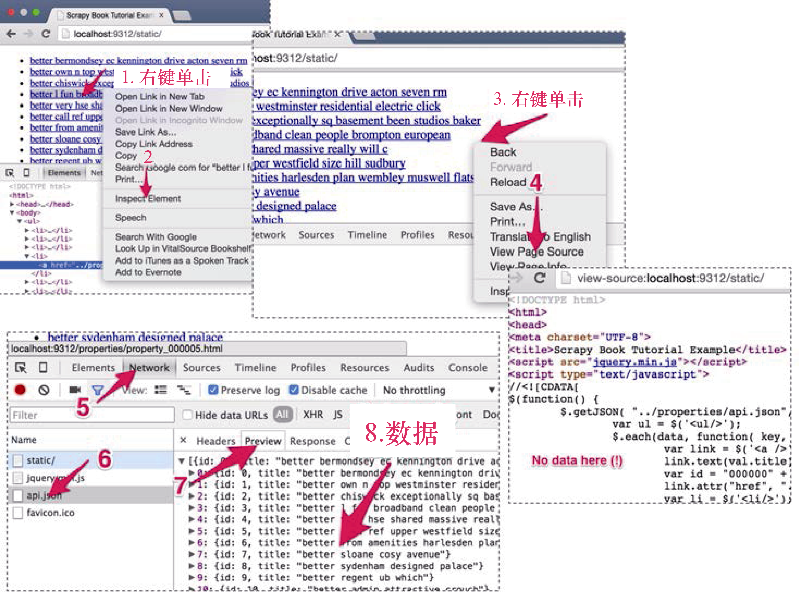

### 5.2　使用JSON API和AJAX页面的爬虫

有时，你会发现自己在页面寻找的数据无法从HTML页面中找到。比如，当访问 `http://localhost:9312/static/` 时（见图5.3），在页面任意位置右键单击 **inspect element** （1, 2），可以看到其中包含所有常见HTML元素的DOM树。但是，当你使用 `scrapy shell` 请求，或是在Chrome浏览器中右键单击 **View Page Source** （3, 4）时，则会发现该页面的HTML代码中并不包含关于房产的任何信息。那么，这些数据是从哪里来的呢？


<center class="my_markdown"><b class="my_markdown">图5.3　动态加载JSON对象时的页面请求与响应</b></center>

与平常一样，遇到这类例子时，下一步操作应当是打开Chrome浏览器开发者工具的 **Network** 选项卡，来看看发生了什么。在左侧的列表中，可以看到加载本页面时Chrome执行的请求。在这个简单的页面中，只有3个请求： **static/** 是刚才已经检查过的请求； **jquery.min.js** 用于获取一个流行的Javascript框架的代码；而 **api.json** 看起来会让我们产生兴趣。当单击该请求（6），并单击右侧的 **Preview** 选项卡（7）时，就会发现这里面包含了我们正在寻找的数据。实际上， `http://localhost:9312/properties/api.json` 包含了房产的ID和名称（8），如下所示。

```python
[{
　　"id": 0,
　　"title": "better set unique family well"
},
... {
　　"id": 29,
　　"title": "better portered mile"
}]
```

这是一个非常简单的JSON API的示例。更复杂的API可能需要你登录，使用POST请求，或返回更有趣的数据结构。无论在哪种情况下，JSON都是最简单的解析格式之一，因为你不需要编写任何XPath表达式就可以从中抽取出数据。

Python提供了一个非常好的JSON解析库。当我们执行 `import json` 时，就可以使用 `json.loads(response.body)` 解析JSON，将其转换为由Python原语、列表和字典组成的等效Python对象。

我们将第3章的 `manual.py` 拷贝过来，用于实现该功能。在本例中，这是最佳的起始选项，因为我们需要通过在JSON对象中找到的ID，手动创建房产URL以及 `Request` 对象。我们将该文件重命名为 `api.py` ，并将爬虫类重命名为 `ApiSpider` ， `name` 属性修改为 `api` 。新的 `start_urls` 将会是JSON API的URL，如下所示。

```python
start_urls = (
　　'http://web:9312/properties/api.json',
)
```

如果你想执行POST请求，或是更复杂的操作，可以使用前一节中介绍的 `start_requests()` 方法。此时，Scrapy将会打开该URL，并调用包含以 `Response` 为参数的 `parse()` 方法。可以通过 `import json` ，使用如下代码解析JSON对象。

```python
def parse(self, response):
　　base_url = "http://web:9312/properties/"
　　js = json.loads(response.body)
　　for item in js:
　　　　id = item["id"]
　　　　url = base_url + "property_%06d.html" % id
　　　　yield Request(url, callback=self.parse_item)
```

前面的代码使用了 `json.loads(response.body)` ，将 `Response` 这个JSON对象解析为Python列表，然后迭代该列表。对于列表中的每一项，我们将URL的3个部分（ `base_url` 、 `property_%06d` 以及 `.html` ）组合到一起。 `base_url` 是在前面定义的URL前缀。 `%06d` 是Python语法中非常有用的一部分，它可以让我们结合Python变量创建新的字符串。在本例中， `%06d` 将会被变量 `id` 的值替换（本行结尾处%后面的变量）。 `id` 将会被视为数字（ `%d` 表示视为数字），并且如果不满6位，则会在前面加上0，扩展成6位字符。比如， `id` 值为5， `%06d` 将会被替换为000005，而如果 `id` 为34322， `%06d` 则会被替换为034322。最终结果正是我们房产页面的有效URL。我们使用该URL形成一个新的 `Request` 对象，并像第3章一样使用 `yield` 。然后可以像平时那样使用 `scrapy crawl` 运行该示例。

```python
$ scrapy crawl api
INFO: Scrapy 1.0.3 started (bot: properties)
...
DEBUG: Crawled (200) <GET ...properties/api.json>
DEBUG: Crawled (200) <GET .../property_000029.html>
...
INFO: Closing spider (finished)
INFO: Dumping Scrapy stats:
...
　 'downloader/request_count': 31, ...
　 'item_scraped_count': 30,

```

你可能会注意到结尾处的状态是31个请求——每个Item一个请求，以及最初的 `api.json` 的请求。

