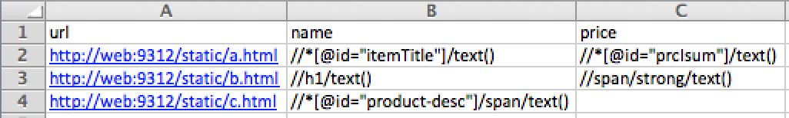

### 5.4　基于Excel文件爬取的爬虫

大多数情况下，每个源网站只会有一个爬虫；不过在某些情况下，你想要抓取的数据来自多个网站，此时唯一变化的东西就是所使用的XPath表达式。对于此类情况，如果为每个网站都使用一个爬虫则显得有些小题大做。那么可以只使用一个爬虫来爬取所有这些网站吗？答案是肯定的。

让我们为该实验创建一个新的爬虫，因为这次爬取的条目会和之前区别很大（实际上我们还没有在该项目中定义任何东西！）。假设此时在 `ch05` 下的 `properties` 目录中。让我们向上一层，如下面的代码所示进行操作。

```python
$ pwd
/root/book/ch05/properties
$ cd ..
$ pwd
/root/book/ch05

```

我们创建了一个名为 `generic` 的新项目，以及一个名为 `fromcsv` 的爬虫。

```python
$ scrapy startproject generic
$ cd generic
$ scrapy genspider fromcsv example.com

```

现在，创建一个 `.csv` 文件，其中包含想要抽取的信息。可以使用一个电子表格程序，比如Microsoft Excel，来创建这个 `.csv` 文件。填入如图5.5所示的几个URL和XPath表达式，然后将其命名为 `todo.csv` ，保存到爬虫目录当中（ `scrapy.cfg` 所在目录）。要想保存为 `.csv` 文件，需要在保存对话框中选择CSV文件（Windows）作为文件格式。


<center class="my_markdown"><b class="my_markdown">图5.5　包含URL和XPath表达式的todo.csv</b></center>

很好！如果一切都已就绪，你就可以在终端上看到该文件。

```python
$ cat todo.csv
url,name,price
a.html,"//­*[@id=""itemTitle""]/text()","//­*[@id=""prcIsum""]/text()"
b.html,//h1/text(),//span/strong/text()
c.html,"//­*[@id=""product-desc""]/span/text()"

```

Python有一个用于处理 `.csv` 文件的内置库。只需通过 `import csv` 导入模块，然后就可以使用如下这些直截了当的代码，以字典的形式读取文件中的所有行了。在当前目录下打开Python提示符，就可以尝试如下代码。

```python
$ pwd
/root/book/ch05/generic2
$ python
>>> import csv
>>> with open("todo.csv", "rU") as f:
　　　　reader = csv.DictReader(f)
　　　　for line in reader:
　　　　　　print line

```

文件中的第一行会被自动作为标题行处理，并且会根据它们得出字典中键的名称。在接下来的每一行中，会得到一个包含行内数据的字典。我们使用for循环迭代每一行。当运行前面的代码时，可以得到如下输出。

```python
{'url': ' http://a.html', 'price': '//­*[@id="prcIsum"]/text()', 
'name': '//­*[@id="itemTitle"]/text()'}
{'url': ' http://b.html', 'price': '//span/strong/text()', 'name': '//
h1/text()'}
{'url': ' http://c.html', 'price': '', 'name': '//­*[@id="product-
desc"]/span/text()'}
```

非常好。现在，可以编辑 `generic/spiders/fromcsv.py` 这个爬虫了。我们将会用到 `.csv` 文件中的URL，并且不希望有任何域名限制。因此，首先要做的事情就是移除 `start_urls` 以及 `allowed_domains` ，然后读取 `.csv` 文件。

由于我们事先并不知道想要起始的URL，而是从文件中读取得到的，因此需要实现一个 `start_requests()` 方法。对于每一行，创建 `Request` ，然后对其进行 `yield` 操作。此外，还会在 `reqeust.meta` 中存储来自 `csv` 文件的字段名称和XPath表达式，以便在 `parse()` 函数中使用它们。然后，使用 `Item` 和 `ItemLoader` 填充 `Item` 的字段。下面是完整的代码。

```python
import csv
import scrapy
from scrapy.http import Request
from scrapy.loader import ItemLoader
from scrapy.item import Item, Field
class FromcsvSpider(scrapy.Spider):
　　name = "fromcsv"
def start_requests(self):
　　with open("todo.csv", "rU") as f:
　　　　reader = csv.DictReader(f)
　　　　for line in reader:
　　　　　　request = Request(line.pop('url'))
　　　　　　request.meta['fields'] = line
　　　　　　yield request
def parse(self, response):
　　item = Item()
　　l = ItemLoader(item=item, response=response)
　　for name, xpath in response.meta['fields'].iteritems():
　　　　if xpath:
　　　　item.fields[name] = Field()
　　　　l.add_xpath(name, xpath)
return l.load_item()
```

接下来开始爬取，并将结果输出到 `out.csv` 文件中。

```python
$ scrapy crawl fromcsv -o out.csv
INFO: Scrapy 0.0.3 started (bot: generic)
...
DEBUG: Scraped from <200 a.html>
{'name': [u'My item'], 'price': [u'128']}
DEBUG: Scraped from <200 b.html>
{'name': [u'Getting interesting'], 'price': [u'300']}
DEBUG: Scraped from <200 c.html>
{'name': [u'Buy this now']}
...
INFO: Spider closed (finished)
$ cat out.csv
price,name
128,My item
300,Getting interesting
,Buy this now

```

正如爬取得到的结果一样，非常简洁直接！

在代码中，你可能已经注意到了几个事情。由于我们没有为该项目定义系统范围的 `Item` ，因此必须像如下代码这样手动为 `ItemLoader` 提供。

```python
item = Item()
l = ItemLoader(item=item, response=response)
```

此外，我们还使用了 `Item` 的成员变量 `fields` 动态添加字段。为了能够动态添加新字段，并通过 `ItemLoader` 对其进行填充，需要实现的代码如下。

```python
item.fields[name] = Field()
l.add_xpath(name, xpath)
```

最后，还可以使代码更加好看。硬编码 `todo.csv` 文件名不是一个非常好的实践。Scrapy提供了一个非常便捷的方法，用于传输参数到爬虫当中。当传输一个命令行参数 `-a` 时（比如： `-a variable=value` ），就会为我们设置一个爬虫属性，并且可以通过 `self.variable` 取得该值。为了检查变量，并在未提供该变量时使用默认值，可以使用Python的 `getattr()` 方法： `getattr(self, 'variable', 'default')` 。总之，我们将原来的 `with open…` 语句替换为如下语句。

```python
with open(getattr(self, "file", "todo.csv"), "rU") as f:
```

现在，除非明确使用 `-a` 参数设置源文件名，否则将会使用 `todo.csv` 作为其默认值。当给出另一个文件 `another_todo.csv` 时，可以按如下方式运行。

```python
$ scrapy crawl fromcsv -a file=another_todo.csv -o out.csv

```

