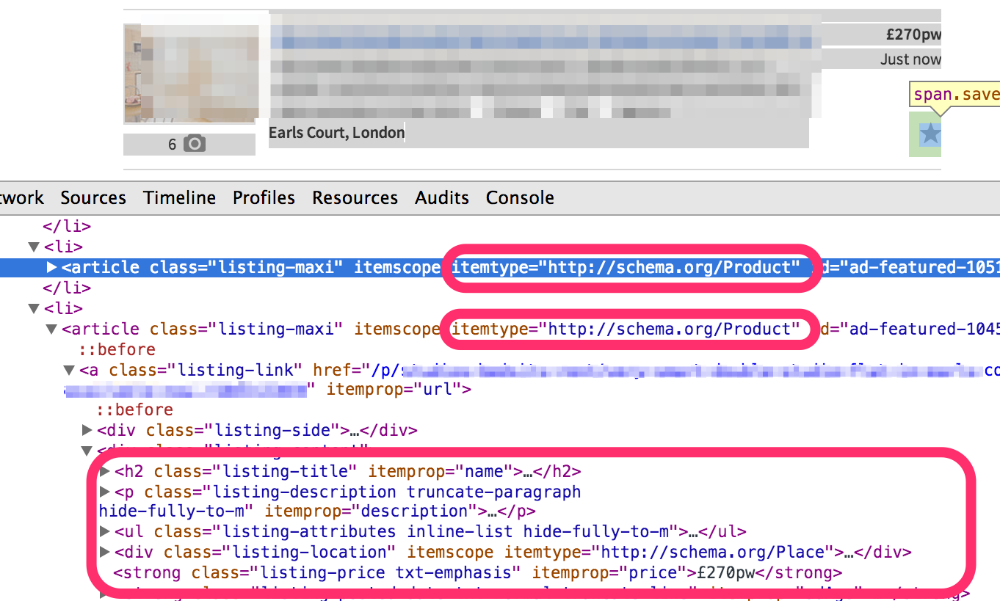

### 5.3　30倍速的房产爬虫

有这样一种趋势，当你开始使用一个框架时，做任何事情都可能会使用最复杂的方式。你在使用Scrapy时也会发现自己在做这样的事情。在疯狂于XPath等技术之前，值得停下来想一想：我选择的方式是从网站中抽取数据最简单的方式吗？

如果你能从索引页中抽取出基本相同的信息，就可以避免抓取每个房源页，从而得到数量级的提升。

> 
> 请记住，很多网站在其索引页中提供了不同的项目数量选择。比如，一个网站可能允许你通过调整参数指定每个索引页显示的房源数是10、50还是100，如 `&show=50` 。显然，如果是这样的情况，就可以将该参数设置为允许的最大值。

比如，在房产示例中，我们所需要的所有信息都存在于索引页中，包括标题、描述、价格和图片。这就意味着只抓取一个索引页，就能抽取其中的30个条目以及前往下一页的链接。通过爬取100个索引页，我们只需要100个请求，而不是3000个请求，就能够得到3000个条目。太棒了！

在真实的Gumtree网站中，索引页的描述信息要比列表页中完整的描述信息稍短一些。不过此时这种抓取方式可能也是可行的，甚至也能令人满意。

> 
> 在许多情况下，我们将不得不权衡数据质量与请求数量的关系。很多源都会限制大量的请求（后续章节会遇到更多此类问题），因此在索引中获取也可能帮助我们解决其他难题。

在我们的例子中，当查看任何一个索引页的HTML代码时，就会发现索引页中的每个房源都有其自己的节点，并使用 `itemtype="http://schema.org/Product"` 来表示。在该节点中，我们拥有与详情页完全相同的方式为每个属性注解的所有信息，如图5.4所示。


<center class="my_markdown"><b class="my_markdown">图5.4　从单一索引页抽取多个房产信息</b></center>

我们在Scrapy shell中加载第一个索引页，并使用XPath表达式进行测试。

```python
$ scrapy shell http://web:9312/properties/index_00000.html

```

在Scrapy shell中，尝试选取所有带有Product标签的内容：

```python
>>> p=response.xpath('//­*[@itemtype="http://schema.org/Product"]')
>>> len(p)
30
>>> p
[<Selector xpath='//­*[@itemtype="http://schema.org/Product"]' data=u'<li 
class="listing-maxi" itemscopeitemt'...]

```

可以看到我们得到了一个包含30个 `Selector` 对象的列表，每个对象指向一个房源。在某种意义上， `Selector` 对象与 `Response` 对象有些相似，我们可以在其中使用XPath表达式，并且只从它们指向的地方获取信息。唯一需要说明的是，这些表达式应该是相对XPath表达式。相对XPath表达式与我们之前看到的基本一样，不过在前面增加了一个'.'点号。举例说明，让我们看一下使用 `.//­*[@itemprop="name"][1]/text()` 这个相对XPath表达式，从第4个房源抽取标题时是如何工作的。

```python
>>> selector = p[3]
>>> selector
<Selector xpath='//­*[@itemtype="http://schema.org/Product"]' ... '>
>>> selector.xpath('.//­*[@itemprop="name"][1]/text()').extract()
[u'l fun broadband clean people brompton european']

```

可以在 `Selector` 对象的列表中使用 `for` 循环，抽取索引页中全部30个条目的信息。

为了实现该目的，我们再一次从第3章的 `manual.py` 着手，将爬虫重命名为"fast"，并重命名文件为 `fast.py` 。我们将复用大部分代码，只在 `parse()` 和 `parse_items()` 方法中进行少量修改。最新方法的代码如下。

```python
def parse(self, response):
　　# Get the next index URLs and yield Requests
　　next_sel = response.xpath('//­*[contains(@class,"next")]//@href')
　　for url in next_sel.extract():
　　　　yield Request(urlparse.urljoin(response.url, url))
　　# Iterate through products and create PropertiesItems
　　selectors = response.xpath(
　　　　'//­*[@itemtype="http://schema.org/Product"]')
　　for selector in selectors:
　　　　yield self.parse_item(selector, response)
```

在代码的第一部分中，对前往下一个索引页的 `Request` 的 `yield` 操作的代码没有变化。唯一改变的内容在第二部分，不再使用 `yield` 为每个详情页创建请求，而是迭代选择器并调用 `parse_item()` 。其中， `parse_item()` 的代码也和原始代码非常相似，如下所示。

```python
def parse_item(self, selector, response):
　　# Create the loader using the selector
　　l = ItemLoader(item=PropertiesItem(), selector=selector)
　　# Load fields using XPath expressions
　　l.add_xpath('title', './/­*[@itemprop="name"][1]/text()',
　　　　　　　　MapCompose(unicode.strip, unicode.title))
　　l.add_xpath('price', './/­*[@itemprop="price"][1]/text()',
　　　　　　　　MapCompose(lambda i: i.replace(',', ''), float),
　　　　　　　　re='[,.0-9]+')
　　l.add_xpath('description',
　　　　　　　　'.//­*[@itemprop="description"][1]/text()',
　　　　　　　　MapCompose(unicode.strip), Join())
　　l.add_xpath('address',
　　　　　　　　'.//­*[@itemtype="http://schema.org/Place"]'
　　　　　　　　'[1]/­*/text()',
　　　　　　　　MapCompose(unicode.strip))
　　make_url = lambda i: urlparse.urljoin(response.url, i)
　　l.add_xpath('image_urls', './/­*[@itemprop="image"][1]/@src',
　　　　　　　　MapCompose(make_url))
　　# Housekeeping fields
　　l.add_xpath('url', './/­*[@itemprop="url"][1]/@href',
　　　　　　　　MapCompose(make_url))
　　l.add_value('project', self.settings.get('BOT_NAME'))
　　l.add_value('spider', self.name)
　　l.add_value('server', socket.gethostname())
　　l.add_value('date', datetime.datetime.now())
　　return l.load_item()
```

我们所做的细微变更如下所示。

+ `ItemLoader` 现在使用 `selector` 作为源，而不再是 `Response` 。这是 `ItemLoader`  API一个非常便捷的功能，能够让我们从当前选取的部分（而不是整个页面）抽取数据。
+ XPath表达式通过使用前缀点号（.）转为相对XPath。

> 
> 比较巧合的是，在我们的例子中，索引页和详情页中的XPath表达式是一样的。实际情况并不总是这样，你可能需要重新开发XPath表达式，以匹配索引页的结构。

+ 我们必须自己编辑 `Item` 的URL。之前， `response.url` 已经给出了房源页的URL。而现在，它给出的是索引页的URL，因为该页面才是我们要爬取的。我们需要使用熟悉的 `.//­*[@itemprop="url"][1]/@href` 这个XPath表达式抽取出房源的URL，然后使用 `MapCompose` 处理器将其转换为绝对URL。

小的改变能够节省巨大的工作量。现在，我们可以使用如下代码运行该爬虫。

```python
$ scrapy crawl fast -s CLOSESPIDER_PAGECOUNT=3
...
INFO: Dumping Scrapy stats:
　 'downloader/request_count': 3, ...
　 'item_scraped_count': 90,...

```

和预期一样，只用了3个请求，就抓取了90个条目。如果我们没有在索引页中获取到的话，则需要93个请求。这种方式太明智了！

如果你想使用 `scrapy parse` 进行调试，那么现在必须设置 `spider` 参数，如下所示。

```python
$ scrapy parse --spider=fast http://web:9312/properties/index_00000.html
...
>>> STATUS DEPTH LEVEL 1 <<<
# Scraped Items --------------------------------------------
[{'address': [u'Angel, London'],
... 30 items...
# Requests ---------------------------------------------------
[<GET http://web:9312/properties/index_00001.html>]

```

正如期望的那样， `parse()` 返回了 `30` 个 `Item` 以及一个前往下一索引页的 `Request` 。请使用 `scrapy parse` 随意试验，比如传输 `--depth=2` 。

