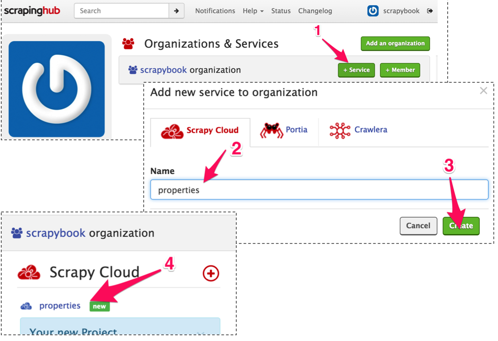
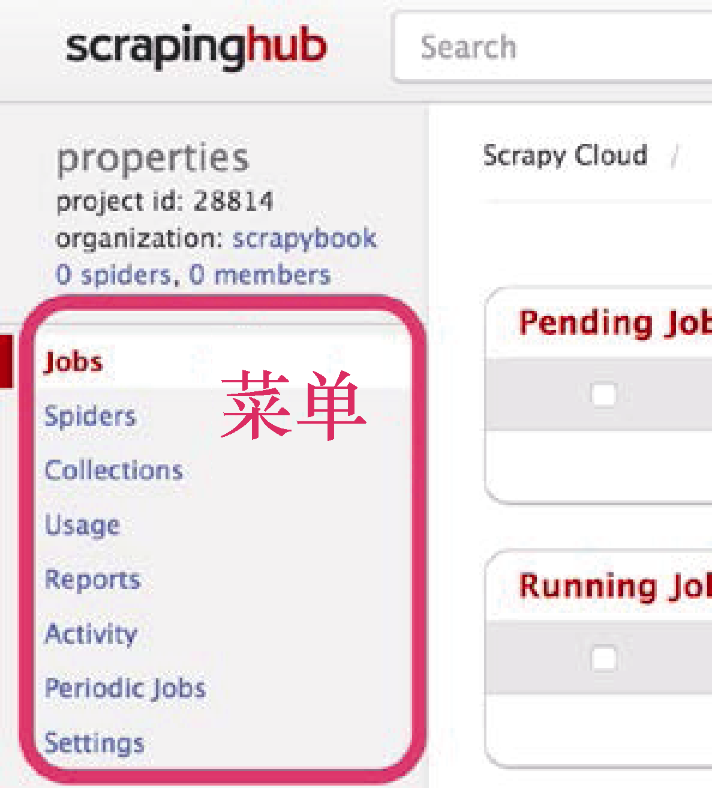
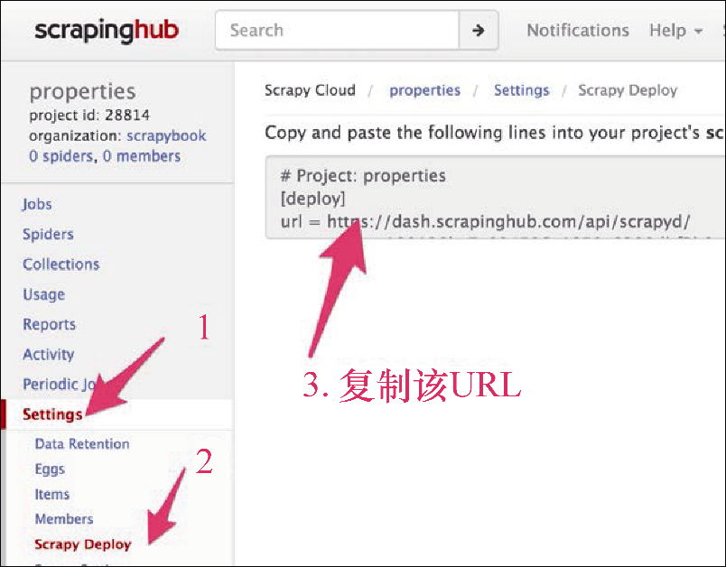

### 6.1　注册、登录及创建项目

第一步是在 `http://scrapinghub.com/` 上面创建账号。我们所需填写的只有邮箱地址和密码。在单击确认邮件的链接后，就可以登录到其服务中。我们可以看到的第一个页面是个人面板。目前，我们还没有任何项目，因此现在单击 **+Service** 按钮（1）来创建一个项目，如图6.1所示。

<b class="my_markdown">图6.1　在scrapinghub上创建新项目</b>

将项目命名为 `properties` （2），然后单击 **Create** 按钮（3）。之后，单击主页的 **new** 链接（4）打开该项目。

项目面板是项目中最重要的页面。在左侧的菜单中，可以看到几个区域，如图6.2所示。 **Jobs** 和 **Spiders** 区域分别提供关于运行和爬虫的信息。 **Periodic Jobs** 允许我们计划定期爬取任务。而另外4个区域目前来说对我们没有那么有用。

<b class="my_markdown">图6.2　主菜单</b>

我们可以直接前往 **Settings** 区域（1），如图6.3所示。与很多网站的设置不同，Scrapinghub的设置提供了很多功能，需要你十分了解它们。目前，我们的主要关注点是 **Scrapy Deploy** 区域（2）。

<b class="my_markdown">图6.3　爬虫部署设置</b>

