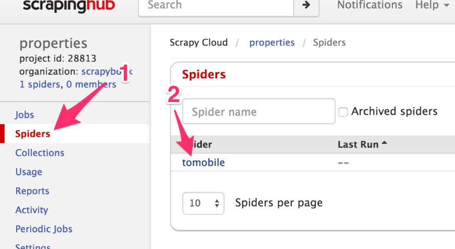
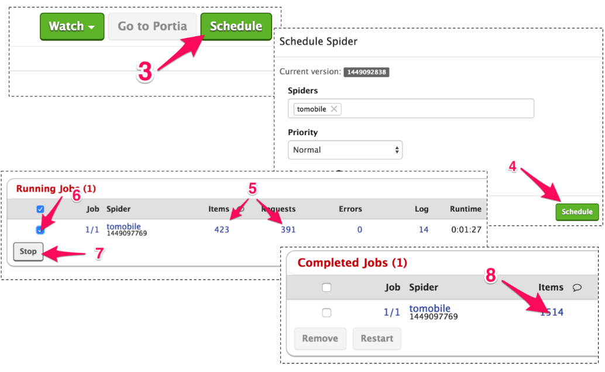

### 6.2　部署爬虫与计划运行

我们将直接从开发机进行部署。要想实现这一目标，只需将 **Scrapy Deploy** 页面中的代码（3）拷贝到项目中的 `scrapy.cfg` 文件中，替换掉默认的 `[deploy]` 区域即可。你会注意到我们并不需要设置密码。我们将使用第4章中的房产项目作为示例，使用该爬虫的原因是目标数据需要能够在网络上访问到，和第4章使用的情况一样。在使用它之前，需要恢复原始的 `settings.py` 文件，移除和Appery.io管道相关的引用。

> 
> 本章代码在 `ch06` 目录中。其中，该示例位于 `ch06/properties` 目录中。

```python
$ pwd
/root/book/ch06/properties
$ ls
properties scrapy.cfg
$ cat scrapy.cfg
...
[settings]
default = properties.settings
# Project: properties
[deploy]
url = http://dash.scrapinghub.com/api/scrapyd/
username = 180128bc7a0.....50e8290dbf3b0
password =
project = 28814

```

为了部署爬虫，还需要使用Scrapinghub提供的 `shub` 工具。可以通过 `pip install shub` 安装该工具，不过我们已经在开发机中已经安装好该工具了。可以使用下述方法登录Scrapinghub。

```python
$ shub login
Insert your Scrapinghub API key : 180128bc7a0.....50e8290dbf3b0
Success.

```

我们已经将API key复制到 `scrapy.cfg` 文件中了，不过也可以通过单击Scrapinghub网站右上角的用户名，再单击 **API Key** 找到该值。无论如何，现在我们已经准备好使用 `shub deploy` 部署爬虫了。

```python
$ shub deploy
Packing version 1449092838
Deploying to project "28814" in {"status": "ok", "project": 28814, 
"version": "1449092838", "spiders": 1}
Run your spiders at: https://dash.scrapinghub.com/p/28814/

```

Scrapy将本项目中的所有爬虫打包，并上传到Scrapinghub当中。可以注意到，此时产生了两个新目录和一个新文件。这些只是辅助文件，如果不需要的话，可以安全地删除它们，不过通常情况下没必要在意它们。

```python
$ ls
build project.egg-info properties scrapy.cfgsetup.py
$ rm -rf build project.egg-info setup.py

```

现在，当单击Scrapinghub的 **Spiders** 区域（1）时，可以找到刚刚部署的 **tomobile** 爬虫，如图6.4所示。


<center class="my_markdown"><b class="my_markdown">图6.4　选择爬虫</b></center>

当单击它时（2），会进入到爬虫面板，如图6.5所示。该面板中包含大量信息，不过目前我们需要做的就是单击右上角的 **Schedule** 按钮（3），然后在弹出的对话框中再次单击 **Schedule** 按钮（4）。


<center class="my_markdown"><b class="my_markdown">图6.5　计划爬虫运行</b></center>

几秒钟之后，可以在页面中的 **Running Jobs** 区域看到新的一行，之后 **Requests** 和 **Items** 的数值（5）开始不断增长。

> 
> 与开发时的运行速度相比，此时的运行速度可能不会降低。Scrapinghub使用了算法预估每秒的请求数，能够让你在执行时不会被屏蔽。

让它运行一会儿，然后选择该任务的复选框（6），并单击 **Stop** 按钮（7）。

几秒钟之后，我们的任务将会停止，并进入 **Completed Jobs** 区域。要想查看已经抓取的条目，可以单击items链接中的数字（8）。

