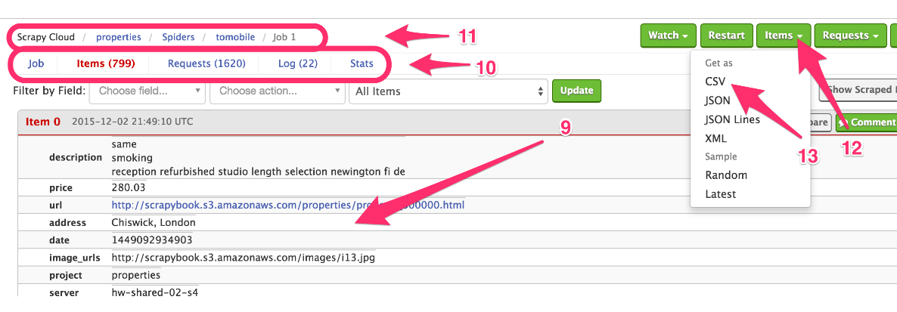

### 6.3　访问item

现在，我们需要前往任务页，如图6.6所示。在该页中，可以查看到我们的item（9），并确保其没有问题。我们还可以使用上面的控件进行过滤。当向下滚动页面时，更多的item会被自动加载出来。


<center class="my_markdown"><b class="my_markdown">图6.6　查看及导出item</b></center>

如果存在一些没能正常运行的情况，可以在 **Items** 上方的 **Requests** 和 **Log** 中找到有用的信息（10）。可以使用顶部的面包屑导航回到爬虫或项目中（11）。当然，也可以通过单击左上方的 **Items** 按钮（12），选择合适的选项（13），将item以常见的CSV、JSON、JSON行等格式下载下来。

另一种访问item的方式是通过Scrapinghub提供的Items API。我们所需做的就是查看任务或items页面中的URL，类似于下面这样。

```python
https://dash.scrapinghub.com/p/28814/job/1/1/

```

在该URL中， **28814** 是项目编号（之前在 `scrapy.cfg` 文件中设置过该值），第一个 `1` 是该爬虫的编号/ID（即" **tomobile** "爬虫），而第二个1则是任务编号。以上述顺序使用这3个数值，并使用我们的用户名/API Key进行验证，就可以在控制台中使用 `curl` 建立到 `https://storage.scapinghub.com/ items/<project id>/<spider id>/<job id>` 的请求，获取item，该过程如下所示。

```python
$ curl -u 180128bc7a0.....50e8290dbf3b0: https://storage.scrapinghub.com/
items/28814/1/1
{"_type":"PropertiesItem","description":["same\r\nsmoking\r\nr...
{"_type":"PropertiesItem","description":["british bit keep eve...
...

```

如果它请求输入密码，我们将其留空即可。允许编程访问数据的特性使得我们可以编写应用，使用Scrapinghub作为数据存储后端。不过需要注意的是，这些数据并不是无限期存储的，而是依赖于订阅方案中的存储时间限制（对于免费方案来说该限制为7天）。

