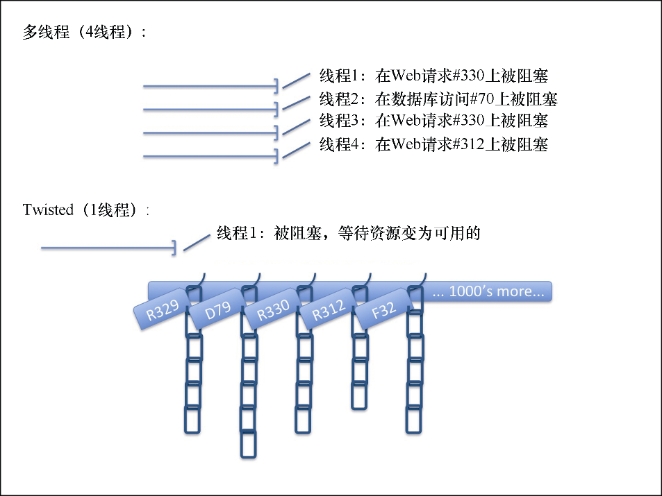

### 8.1　Scrapy是一个Twisted应用

Scrapy是一个内置使用了Python的Twisted框架的抓取应用。Twisted确实有些与众不同，因为它是事件驱动的，并且鼓励我们编写异步代码。习惯它需要一些时间，不过我们将通过只学习和Scrapy有关的部分，从而让任务变得相对简单一些。我们还可以在错误处理方面轻松一些。GitHub上的完整代码会有更加彻底的错误处理，不过在本书中将忽略该部分。

让我们从头开始。Twisted与众不同是因为它的主要口号。

> 
> 在任何情况下，都不要编写阻塞的代码。

代码阻塞的影响很严重，而可能造成代码阻塞的原因包括：

+ 代码需要访问文件、数据库或网络；
+ 代码需要派生新进程并消费其输出，比如运行shell命令；
+ 代码需要执行系统级操作，比如等待系统队列。

Twisted提供的方法允许我们执行上述所有操作甚至更多操作时，无需再阻塞代码执行。

为了展示两种方式的不同，我们假设有一个典型的同步抓取应用（见图8.1）。假设该应用包含4 个线程，并且在一个给定的时刻，其中 3 个线程处于阻塞状态，用于等待响应，而另一个线程被阻塞，用于执行数据库写访问以保存 `Item` 。在任何给定时刻，很有可能无法找到抓取应用的一个执行其他事情的线程，只能等待一些阻塞操作完成。当阻塞操作完成时，一些计算操作可能占用几微秒，然后线程再次被阻塞，执行其他阻塞操作，这很可能持续至少几毫秒的时间。总体来说，服务器不会是空闲的，因为它运行了几十个应用程序，并使用了上千个线程，因此，在一些细致的调优后，CPU才能够合理利用。

<b class="my_markdown">图8.1　多线程代码和Twisted异步代码的对比</b>

Twisted/Scrapy的方式更倾向于尽可能使用单线程。它使用现代操作系统的I/O复用功能（参见 `select()` 、 `poll()` 和 `epoll()` ）作为“挂起器”。在通常会有阻塞操作的地方，比如 `result = i_block()` ，Twisted提供了一个可以立即返回的替代实现。不过，它并不是返回真实值，而是返回一个hook，比如 `deferred = i_dont_block()` ，在这里可以挂起任何想要运行的功能，而不用管什么时候返回值可用（比如， `deferred.addCallback(process_result)` ）。一个Twisted应用是由一组此类延迟运行的操作组成的。Twisted唯一的主线程被称为Twisted事件反应器线程，用于监控挂起器，等待某个资源变为可用（比如，服务器返回响应到我们的 `Request` 中）。当该事件发生时，将会触发链中最前面的延迟操作，执行一些计算，然后依次触发下面的操作。部分延迟操作可能会引发进一步的I/O操作，这样就会造成延迟操作链回到挂起器中，如果可能的话，还会释放CPU以执行其他功能。由于我们使用的是单线程，因此不会存在额外线程所需的上下文切换以及保存资源（如内存）所带来的开销。也就是说，我们使用该非阻塞架构时，只需一个线程，就能达到类似使用数千个线程才能达到的性能。

坦率地说，操作系统开发人员花费了数十年的时间优化线程操作，以使它们速度更快。性能的争论没有以前那么强烈了。有一件大家都认同的事情是，为复杂应用编写正确的线程安全代码非常困难。当你克服考虑延迟/回调所带来的最初冲击后，会发现Twisted代码要比多线程代码简单得多。 `inlineCallbacks` 生成器工具使得代码更加简单，我们将会在后续章节进一步讨论它。

> 
> 可以说，到目前为止，最成功的非阻塞I/O系统是Node.js，主要是因为它以高性能和并发性作为出发点，没有人去争论这是好事还是坏事。每个Node.js应用都只用非阻塞API。在Java的世界里，Netty可能是最成功的NIO框架驱动应用，比如Apache Storm和Spark。C++ 11的 `std::future` 和 `std::promise` （与延迟操作非常类似）通过使用libevent或纯POSIX这些库，使得编写异步代码更加简单。

