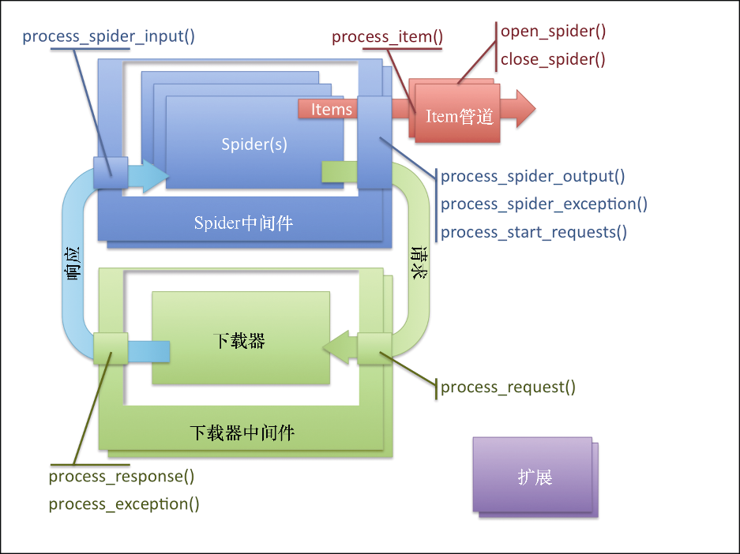
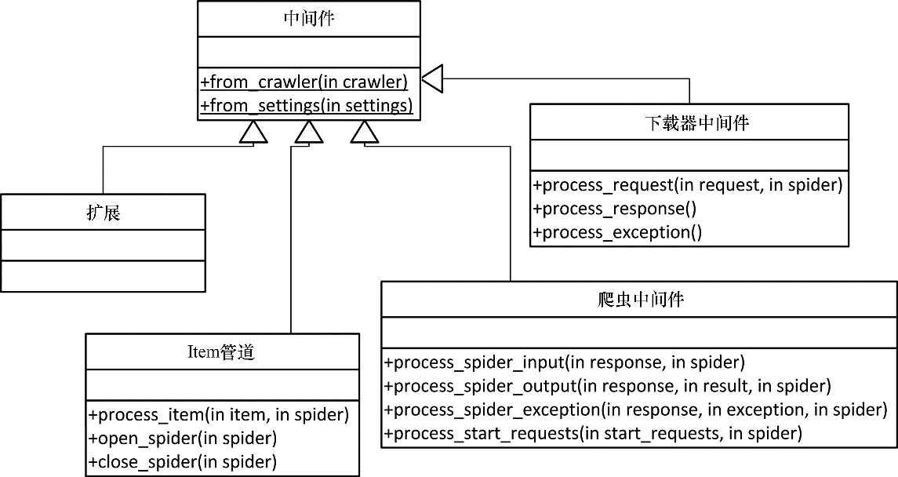

### 8.2　Scrapy架构概述

图8.2所示为Scrapy的架构。

<b class="my_markdown">图8.2　Scrapy架构</b>

你可能已经注意到，该架构运行在我们熟悉的三类对象之上： `Request` 、 `Response` 以及 `Item` 。我们的爬虫就在架构的核心位置，它们创建 `Request` ，处理 `Response` ，生成 `Item` 和更多的 `Request` 。

爬虫生成的每个 `Item` 都使用其 `process_item()` 方法由Item管道序列执行后置处理。通常情况下， `process_item()` 会修改 `Item` ，然后以返回这些 `Item` 的方式将其传给后续的管道。有时候（比如冗余或非法数据的情况），我们可能需要放弃一个Item，此时可以通过抛出 `DropItem` 异常的方式实现。这种情况下，后续的管道将不会再接收该Item。如果我们提供了 `open_spider()` 和 `/` 或 `close_spider()` 方法，那么爬虫会对应地在开始和结束爬虫时调用该方法。这里是我们进行初始化和清理工作的时机。Item管道通常用于执行问题域名或基础结构的操作，比如清理数据、向数据库插入 `Item` 等。你还会发现自己会在项目之间很大程度地复用它们，尤其是当处理基础架构细节时。第4章中使用过的Appery.io管道，即通过少量配置上传 `Item` 到Appery.io的工作，就是用Item管道执行基础架构工作的一个例子。

我们通常会从爬虫发送 `Request` ，并得到返回的 `Response` ，来进行工作。Scrapy以透明的方式负责Cookie、权限认证、缓存等，我们所需要做的就是偶尔调整一些设置。这其中大部分功能是在下载器中间件中实现的。它们通常都非常复杂，在处理 `Request/Response` 内部构件时有着很高的技巧。你可以创建自定义的中间件，以使Scrapy按照你要求的方式处理 `Request` 。通常，成功的中间件可以在多个项目中复用，并且可以向其他Scrapy开发者提供有用的功能，因此向社区分享是个不错的选择。你没有必要经常编写下载器中间件。如果你想了解默认的下载器中间件，可以查看Scrapy的Github仓库中 `settings/default_settings.py` 文件的 `DOWNLOADER_MIDDLEWARES_BASE` 设置。

下载器是真正执行下载的引擎。除非你是Scrapy的代码贡献者，否则不要修改它。

有时候，你可能需要编写爬虫中间件（见图8.3）。这些中间件在爬虫之后且所有下载器中间件之前处理 `Request` ；而在处理 `Response` 时，则是相反的顺序。使用下载器中间件，可以做很多事情，比如重写所有URL，使用HTTPS代替HTTP，而不用管爬虫从页面中抽取出来的内容是什么。它可以实现特定于项目需求的功能，并分享给所有的爬虫。下载器中间件和爬虫中间件最主要的区别是，当下载器中间件获取一个 `Request` 时，只会返回一个 `Response` 。而爬虫中间件可以在对某些 `Request` 不感兴趣时舍弃掉它们，或者对每个输入的 `Request` 都发出多个 `Request` ，用来完成你的应用程序的目标。可以说爬虫中间件是针对 `Request` 和 `Response` 的，而Item管道是针对 `Item` 的。爬虫中间件同样也接收 `Item` ，不过通常情况下不会对其进行修改，因为在Item管道中进行这些操作更加容易。如果你想了解默认的爬虫中间件，可以在Scrapy的Git上查看 `settings/default_settings.py` 文件的 `SPIDER_MIDDLEWARES_BASE` 设置。

<b class="my_markdown">图8.3　中间件架构</b>

最后还有一个部分是扩展。扩展非常常见，实际上其常见程度仅次于Item管道。它们是在爬取工作启动时加载的普通类，可以访问设置、爬虫、注册回调信号以及定义自己的信号。信号是一类基础的Scrapy API，它可以让回调函数在系统中发生某些事情时进行调用，比如 `Item` 被抓取、丢弃时或爬虫开启时。有很多非常有用的预定义信号，我们将会在后边见到其中的一部分。某种意义上讲，扩展有些博而不精，它能够让你写出任何可以想到的工具，但又无法给你实际的帮助（比如像Item管道的 `process_item()` 方法）。我们必须将其hook到信号上，自己实现需要的功能。例如，在达到指定页数或Item个数后停止爬取，就是通过扩展实现的。如果想要了解默认的扩展，可以从Scrapy的Git上查看 `settings/default_settings.py` 文件的 `EXTENSIONS_BASE` 设置。

更严格地说，Scrapy把所有这些类都当作是中间件（通过 `MiddlewareManager` 类的子类管理），允许我们通过实现 `from_crawler()` 或 `from_settings()` 类方法，分别从 `Crawler` 或 `Settings` 对象初始化它们。由于 `Settings` 可以从 `Crawler` 中轻松获取（ `crawler.settings` ），因此 `from_crawler()` 是更加流行的方式。如果不需要 `Settings` 或 `Crawler` ，可以不去实现它们。

表8.1可以帮助你在针对指定问题时决定最好的机制。

<b class="my_markdown">表8.1</b>

| 问题 | 解决方案 |
| :-----  | :-----  | :-----  | :-----  |
| 一些只针对于我正在爬取的网站的内容 | 修改爬虫 |
| 修改或存储Item——特定领域，可能在项目间复用 | 编写Item管道 |
| 修改或丢弃 `Request/Response` ——特定领域，可能在项目间复用 | 编写爬虫中间件 |
| 执行 `Request/Response` ——通用，比如支持一些定制化登录模式或处理Cookie的特定方式 | 编写下载器中间件 |
| 所有其他问题 | 编写扩展 |

